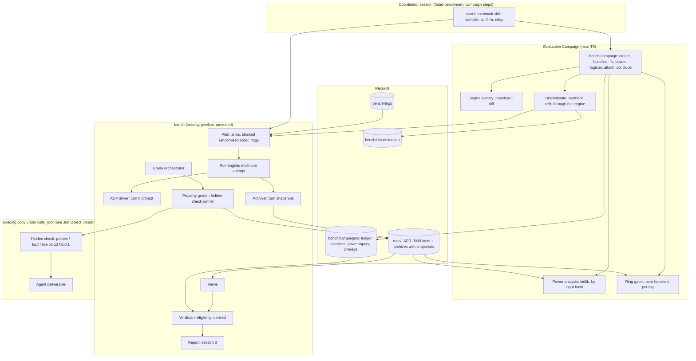
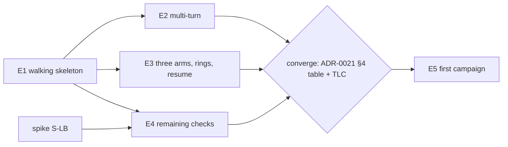

# Architecture amendment: the Evaluation Campaign

- **Status:** Revised after architect council rounds 1 and 2 (2026-10-03). Distributed Systems PASS; Security & Identity PASS (S2 re-checked and cleared, round 3); SRE and the other lenses PASS WITH CONDITIONS; see [Gate record](#gate-record).
- **Tier:** T2 (the driving spec's cost-of-error tier: a wrong verdict misdirects pack changes on every harness).
- **Driving spec:** `docs/specs/enterprise-evaluation.md` (EV-1..EV-20; gated 2026-10-03). It refines `docs/specs/harness-bench.md`.
- **Refines:** `docs/architecture.md` (the architecture of record). Everything there holds unless an ADR below amends it.
- **Author / date:** Claude Code (Opus 5.5), the `/define-architecture` author seat (Peer Mode: Enterprise, Distributed Systems, Security & Identity, Tech Lead, Data & Persistence), for @timianmalloo, 2026-10-03.
- **Why a companion file and not a section of `docs/architecture.md`:** this amendment adds a bounded context, two boundaries, nine components, eight ADRs and its own phasing plan. Inlined, it would roughly double a gated 387-line record and mix two gate histories. `docs/architecture.md` gains a short *Amendment 1* section that points here and lists what is amended, so neither document silently contradicts the other.

**Amends (explicitly; each is recorded in the ADR named):**

| Existing statement | Amended to | ADR |
| --- | --- | --- |
| `docs/architecture.md`: "one isolated cell per (task version, combo, pack, repetition)" | one cell per (task version, combo, **arm**, repetition) | ADR-0014 |
| ADR-0006 Identity: `cell_id` hashes `(task_version_hash, combo_id, pack_setting, repetition)` | the same recipe and key name; the `pack` ingredient carries the **arm id**; `on`/`off` are the legacy arm ids | ADR-0014 |
| Plan: one `pack` `{source, commit}`; matrix `packs: ["on","off"]` | plan `arms`: one pack revision per pack-on arm; matrix `bench-matrix/2` `arms:`; `bench-matrix/1` read as two arms | ADR-0014 |
| ADR-0007 and the TLA+ invariant "at most one prompt per cell" | at most one prompt per **(cell, turn)**; turn n+1 only after turn n ended and its snapshot is archived | ADR-0015 |
| ADR-0013 §2: "At the end of every turn the engine terminates the job" | at the end of the attempt's **last** turn | ADR-0015 |
| ADR-0006 `archive_files` grain "file or link in one archive attempt of one cell" | "… in one **snapshot** of one archive attempt of one cell"; absent `snapshot` reads `final` | ADR-0015 |
| `report/pack_improvement._passed`: a missing `pass_at_1` counts as a fail | a missing `pass_at_1` is NOT_RECORDED and excluded from pass counts | ADR-0019 |
| `archive.archive_cell`: checks `exists` once, then copies in place (a crash leaves a partial folder that deadlocks resume) | temporary sibling, fsync, verify, rename; "exists" means "complete" (pre-existing defect) | ADR-0015 §5a |
| ADR-0007 §2 resume cases (containers, per cell); no resume entry point in the engine | plan-level resume with per-turn reconciliation, launch-time identity and disk checks, `last_progress_at` and an alarm exit | ADR-0021 |
| ADR-0011 C5/C9 import lint | extended to the campaign, identity, power, verdict, gate and property-grader modules | ADR-0011 Am. 1 |

## Context & constraints

**What the system must do** (spec Problem and Core scenario): answer, per harness and per Enterprise/Production property, "does pack revision X give better outcomes per unit of cost than pack-off and than pack revision Y?", with a stated confidence and MDE, from one pre-registered, powered, frozen comparison grid. Quoted requirements that shape the structure:
- EV-17: "Every (admitted task, combo, repetition) has exactly one cell per arm"; "Grid-4's matrix re-planned gives the same (task, combo, arm, repetition) set as its frozen `plan.json`"; the launch order is "a seeded permutation recorded with its seed".
- EV-4 / DR-E4: the turn-2 requirement arrives "as a second user message in the same attempt"; "the turn-1 tree is archived as a turn snapshot before the turn-2 message is sent".
- EV-7: discrimination records are produced "through the engine": the engine's own working-copy path and grading pass.
- EV-16: after the baseline "a change is a recorded defect fix or nothing"; a run whose identity differs otherwise is ineligible.
- EV-2/EV-3 and NFR Security: probes and fakes "reach only the grading copy's deliverable on loopback".
- EV-12: the power analysis matches closed-form references (93 per arm; 53 and 115 pairs) and an independent implementation.

**Hard constraints (unchanged):** native on the operator's host, no Docker (ADR-0013 Am. 1); subscriptions only, no API keys (owner decision 1); single operator, proportionate security (ADR-0012); the engine is Windows-only today, so a campaign's platform is Windows until the macOS port (ADR-0013 §5); facts are append-only hash-chained JSONL and every result is a derived view (ADR-0006).

## The system as a system (Stage 1)

- **Stocks:** campaign records (small, long-lived, cross-run); run ledgers and archives (large, per run); discrimination records (one per task version × engine identity × platform); the defect-fix list (grows only); model-time capacity (nights).
- **Flows:** authoring → readiness → baseline → pilot → power → pre-registration → grid → verdicts; pack commit → regression ring → signal.
- **Feedback loops:** the pilot gate (a defect found → a recorded fix → re-pilot); the re-grade policy (a fix → every campaign run re-graded); the final power analysis (pilot rates → repetitions → plan size); the pack loop (verdict → upstream change → ring).
- **Delays:** a grid is about 5 h run + 5 h grade at parallelism 2 (spec, measured); the campaign grid is multi-night (DR-E5); between-run drift (+24 % Claude Code pack-off tokens grid-3 → grid-4) is the delay that makes separate runs unusable for a comparison.
- **Boundary:** the campaign context decides *which runs count and how they are analysed*; it never runs a cell or writes a run's facts. Excluded: building the slimmed pack (EN6), parallel grading (EN7), USD (EN8).

**Candidate shapes considered:**
1. **Campaign as a thin committed ledger over unchanged runs** (chosen). Runs stay the unit of execution; arms generalise the pack setting inside one run; the campaign references runs by id, and everything it concludes is derived by reading them.
2. **Campaign as a super-run:** one long-lived run that holds the pilot, the grid and the rings as phases. Rejected: it breaks the run's frozen-plan invariant (the plan would change after the pilot), makes resume and `bench verify` span days of mixed engines, and couples the campaign's lifetime to one ledger.
3. **Three arms as three runs joined by US-52:** rejected by DR-E1 (drift poses as a pack effect; C-E2).
4. **A results database for campaign state:** rejected for the reasons ADR-0006 rejected `results.duckdb` (mutable, a second source of truth).

**The leverage point** is the representation of the arm and the engine identity, not the verdict UI: if the arm cannot be added without changing every `cell_id`, grids 1-4 stop loading; if engine identity is "the bench commit", every docs commit breaks a campaign's freeze. Both are decided first (ADR-0014, ADR-0017).

## Archetype & tier allocation

- **System shape: unchanged.** A batch Pipes and Filters pipeline, all T0. The campaign adds filters before (readiness, baseline, power, pre-registration) and after (eligibility, verdicts) the existing plan → run → grade → report pipeline.
- **No new AI capability.** The hidden checks, gates, power analysis, eligibility and verdicts are deterministic computations (P2, P5). Judges enter only if DR-T2 names a judged primary metric, and then the existing allocation applies unchanged (ADR-0009, two blind vendors).
- **Rejected archetypes:** H (Long-Horizon Agent) as campaign driver or verdict writer: it fails P2/P3 and would read untrusted cell text; D (Grounded Synthesizer) for verdicts: a verdict is a rule over intervals, so a model adds only error; E (Generate-Verify-Select): nothing is selected.

| Capability | Tier | Why |
| --- | --- | --- |
| Arms, blocked randomised launch order, plan, rings | T0 | Deterministic expansion with a recorded seed |
| Second turn and turn snapshots | T0 | Engine and archiver steps; the model is the system under test |
| Campaign ledger, baseline, engine identity, defect fixes, eligibility | T0 | Hash and set comparisons |
| Discrimination records (synthetic cells) | T0 | The engine's own path with a deterministic solution applier |
| Hidden checks (probes, fault fakes, diff statistics) | T0 | Fixed payloads, recorded seeds (US-26) |
| Power analysis, verdicts, dominance, ring gates | T0 | Closed-form and seeded bootstrap, reference-checked |

## Domain model and durable representation (Stage 3, DM1-DM13)

**Bounded contexts:** as the spec (one new: **Evaluation Campaign**; Benchmark Catalog extended; Run Execution and Evidence amended; Reporting extended). The ubiquitous language is the spec's glossary; this document adds no term except **engine identity manifest** (the per-component form of the spec's *engine baseline*, ADR-0017) and **synthetic cell** (a cell whose "agent" applies an authored solution tree, ADR-0016).

**Aggregates and where each invariant is enforced:**

| Aggregate | Invariant (spec) | Enforced by |
| --- | --- | --- |
| Campaign | pre-baseline changes free; post-baseline only recorded fixes; the fix list only grows; pre-registration fixed from the grid's first cell | the campaign ledger's single writer (`bench campaign`, under `campaign.lock`) refusing out-of-state commands; the fix chain's before-hash check (ADR-0016, ADR-0017) |
| Discrimination record | valid only for its exact (task version hash, engine identity, platform); never edited | content-addressed, create-only file name (ADR-0016) |
| Run (amended) | frozen plan holds exactly one pack revision per pack-on arm, none for pack-off | `plan.build_plan` validation, `plan_hash` (ADR-0014) |
| Cell (amended) | one (task version, combo, arm, repetition); at most one prompted attempt, which may hold several turns; exactly one execution outcome | `cell_id` recipe; lifecycle log and TLA+ model (ADR-0014, ADR-0015) |

**New durable records and their grains** (detail in ADR-0016; every other fact is ADR-0006's, unchanged):

| Record | Where | Grain: one row/file is exactly one … | History rule |
| --- | --- | --- | --- |
| Campaign ledger | `bench/campaigns/<campaign_id>/ledger.jsonl` (committed) | state transition or recorded decision of one campaign | append-only, hash-chained (ADR-0006 rules) |
| Engine identity manifest | `bench/campaigns/<id>/identity/<hash>.json` | engine identity (component → hash map) | immutable, content-addressed |
| Recorded defect fix | a campaign ledger row `defect_fix.admitted` | admitted change of named components under a defect class | append-only; the list only grows |
| Power-analysis inputs | `bench/campaigns/<id>/power/<input_hash>.json` | set of power-analysis inputs | immutable; outputs derived, never stored as truth |
| Pre-registration | `bench/campaigns/<id>/prereg/<hash>.json` | frozen statement | immutable; the `registered` row names the current one |
| Discrimination record | `bench/discrimination/<task>/<tv16>-<id16>-<platform>.json` (committed) | discrimination trial of one task version under one engine identity on one platform | create-only through `create_once` (temp, fsync, `os.link`), never edited; reconciled against the referenced run when it exists locally |
| Ring template | `bench/rings/<name>.yaml` (committed), a `bench-matrix/2` file with `ring.tag` and role-named arms | ring definition; identity = content hash | a change is a new hash |
| Turn snapshot | the cell archive, `archive_files` rows with `snapshot: turn-<n>` | file or link in one snapshot of one archive attempt of one cell | append-only, written before the next turn (ADR-0015) |

**Layering (DM6):** one operational store per scope — run ledgers for execution and grading, the campaign ledger for campaign decisions. Verdicts, eligibility, gate results, power outputs and dominance are derived projections, recomputed on every read and never a second source of truth.

**Migration (expand-migrate-contract):** *Expand* — new plan schema `bench-plan/2` with `arms`, new matrix schema `bench-matrix/2`, the `snapshot` column, new event types; readers accept both shapes through one accessor each (`arm of a cell`, `pack revision of an arm`, `snapshot of an archive row`). *Migrate* — none: no historical file is rewritten or backfilled; grids 1-4 keep `bench-plan/1` and are read through the accessors. *Contract* — not planned: `bench-plan/1` stays readable for as long as grids 1-4 are kept (EN9). The equivalence control is EV-17's grid-4 re-plan test plus the existing catalog-freeze view and board goldens.

## Component map & boundaries

**New boundaries:**

| Boundary | Where | Rule |
| --- | --- | --- |
| B7 · hidden check ↔ deliverable | The grading copy under `cells_root`, one Job Object | The deliverable is untrusted code running with the operator's rights (ADR-0010, ADR-0013). Probes and fakes reach only it, over in-process calls or `127.0.0.1`; the check's result reaches the grader only on the check's own stdout pipe, schema-bound; the check tree is hashed before and after (ADR-0018). |
| B8 · campaign ↔ runs | `bench/campaigns/` versus `runs/` | The campaign references runs, grading passes and records by id and hash. It never copies a run's facts and never writes into `runs/`; eligibility and gate results are recomputed from the runs (ADR-0016). |

B1-B6 are unchanged. B3 (task oracle ↔ cell) now also covers hidden checks, reference and naive solutions, fault fixtures and planted canaries: they live under `tasks/<ID>/oracle/` and enter only a grading copy (US-3, US-8).

**Components** (each a `/design-slice` unit):
- **Arms in the plan** [ADR-0014]. `bench-matrix/2` `arms`, `bench-plan/2`, the blocked randomised launch order with its seed, `comparisons` (ordered arm pairs), per-arm US-9 workspace check, the board and pack section generalised from (off, on) to a comparison pair.
- **Multi-turn attempt** [ADR-0015]. Turn prompts in the task (`turns/<n>.md`), per-turn `prompt_sent` with the existing ack barrier, turn-end snapshot by the archiver, per-turn spans; the lifecycle model extended.
- **Campaign record** [ADR-0016]. `bench campaign` commands, the ledger, states, idempotent commands.
- **Engine identity and freeze** [ADR-0017]. The manifest builder and differ; baseline; defect-fix chain; eligibility; re-grade policy.
- **Discriminate** [ADR-0016]. Synthetic cells (`synthetic` harness profile applying `oracle/solutions/{reference,naive}`) through the engine's workspace, archive and grading path; the readiness check in `bench validate`.
- **Property grader / hidden-check runner** [ADR-0018]. One generic runner for every property task's check.
- **Catalog 0.7** [ADR-0019]. Property metrics, scenario-7 `pass_at_1`, expected-value declarations, the NOT_RECORDED fix in the pack section.
- **Power, verdicts, dominance, ring gates** [ADR-0020]. Pure stdlib functions; the report's section 3 and the ring report's regression check.
- **Plan-level resume and liveness** [ADR-0021]. `bench run <run_id>` resumes; per-turn reconciliation; launch-time identity and disk checks; `last_progress_at` and `--alarm-after`.
- **Crash-atomic writes** [ADR-0015 §5a, ADR-0016 §2a]. One rename-based archive write and one `create_once` helper, shared by every create-only record.

**Patterns, named (additions):**

| Where | Pattern |
| --- | --- |
| Launch order | Blocked randomisation (permuted blocks), seeded |
| Campaign ledger | Event Log + Single Writer; state machine with guarded transitions |
| Engine identity | Content-addressed manifest; diff as the explanation |
| Discrimination | Synthetic transaction through the production path (a test double at the agent seam, not a second path) |
| `synthetic` profile | Ports & Adapters (another harness profile Strategy) |
| Hidden check | Test Harness with Fault Injection (fake dependency, fault schedule); Attack Probe Suite |
| Power, verdicts | Pure function + reference-case oracle (Deterministic Verifier) |
| Eligibility, gate results | Derived projection (recomputed on read) |
| Archive and create-only records | Write-to-temp then atomic rename / link (crash-atomic publish) |
| Resume | Write-ahead intent log replay (ADR-0007), per turn |

## Contracts at the seams

| Seam / dependency | Contract relied on | Source / spike | Confidence |
| --- | --- | --- | --- |
| ACP: a second `session/prompt` on the same session and stdin channel after the first returned `stopReason: end_turn` | Accepted by all three adapters with no second `session/new`; same session id; no permission request or error; per-turn usage in each response; context carry strongly indicated, not isolated | Spike E4, `docs/notes/spike-e4-post-turn-prompt.md` (commit `ebf21cee`; merging to main after this draft) | **Verified on Windows** (claude-code opus-5-5, codex gpt-6-sol, copilot gpt-6-sol); **Flagged on macOS** (not run) and for a third prompt (not run) |
| ACP `session/load` | Not used: the restart fallback is not adopted (ADR-0015) | — | — |
| `statistics.NormalDist.inv_cdf` (Python 3.14.6, stdlib) | z₀.₉₇₅ = 1.959963984540054, z₀.₈₀ = 0.8416212335729144; reproduces 93 (92.9988), 53 (52.5207), 115 (114.2488) | Run in this session (scratch script) | Verified |
| `random.Random` streams via `stats.rng(seed, key)` | Deterministic per (seed, key) | Existing `stats.py`, T-S4 | Verified (existing control) |
| A Python process binding `127.0.0.1:0` on Windows 11 | No Windows Defender Firewall prompt for a loopback-only listener; loopback traffic is not filtered | Not spiked. Prior use: the S-04b probe server bound `127.0.0.1` on this host (`tests/fixtures/acp/scripted-user/probe_server.py:140`); no prompt was recorded, but none was looked for | **Flagged → spike S-LB** |
| The same on macOS (Application Firewall) | No prompt for a loopback-only listener of an unsigned interpreter | Not spiked; the engine does not run on macOS yet | Flagged (only matters after the port) |
| OS-assigned ports (`bind(("127.0.0.1", 0))`) | Distinct ports for concurrent listeners | Stdlib socket semantics | Inferred (exercised by the S-04b probe) |
| Windows Job Object membership of grandchildren | A deliverable started by the check inherits the grading job | ADR-0013 N2; probe N4 open | Inferred → probe N4 |
| Catalog content-address and freeze | `catalog_hash` recipe (R-59 c1); `bench/catalog-freeze.yaml` goldens per version | Existing controls | Verified |
| `os.link(tmp, final)` on NTFS | Creates a hard link; raises `FileExistsError` if `final` exists | Python stdlib docs (recalled) | Inferred → the `create_once` test |
| `os.rename(tmp_dir, final_dir)` on one NTFS volume | One metadata operation; fails if `final_dir` exists | Win32 `MoveFileEx` semantics (recalled) | Inferred → the kill-during-copy test |
| Grading environment allowlist | `HOST_ENV` in `grade/correctness.py:48` (built `:97`) and `grade/mutation.py:38` (built `:195`) | Read 2026-10-03 | Verified |
| `subprocess.Popen` handle list on Windows | `close_fds=True` with `STARTUPINFO.lpAttributeList["handle_list"]` limits inheritance to the listed handles | Python docs (recalled) | Inferred → `test_deliverable_cannot_write_result_pipe` |

**Spike S-LB (loopback firewall), how it settles the flag.** A stdlib script, run once per platform with the operator present: (1) copy the interpreter to a fresh path so no existing firewall rule matches; (2) bind `127.0.0.1:0`, connect from a second process, exchange one request; (3) record whether a dialog appeared and diff `Get-NetFirewallRule` (Windows) or `socketfilterfw --listapps` (macOS) before and after; (4) positive control: the same with `0.0.0.0`, which must produce a prompt or a rule, so the probe is shown able to see one. Pass = no prompt and no new rule for the loopback bind, and the positive control fires. Until it passes, ADR-0018 carries an `assume:` and phase E1 uses in-process probes only (no listener).

## Cross-cutting concerns

**Identity & trust boundaries (Security & Identity, Peer Mode).**
- No new principal and no new credential. Hidden checks run as the operator, like grading today (ADR-0012, ADR-0013). Synthetic cells use no credential at all.
- B7 is the new trust boundary: agent-written code executed by the grader on purpose, with attack payloads. Controls in ADR-0018: Job Object + deadline; the check and the deliverable get the grading `HOST_ENV` allowlist, never `os.environ`, so no OAuth or API token reaches agent code (§9); the deliverable is spawned only through `bench_check.spawn_deliverable` with an explicit handle list, so it cannot inherit the result pipe (§10); loopback-only by construction (literal `127.0.0.1`, asserted with `getsockname`); in-process probing preferred; result on the check's own pipe with a closed schema; the check tree hashed before and after; planted secrets are synthetic canaries with a scanner-named shape (R-E9).
- During a check, hostile code runs with the operator's rights while the campaign ledger and discrimination records exist on disk; create-only is an application convention, not an OS permission. Mitigation: no campaign write is open during a grading pass, and `bench campaign verify` (chain, content-address names, `git status` of the record folders) runs after every pass and before every campaign command (ADR-0016 §8, ADR-0018 §11). Edits are detected, not prevented.
- Accepted residual (owner rulings ADR-0012/0013): a deliverable runs with the operator's rights during grading, as a cell already does during its turn; a deliverable that binds all interfaces is reachable from the LAN for the duration of its check.
- Campaign records are tamper-evident (hash chain) and witnessed by git commits; they are not tamper-proof against the operator (single operator, ADR-0012).

**Observability** (instrumentation standard IO1-IO12; each operator question has a named source on the normal path, no flag):

| Question | Emitting source |
| --- | --- |
| How long did the pilot / ring / grid take to run and to grade? | existing `events` spans (run, grading pass); the ring report shows them against the plan's bound (EV-14, EV-15) |
| How long did each turn take; how big was each snapshot; was the tree quiescent? | `cell.turn_ended` (turn, stop reason, turn seconds) and `cell.turn_snapshot_archived` (files, bytes, duration, active processes in the job at snapshot time) |
| Which check cases failed, how long did each take, did any hit its bound? | the hidden-check result (per case: id, outcome, duration ms) in the grading evidence; the score's reason names the first failing case |
| Is the run still progressing (pushed, not polled)? | `last_progress_at` from the ledger tail in `bench status --json`; `bench status --alarm-after <s>` exits non-zero on a stale heartbeat or stalled progress, run by a scheduled task (ADR-0021 §7) |
| How long did the identity check and the disk check take, and what did they read? | `identity_check_ms` and free bytes on each launch span (ADR-0017 §7, ADR-0021 §8) |
| Why is a campaign stuck? | campaign ledger rows (state transitions, refusals are not rows: refusals print a named item and an action) and `bench campaign status --json` (schema-bound, B2) |
| Why is a run ineligible? | the eligibility projection: the named differing identity components (ADR-0017) |
| What did the power analysis assume? | the stored inputs file (population, `assumed` labels, source run ids) and its hash in the ledger |
| How far was the prediction from reality? | the plan's predicted cells/hours vs the run's measured spans, shown at the next power analysis |

Every measurement degrades to NOT_RECORDED with a reason, never to a plausible number (IO1): a check that exceeds its outer bound is NOT_RECORDED `check exceeded its bound`, not a 0.

**Idempotency.**
- Re-grades: a re-grade is a new grading pass (ADR-0006); hidden-check seeds derive from `(task_version, cell_id, metric_id)`, so a re-grade of one archive reproduces the probe results exactly (EV-2); turn snapshots are immutable inputs.
- Campaign commands are idempotent by state: repeating a command that already took effect with the same content (same baseline manifest hash, same prereg hash, same fix `(defect_class, commit)`) is a no-op success; different content in a state that forbids it is refused with the named item.
- Discrimination records are create-only by key; a second production at the same key is compared with the first and must match (a mismatch is a determinism defect, reported, never overwritten).
- Resume (US-18, ADR-0021): turn k crashed ⇔ `prompt_sent{k}` and neither `turn_ended{k}` nor an outcome; a crashed turn is a coordinator crash — kill, confirm, record, archive, never relaunch. A cell between turns when the engine died cannot continue (its session died with the engine) and is recorded `failed (coordinator crash between turns)`. Resume skips cells whose outcome event is recorded and is itself idempotent.
- Archive and create-only writes are crash-atomic (temporary sibling or file, fsync, rename or `os.link`), so "exists" always means "complete" and a resume never deadlocks on a partial folder (ADR-0015 §5a, ADR-0016 §2a).

**Failure modes (selected; full list per slice):**

| Failure | Behaviour |
| --- | --- |
| A harness build changes and the same-session second prompt stops working | turn 2's `session/prompt` fails → the cell ends with that cause, turn-2 metrics NOT_RECORDED; the profile qualification suite (ADR-0011) gains a two-turn case so a build change is caught before a campaign |
| Adapter dies between turns | `failed (adapter crash)`, turn-2 metrics NOT_RECORDED `turn 2 not reached`, primary 0 (EV-4) |
| Snapshot copy fails (sharing violation) | bounded retry as teardown does; then the cell ends `failed (archive)`, infrastructure-attributed, turn 2 not sent |
| A check hangs past a case bound | that case is a measured failure (EV-3); past the outer bound, the job is terminated and the metric is NOT_RECORDED with reason (the pilot gate catches it) |
| Check output invalid or check tree changed | NOT_RECORDED `check output invalid` / `check tampered`; flagged in the ring gate |
| A run-side defect fix lands mid-grid | earlier runs become ineligible for confirmatory verdicts (ADR-0017; DI6) |
| Campaign ledger torn tail | ADR-0006 owner-only tail repair on the next command |
| Two `bench campaign` commands at once | `campaign.lock` (existing `oslock`); every check reads state after acquiring it (no check-then-act window); the second waits or refuses |
| Crash during an archive or snapshot copy | the temporary sibling is redone on resume; a complete final folder without its event is re-verified and recorded (ADR-0015 §5a) |
| Engine crash between turn 1 and turn 2 | the session died with the engine: `failed (coordinator crash between turns)`, archived with its turn-1 snapshot, never relaunched (ADR-0021 §4) |
| Engine crash or night boundary in a multi-night grid | `bench run <run_id>` resumes: skips terminal cells, reconciles the rest, grades after (ADR-0021) |
| Engine code changes mid-run | the next launch stops with `engine identity drift` and the named diff (ADR-0017 §7) |
| Disk low mid-night | launching stops with `disk low` and the measured value; a failed query records `not recorded` (ADR-0021 §8) |
| Subscription login expires mid-run (turn 1 or 2) | `blocked (auth)` (`HB-CELL-202`), a named item in the pilot gate and `bench status`, excluded from verdicts with its id; never NOT_RECORDED or a 0 |
| Host sleeps during turn 2 or a hidden check | `host_suspended` for the cell; NOT_RECORDED `host suspended` for the grading step, re-run next pass (ADR-0015 §7a, ADR-0018 §12) |
| Progress stalls silently | `bench status --alarm-after` exits non-zero from a scheduled task (ADR-0021 §7) |

## Lifecycle model obligations (additions to `models/run_lifecycle.tla`)

- **Bounds:** 2 turns per cell in the multi-turn configuration, plus the existing bounds.
- **Invariants** (each with a seeded-bug variant TLC must reject, checked **before the build starts**; ADR-0015 §7): `PromptOncePerTurn`; `SnapshotBeforeNextTurn`; `NoSnapshotInFlight`; `CrashedTurnPredicate` (resume treats turn k as crashed iff `promptSent[c][k] /\ ~turnEnded[c][k] /\ ~terminal[c]`; the seeded variant kills a cell whose turn 1 ended); `ArchiveExistsMeansComplete`; `NoResumeAfterStop` (ADR-0021); the existing invariants unchanged.
- **Liveness:** a cell whose turn 1 ends either sends turn 2 or reaches a terminal outcome.

## LOA conformance (C1-C11) for the new components

| Criterion | Status for this amendment |
| --- | --- |
| C1 tier annotation | No new gateway call site. Unchanged control. |
| C2 budget propagation | The cell budget covers all turns of the attempt; the hidden check has a per-case bound and an outer `grading_step_timeout`. |
| C3 receipt emission | Unchanged (no new model call). Campaign commands write ledger rows; checks write evidence files. |
| C4 typed boundaries | `bench campaign status --json` schema-bound (B2); the hidden-check result schema-bound (B7). |
| C5 side-effect protection | No model output drives a campaign transition; the import lint keeps the campaign, identity, power, verdict, gate and property-grader modules free of the gateway (registered in ADR-0011 Amendment 1). |
| C6 idempotency keys | Per-(cell, turn) prompt intents; content-addressed campaign artefacts; create-only discrimination records; seeds by key. |
| C7 fallback declaration | No silent fallback: a failed check is NOT_RECORDED with reason; a failed turn 2 is never retried in a new session (ADR-0015). |
| C8 pattern naming | The new modules carry `Pattern:` docstrings; the patterns table above joins the C8 list. |
| C9 anti-pattern absence | No model call on the campaign, verdict, gate or hidden-check path (the same lint, ADR-0011 Amendment 1). |
| C10 audit completeness | `bench verify` gains the campaign ledger chain and the turn-snapshot rows; every multi-turn cell has a snapshot row per completed non-final turn. |
| C11 principal propagation | Unchanged deviation (cells act as a benchmark principal); synthetic cells have no principal. |

## Delivery phasing (vertical slices)

| Phase | End-to-end capability it proves | Real | Mocked / stubbed (seam = contract) | Human validation (demo) | Test validation (E2E) | Unblocks |
| --- | --- | --- | --- | --- | --- | --- |
| **E1 · walking skeleton** | One security property task (S1, in-process probes) authored with reference and naive solutions → its discrimination record through the engine → a campaign in `draft` → baseline (identity manifest) → a **2-arm pilot ring** (off, X) on one combo → gate → prior/final power → pre-registration → a 2-arm mini comparison (1 task × 1 combo × k reps) → **one verdict in report section 3** (expected `inconclusive (underpowered)`) | `bench-matrix/2` arms (2 arms) and `bench-plan/2`; blocked order with seed; `synthetic` profile; `bench discriminate`; property grader with the S1 check; catalog 0.7.dev metrics `property_check_pass`, `exploit_probes_blocked`; campaign ledger and states; identity manifest and diff; pilot gate; power (stdlib, reference cases); verdict rule and section 3 for one comparison | Second property task, other properties, the third arm, rework turns (all absent from E1 plans, stated); loopback fakes (seam: `PropertyCheck` contract, in-process only); catalog not frozen (0.7.dev, so E1 runs are exploratory and say so) | Operator walks UF-E1 on S1: sees a failing readiness item, fixes it, baselines, runs the pilot, registers, runs the mini grid, opens section 3, drills to the cells | Grid-4 re-plan equivalence (EV-17); discrimination fixture incl. the SCAN-A red fixture (EV-7); power reference cases + seeded-wrong variant (EV-12); verdict table with boundary rows (EV-18); EVU-4 non-campaign report golden unchanged; campaign ledger tamper tests; check-tamper and check-bound tests; **red first:** `test_property_check_env_excludes_credentials` (S1), `test_deliverable_cannot_write_result_pipe`, `test_forged_result_via_duplicated_handle_is_tampered` and `test_check_killed_before_write_is_tampered` (S2), kill during an archive copy then resume (D1, against today's `archive_cell`), `create_once` exists/crash tests (D3); the identity recheck at launch (R2) | Every later phase |
| **E2 · multi-turn** (spike E4 passed on Windows) | One rework task: turn 1 → snapshot → turn 2 on the same session and channel, graded on snapshot and final tree, with `rework_ratio` | driver split into open / send turn / close; `_attempt` closes stdin after the last turn only; per-turn `prompt_sent` through the ack barrier; the create-once snapshot write; `turn` and `snapshot` in the record model; TLA+ additions; rework grader; synthetic cells with per-turn solution trees; a two-turn case in the profile qualification suite | macOS (not run; campaigns are Windows-only until the port) | Run the rework task on all three harnesses; open a cell card showing both trees | TLC with the new invariants and seeded variants; kill-in-each-turn-state; EV-4 turn-2-not-reached fixture; snapshot verify; a legacy single-turn archive verifies unchanged | Rework property; the baseline precondition (EV-4, cites spike E4) |
| **E3 · three arms, rings and resume** | pack-off, X and Y interleaved in one run; the pack-regression ring with roles; the board and pack section per comparison pair; ring-hash refusal; **plan-level resume** of a run across a night boundary | 3-arm plans; `comparisons`; ring files (`bench-matrix/2` + `ring.tag`) and role binding; regression-check section; scenario-7 `pass_at_1` and the NOT_RECORDED fix; catalog 0.7 frozen with goldens (append-only `corrected_from`); ADR-0021 resume, `last_progress_at`, `--alarm-after`, per-launch disk check | — | P4 runs the regression ring on a candidate and reads one line per property; the operator stops a run mid-night, resumes it, and reads the resume counts in `bench status` | EV-17 launch-balance (<5 %), per-arm US-9; EV-15 hash refusal; EVU-6; US-4 goldens for 0.6 metrics unchanged under 0.7 (EV-10); kill-in-each-state then resume for every row of ADR-0021 §4; stale-progress alarm fixture | The comparison grid's shape; multi-night runs |
| **E4 · remaining property checks** | Resilience (loopback fault fake), no-guessing, simplicity, second security task: all ten tasks ready | loopback fake harness after spike S-LB; diff statistics; `verified_before_use` from `tool_calls` order; `hallucinated_symbol_errors` | — | Each task's discrimination record reproduces | EV-3 parallel-port isolation; hang-is-measured fixture; EV-6 no double count with `scope_creep` | The full pilot |
| **E5 · campaign end to end** | The first real campaign: baseline at frozen 0.7, records reproduced, full pilot ring, admission, final power, pre-registration, multi-night 3-arm grid with resume, verdicts with dominance and eligibility, a defect fix with re-grade. **Hard precondition:** the alarm delivery channel (a toast at minimum, plus a push if configured) is built and its drill recorded; registration refuses a multi-night grid without it (ADR-0021 §7) | everything | — | P1 decides per harness from section 3; the operator acknowledges a drill notification from a seeded stale run | EV-16 ineligibility fixture (a changed `grade/formal.py`); coverage simulations (EV-18, EV-19); EVU-1..8, axe | — |

**Dependency graph (council Simplifier, adopted).** E1 is the only serial prefix. After E1, three tracks run in parallel, each in its own worktree: **E2** (multi-turn: driver, engine `_attempt`, archiver snapshots, TLA+), **E3** (arms, rings, catalog 0.7, resume) and **E4** (remaining property checks; its loopback half waits for spike S-LB). They converge before **E5**. The seam between E2 and E3 is ADR-0021 §4's per-turn rows: whichever track joins second adds them, and the convergence check before E5 runs the whole §4 table and TLC with every §7 invariant. E5 needs all three.

**Seam contracts (mocked in E1, replaced by substitution):** `PropertyCheck` (input: grading copy path, seed, declared cases; output: the closed result schema) — E1 implements it in-process; E4 adds the loopback fake behind the same contract. Absent arms, turns and properties are absent from plans, never faked; E1 runs are `exploratory` because catalog 0.7 is not frozen, and the report says so.

## Open assumptions, unspiked contracts, decision requests

- **Closed by spike E4 (Windows):** a second `session/prompt` on the same ACP session after `end_turn` works on Claude Code, Codex and Copilot (ADR-0015). Still flagged: macOS, a third prompt, and context carry isolated from a prompt that restates turn-1 facts.
- *assume:* (ADR-0018) a loopback-only listener raises no firewall prompt on Windows 11. Confirm: spike S-LB. Breaks if false: an unattended grading pass stalls behind a modal dialog (the bind still succeeds); mitigation is a pre-created allow rule for the pinned interpreter, recorded in preflight.
- *assume:* (ADR-0018) a deliverable started by the check stays in the grading Job Object. Confirm: probe N4 (open since phase 1). Breaks if false: a hung deliverable survives the check.
- **Unspiked:** loopback firewall behaviour (spike S-LB, Windows; macOS after the port); spike E4 on macOS; a third ACP prompt.
- **Decided (operator, 2026-10-03), DI6:** after a run-side defect fix, cells that ran before it are **not** eligible — "No — re-run them." They become exploratory and the campaign re-runs them (ADR-0017 §5).
- *assume:* `os.link` and a same-volume directory `os.rename` behave atomically on NTFS (ADR-0015 §5a, ADR-0016 §2a). Confirm: the `create_once` tests and the kill-during-copy test in E1. Breaks if false: a crash can still leave a partial record; the fallback is a completion marker written last.

## Residual architectural risk

- The verdict covers two authored tasks per property, three harnesses, today's builds, Windows (spec residual risk).
- A deliverable executes with the operator's rights during grading, and may be LAN-reachable for a check's duration if it ignores the loopback contract.
- Campaign records are tamper-evident, not tamper-proof; git history is the witness.
- The multi-turn path is verified on Windows only, for two turns, on today's adapter builds; a harness update can break it silently between campaigns unless the qualification suite's two-turn case runs (ADR-0011). Context carry into turn 2 is strongly indicated, not isolated.
- A cell caught between turns by an engine crash is lost (recorded and excluded, never relaunched), because kill-on-close ends its session.
- During a hidden check, agent code with the operator's rights could edit campaign records: detected (verify after every pass), not prevented. A result forged through a duplicated handle, or written after killing the check, is refused as `invalid (check tampered)` (ADR-0018 §10a). What stays **undetected** is code injection into the check (directly or through another same-user process), which can change outcomes before its one write; accepted (ADR-0012/0013), with a low-rights check user as the upgrade.
- No alarm for the alarm: if the scheduled alarm task is disabled, nothing fires; `bench status` warns when no alarm check ran recently (ADR-0021 §7).
- Auth expiry on the non-campaign board is still attributed to the harness (backlog, CAUSE-A; ADR-0021).
- The hidden-check runner is Windows-only until the macOS port (process group with confirmed termination).
- G2's cells in grids 3-4 stay un-rankable: the scenario-7 pass rule makes a new task version, so only new runs record it (ADR-0019).
- The driver/engine change for turns touches the most-tested path in the engine (the ack barrier and `_attempt`'s `finally`); a regression there affects every cell, not only rework cells.
- Between turns, a process the agent left running in the cell's job can change the tree after the snapshot; the snapshot event records the job's active-process count so this is visible, not prevented.

## Status & next action

| | |
| --- | --- |
| **Completed** | This amendment, revised after council round 1; ADR-0014..0021; amendment text in ADR-0006, 0007, 0010, 0011, 0013; phasing E1 → (E2 ∥ E3 ∥ E4) → E5 |
| **Remaining** | Re-check of the Security, Distributed Systems and SRE blocks by their reviewers → E1 → E2, E3, E4 in parallel → E5 |
| **Best next action** | The three blocking reviewers re-check; then `/design-slice` of E1 starting with ADR-0014 and the red-first S1, S2, D1 and D3 tests |

## Gate record

**Round 1 (2026-10-03).** Seven reviewers in Adversary Mode, convened by the Leader. The authors applied every finding as below. **The authors do not clear any veto:** the Security & Identity and Distributed Systems hard vetoes, and the SRE block, stay open until their reviewers re-check.

**Operator decision applied:** DI6 (2026-10-03), "No — re-run them" (ADR-0017, *Operator decision*).

**Security & Identity — hard veto, BLOCK (re-check pending).**

| # | Finding | Resolution |
| --- | --- | --- |
| S1 | Agent code could inherit OAuth/API tokens through the check's environment | ADR-0018 §9: check and deliverable environments come from the shared `HOST_ENV` allowlist (`correctness.py:48/97`, `mutation.py:38/195`), never `os.environ`; red-first test `test_property_check_env_excludes_credentials`; STRIDE row added |
| S2 | The deliverable could inherit the result-pipe handle and forge a result | ADR-0018 §10: spawn only through `bench_check.spawn_deliverable` with an explicit handle list (ADR-0013's adapter discipline); red-first test `test_deliverable_cannot_write_result_pipe`; residual (`DuplicateHandle` with operator rights) stated |
| S3 | Hostile code runs beside the campaign records; create-only is not an OS permission | ADR-0016 §8, ADR-0018 §11: residual stated; no campaign write open during a grading pass; `bench campaign verify` (chain, content-address names, `git status`) after each pass and before each command; cross-cutting section updated |

**Distributed Systems — hard veto, BLOCK (re-check pending).**

| # | Finding | Resolution |
| --- | --- | --- |
| D1 | Archive and snapshot writes are not crash-atomic; a crash deadlocks resume | ADR-0015 §5a: temporary sibling, fsync, verify, rename; applies to the existing end-of-attempt archive (pre-existing defect; class recorded at implementation); resume handling of `*.tmp-*` and of a complete folder without its event; red-first kill-during-copy test; TLA+ `ArchiveExistsMeansComplete` |
| D2 | The multi-turn resume predicate was not per turn | ADR-0015 §6-§7 and ADR-0021 §4: "turn k crashed ⇔ `prompt_sent{k}` and neither `turn_ended{k}` nor an outcome"; named invariant `CrashedTurnPredicate` with a seeded variant, checked before the build. **For the re-check:** a live engine never kills a cell between turns; after an engine restart such a cell cannot continue, because kill-on-close (ADR-0013) ended its session; it is recorded `failed (coordinator crash between turns)`, never relaunched |
| D3 | Create-only discrimination records were not crash-atomic | ADR-0016 §2a: one `create_once` primitive (temp file, fsync, `os.link`, unlink) for every create-only record, with compare-and-refuse when the file exists |
| D4 | Scenario-7 pass rule in `task.yaml` means grids 3-4 G2 stay un-rankable | ADR-0019 item 3 states it plainly; consequences and residual risks updated |
| D5 | Arm id carries no pack revision | ADR-0014 follow-ups: an explicit arm → pack-revision mapping is a hard precondition of any cross-run join (US-52); ADR-0006 Amendment 5 repeats it |
| D6 | TOCTOU in campaign admission checks | ADR-0016 §1: lock first, then read state; every admission and refusal check runs inside `campaign.lock` |

**SRE — BLOCK, escalated (re-check pending).**

| # | Finding | Resolution |
| --- | --- | --- |
| Resume | No plan-level resume for a multi-night run | New **ADR-0021**: entry point, refusals, how the ledger proves a cell terminal, per-cell/per-turn reconciliation table, grading after resume, what the operator sees; ADR-0007 Amendment 1 |
| R1 | No pushed liveness signal | ADR-0021 §7: `last_progress_at` from the ledger tail; `bench status --alarm-after` non-zero exit, run by a scheduled task |
| R2 | Identity drift found only at verdict time | ADR-0017 §7: run-side identity rechecked at run start and before each launch; stop with `engine identity drift` and the named diff |
| R3 | Sleep detection did not cover turn 2 or the check bound | ADR-0015 §7a (engine-loop detector covers turn 2; seeded test); ADR-0018 §12 (grading step with a suspend gap is NOT_RECORDED `host suspended`, re-run) |
| R4 | Auth expiry folded into NOT_RECORDED | `blocked (auth)` (`HB-CELL-202`) wired per turn (ADR-0015 §7a), named in the pilot gate and status, excluded from verdicts with its id (failure-modes table). Not changed: its existing ledger attribution field, so historical reports do not move — **for the SRE re-check** |
| minors | Pilot coverage; disk check; worst-case time | ADR-0016 §7 (registration refuses a pilot that misses a grid (task, combo, harness)); ADR-0021 §8 (per-launch disk check degrading to `not recorded`; worst-case slot and grading envelopes in `bench plan`) |

**Data & Persistence — PASS WITH CONDITIONS (applied).**

| # | Finding | Resolution |
| --- | --- | --- |
| P1 | Why records copy score sets; stale copy risk | ADR-0016 §4: why (runs/ is local and ignored) and read-time reconciliation against the run's current grading pass, failing readiness on a difference |
| P2 | The 0.6 board-golden correction must be append-only | ADR-0019 item 4: `corrected_from {hash, defect_class, commit}` beside the new value; never overwritten |
| P3 | Full grain statements | ADR-0016 §2 (identity, pre-registration, power inputs in "one file is exactly one …, identified by …, recorded when …" form) |

**Enterprise Architect — PASS WITH CONDITIONS (applied).**

| # | Finding | Resolution |
| --- | --- | --- |
| E1 | ADR-0018 claimed macOS on a Win32 primitive | ADR-0018 §8: runner scoped to Windows; macOS primitive is an explicit port follow-up; ADR-0013 item 6 |
| E2 | C5/C9 controls not registered | ADR-0011 Amendment 1 (C4, C5, C9, C10 rows) |
| E3 | Pointer notes instead of amendment text | Real amendment text: ADR-0006 Amendment 5, ADR-0007 Amendment 1, ADR-0010 Amendment 1, ADR-0013 item 6 (Amendment 3) |

**Simplifier — PASS WITH CONDITIONS, soft (adopted).** E2 ∥ E3 (∥ E4) converging before E5, with the dependency graph (*Delivery phasing*); one `create_once` compare-and-refuse helper (ADR-0016 §2a); rings as `bench-matrix/2` files with `ring.tag` and role-named arms, no `bench-ring/1` (ADR-0016 §6).

**Patterns Expert — advisory (adopted).** "Derived projection (recomputed on read)" replaces "materialized view" (patterns table); per-case bounds declared per (task, interface: in-process | loopback) (ADR-0018 §12); allocation concealment ruled out in one line (ADR-0014 §4).

**Round 2 (2026-10-03): re-checks by the blocking reviewers.**
- **Distributed Systems:** D1-D6 cleared → **PASS**. Nit applied: ADR-0021 §4 gains the row "turn-1 snapshot copy crashed mid-write" (temporary sibling redone through ADR-0015 §5a, then the between-turns row).
- **SRE:** block cleared → **PASS WITH CONDITIONS**, applied: (1) the alarm delivery channel (toast at minimum, push if configured) is a hard precondition of E5, proven by a recorded drill, and registration of a multi-night grid refuses without it (ADR-0021 §7; phasing E5); (2) residual "no alarm for the alarm" stated, mitigated by `last_alarm_check_at` and a `bench status` warning when no check ran within 2 × the interval (ADR-0021 §7); (3) the non-campaign board still attributes auth expiry to the harness: a backlog item against CAUSE-A (ADR-0021 *Consequences*); the Leader files the defect-class entry.
- **Security & Identity:** S1, S3 and E1 cleared. **S2 not cleared:** the round-1 residual was mischaracterised. A same-user deliverable can `OpenProcess` + `DuplicateHandle` the check's own stdout and write a schema-valid forged document, which nothing detected. Resolution in ADR-0018 §10a (and §4, the STRIDE row, *Consequences*):
  - (a) the check holds outcomes in memory and makes its one result write only after the Job Object holds the check alone;
  - (b) the grader accepts only one document, with no trailing bytes, that arrived while the check was alive and alone in the job, followed by the check's own clean exit with the expected code (kernel exit time on the grader's handle). Anything else is `invalid (check tampered)` → NOT_RECORDED, never a score;
  - red-first tests `test_forged_result_via_duplicated_handle_is_tampered` and `test_check_killed_before_write_is_tampered`, plus forge-then-exit and forge-then-kill variants;
  - the residual is restated: killing the check and faking its exit code is distinguishable; code injection into the check, directly or through another same-user process, remains **undetected** and is accepted (ADR-0012/0013), with a low-rights check user as the upgrade.

**Final gate table:**

| Lens | Verdict | Notes |
| --- | --- | --- |
| Security & Identity (hard veto) | **PASS** | S1, S3, E1 cleared in round 2; S2 cleared in round 3 (ADR-0018 §10a: write-once-last-and-alone plus the grader's single-document, alone-at-arrival and kernel-exit cross-check); nit applied: the two-document race defence is an explicit test |
| Distributed Systems (hard veto) | **PASS** | D1-D6 cleared; nit applied |
| SRE | **PASS WITH CONDITIONS** | Conditions 1-3 applied (ADR-0021 §7, *Consequences*; phasing E5) |
| Data & Persistence | **PASS WITH CONDITIONS** (applied) | P1-P3 |
| Enterprise Architect | **PASS WITH CONDITIONS** (applied) | E1-E3 |
| Simplifier | **PASS WITH CONDITIONS** (applied) | parallel tracks, `create_once`, rings as matrices |
| Patterns Expert | **PASS WITH CONDITIONS** (applied) | naming, bounds per interface, allocation concealment |

`GATE define-architecture (amendment: evaluation campaign) · 2026-10-03 · 2 rounds · Security & Identity, Distributed Systems, SRE, Data & Persistence, Enterprise Architect, Simplifier, Patterns · verdict: PASS — Security & Identity PASS (S2 cleared, round 3); Distributed Systems PASS; SRE, Data & Persistence, Enterprise, Simplifier, Patterns PASS WITH CONDITIONS (applied) · operator decision DI6 recorded (No — re-run them) · authors did not clear their own vetoes`

---
**Handoff:** → council gate → `/design-slice` per phase, starting with E1.
