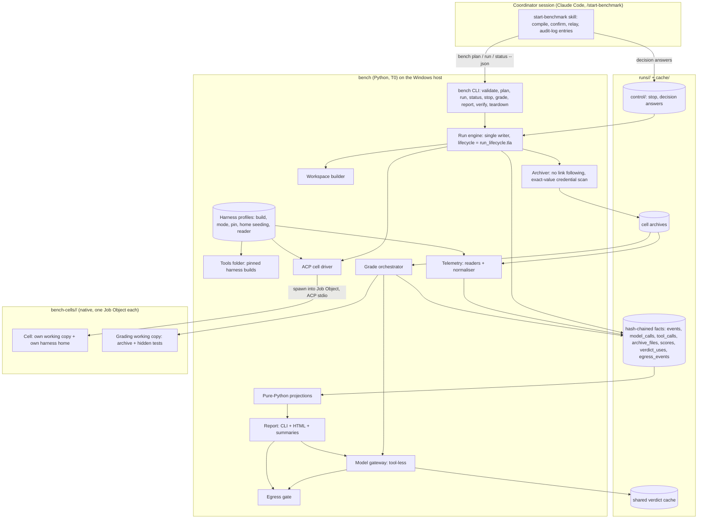

# Architecture: harness-bench

- **Status:** In review. Passed the architect council in two rounds (Gate record); owner decisions 1–5 and 7 ruled; decision 6 open.
- **Tier:** T1.
- **Driving spec:** `docs/specs/harness-bench.md` (US-1..US-52; in review; amended by this architecture, see [Spec amendments](#spec-amendments-made-by-this-architecture)).
- **Evidence:** `docs/notes/spike-runner-path.md` (spikes 1–2), `docs/notes/spike-isolation-permissions.md` (R1, R2, R11, N1, N2).
- **Author / date:** Claude Code (Opus 5.5) for @timianmalloo, 2026-09-23.
- **Supersedes, in the proposal's Architecture section:**
  - "every measured cell is a coord-run/1 worker" (ADR-0002);
  - "OTel collector telemetry sink" (ADR-0008);
  - "judges through Claude Code and Codex" (ADR-0009).

## Context & constraints

**What the system must do:** the spec's core scenario. Run a `harness × model × pack` matrix over a BOM, one isolated cell per (task version, combo, pack, repetition); grade every cell with the strongest oracle; report with honest uncertainty.

**Hard constraints:**
- **Host.** One Windows 11 workstation; local only (NG2); Windows host only (NG9). Docker Desktop only for Harbor tasks (ADR-0013).
- **Isolation.** Each cell works in its own working copy, and nothing more (owner ruling, ADR-0013). US-8, US-13 and US-14 as amended; US-48 withdrawn for authored tasks.
- **Validity.** US-9–US-12: verbatim prompts, pack-free `pack=off`, served model verified with at least one call, pinned builds.
- **Reproducibility.** US-4 and US-26.
- **Scale.** At most 576 cells per run, 4 in parallel, each at most 60 minutes. The smoke worst case is about 12 h of wall clock (`bench plan` states the envelope).
- **Quality attributes that shape the structure:** validity of the comparison over speed; determinism at every non-model step; evidence behind every number; failures attributed, never blamed on the wrong party.

## Archetype & rationale

- **System shape:** a batch **Pipes and Filters** pipeline (validate → plan → run → grade → report), all T0.
- **A — Cascade Pipeline** is used where tiers escalate: the oracle ladder (Cascade + Deterministic Verifier, LOA 1.2 and 3.1) and the scripted-user matcher (T0 match, then a model only for the remainder).
- **Judges:** an independent jury of two vendors (Self-Consistency across providers, LOA 3.5), with the calibration set as the verifier. They are not an Adversarial Ensemble: neither judge argues against the other.
- **AI summaries:** D — Grounded Synthesizer, with claims checked against the results.
- **The agents under test** are H (Long-Horizon Agent) instances. They are what is measured, not part of this architecture.
- **Rejected:**
  - H as the orchestrator (an LLM coordinator scheduling and grading the benchmark): it fails P2 and P3, cannot be model-checked, and reads untrusted cell text (ADR-0007).
  - B (Adversarial Ensemble) as the judge pattern: there is no debate.
  - E (Generate-Verify-Select): nothing is selected among candidates.

## Capability-tier allocation

| Capability | Tier | Why this tier |
| --- | --- | --- |
| Validate, plan, schedule, budgets, stop, resume, archive, teardown, verify | T0 | Fully computable; model-checked lifecycle (P2) |
| Working copy builds, pack on/off | T0 | Deterministic file and git operations |
| Telemetry normalisation, cost, correctness, drift, process, formal checks, statistics | T0 | Mechanical oracles first |
| Egress scan, credential exact-value scan | T0 | Must be deterministic and testable |
| Report rendering | T0 | A pure function of the derived views |
| Scripted-user matcher | T0 in phase 2; + T2/T3 for the remainder from phase 3, cached | Most questions resolve by exact or normalised match (US-31) |
| AI summaries | T3, tool-less | Correctness comes from the claim check (P5) |
| Judges | T3+, tool-less | Only what no mechanical rung can measure; two vendors (P6) |
| Matrix compilation (`/compile`) | T3 in the coordinator session | Checked by `bench validate` and P1's confirmation |

## Component map & boundaries

**Boundaries:**

| Boundary | Where | Rule |
| --- | --- | --- |
| B1 · agent ↔ host | The cell's working copy | The cell works in its own working copy with its own harness home; it runs with the operator's rights and its reach outside the working copy is not restricted (owner ruling, ADR-0013). |
| B1b · cell ↔ cell | Paths | Per-cell working copies and homes; no shared paths by construction (US-8, US-13). |
| B2 · cell ↔ coordinator | `bench status --json` | Schema-bound: enums, ids, hashes, counts, no free strings. Stderr tails go to the archive only (ADR-0002, ADR-0007, US-46). |
| B3 · task oracle ↔ cell | `tasks/<ID>/tests`, `oracle/` | Never in the task clone or its history; copied into a grading working copy only after the cell has ended (US-3, US-8). |
| B4 · benchmark ↔ vendors | The egress gate | The only path for gateway calls and report publication (ADR-0005, ADR-0009). |
| B5 · record ↔ views | `runs/` versus the projections | Views are computed in memory, never persisted as truth (ADR-0006). |
| B6 · cell output ↔ host tooling | Archives and workspaces on the host | Untrusted: no host execution, safe host git, no link following, no agentic tool opens them (ADR-0010). |

**Components** (each is a `/design-slice` unit; backlog id in brackets):
- **start-benchmark skill** [S-01]. Compiles the matrix, presents the plan (US-6), starts `bench run`, relays decision requests, writes the pack audit-log entries. It holds a deny rule for `runs/**` and `bench-cells/**`.
- **Run engine** [S-05, S-13]. Everything in ADR-0007:
  - the lifecycle log, write-ahead launch intents, a Job Object per cell, the control mailbox;
  - monotonic budgets, suspend detection, the failure taxonomy, the circuit breaker;
  - heartbeat, preflight, span instrumentation;
  - resume in the full milestone.
- **Workspace builder** [S-05]. One bench-owned local clone per task version (no remote, no oracle in it or its history); one git working copy per cell under `C:\Projects\bench-cells\<run>\<cell>`, with the pack applied or stripped per the pack manifest. Checks ancestors for instruction files.
- **Tools folder** [S-06]. Harness CLIs and adapters installed from the pinned lockfile into a bench-owned folder and invoked by path; executed build and hash recorded (US-12).
- **Harness profiles** [S-06]. Data per harness, including home seeding and the credential kind rules (ADR-0003); qualified by the profile qualification suite (ADR-0011).
- **ACP cell driver** [S-06]. ADR-0002: narrow input surface, deadlines on every step, verbatim prompt, deny-all permissions.
- **Archiver and teardown** [S-05]. Waits until the cell's Job Object reports no active process. Manifest against the source listing, hashes from the source. No link following. Exact-value credential scan. Deletes only after verification, with bounded retry on Windows sharing violations; otherwise keeps the workspace and reports it (US-19).
- **Telemetry** [S-07]. Readers and a normaliser into disjoint token buckets and OTel GenAI names (ADR-0008).
- **Grade orchestrator and graders** [S-08a–g]. Under `grade.lock`, only archived cells, one grading pass at a time. Every step that runs cell content runs natively in its own grading working copy and Job Object, with a deadline (ADR-0010 as amended by ADR-0013).
- **Model gateway and egress gate** [S-09]. ADR-0009 and ADR-0005.
- **Views and statistics** [S-08f, S-11]. Pure-Python projections over the verified facts (`docs/notes/decision-sqlite-views.md`); canonical sorted exports; bootstrap with the plan's seed.
- **Report** [S-10]. CLI and HTML (spec Part C); the summaries through the gateway.
- **Lifecycle model** [S-13]. `models/run_lifecycle.tla` (obligations below).

**Patterns, named:**

| Where | Pattern |
| --- | --- |
| Harness profiles | Ports & Adapters (data-driven Strategy) |
| Readers and normaliser | Anti-Corruption Layer into a Canonical Data Model (OTel GenAI) |
| Launch intents | Write-ahead intent log / Idempotent Action (LOA 5.3) |
| Control files | Single Writer + command mailbox |
| Facts and views | Event Log + Materialized View (CQRS read model); Receipt Ledger (LOA 4.3) |
| Cell and grading processes | Job Object per process tree (Bulkhead for lifetime and resources; not a sandbox) |
| Egress gate | Guardrail Filter (LOA 6.2) |
| Model gateway | AI Gateway with Read-Through cache on exact keys |
| Oracle ladder | Cascade + Deterministic Verifier |
| Consecutive infrastructure failures | Circuit Breaker |

## Contracts at the seams (sourced)

| Seam / dependency | Contract relied on | Source / spike | Confidence |
| --- | --- | --- | --- |
| ACP v1 over stdio | JSON-RPC 2.0 lines; initialize, session/new (cwd), set_mode, set_model, prompt; refusal `{"outcome":{"outcome":"cancelled"}}` | Spike R11 client; pack transport read | Verified |
| `claude-agent-acp` 0.79.0 | `ANTHROPIC_MODEL` pins; `CLAUDE_CODE_EXECUTABLE` selects the CLI; `settings.json` `dontAsk` + allow list honoured | Spikes 1.3–1.4, R2 | Verified |
| `codex-acp` 1.12.0 | Modes and approval policies as read from source; `CODEX_PATH` selects the CLI | Source read; spikes R2, R11 | Verified |
| Codex CLI 0.156.0 | Accepts `gpt-6-sol` with a ChatGPT-account login; 0.154.0 does not; ACP mode `agent-full-access` runs unsandboxed with no prompts natively | Spikes R11.5, N1.1 | Verified |
| Copilot CLI 1.0.88 / 1.0.89 | `--acp --model`, `--allow-tool`; per-home state; login from the Windows credential store | Spikes 1.2, R1, N1.2 | Verified |
| Native records | Claude `projects/<slug>/<sid>.jsonl`; Codex `sessions/…/rollout-*-<sid>.jsonl`; Copilot `session-store.db` `assistant_usage_events`; token semantics differ per harness | Spikes 1.2, R1.2, R11.2 | Verified (formats unversioned) |
| Windows Job Objects (`ctypes`) | Kill-on-close; `TerminateJobObject`; active-process count; peak memory | Spike N2 | Verified |
| Docker Desktop 4.91 / engine 29.8 | Harbor task containers only | Spike R11.1 | Verified |
| Gateway backend (vendor API or headless, tools off) | Tool-less, schema-constrained output | Not spiked; no keys | Flagged (owner decision) |
| TLC on JDK 21 | Model-check the lifecycle | `tools/check_models.py`; US-44 bounds checked | Verified |
| Python monotonic clock on Windows across sleep | Whether it advances during suspend | Not spiked | Flagged (phase 1) |
| Harbor environments as base images; this driver as a Harbor agent | E-tasks in our container shape | Not spiked; Harbor not installed | Flagged (A6) |

## Cross-cutting concerns

**Identity & trust boundaries.**
- A cell acts under a scoped credential kind (ADR-0003). The operator's own subscription login is allowed only for operator-authored tasks.
- Every archived byte is checked for the exact values of issued credentials.
- The coordinator session keeps the operator's tools but reads only schema-bound status (B2), and it never opens cell content (B6).

**Failure & resilience.**
- At-most-once prompting through durable intents; a Job Object per cell, so a kill is confirmed and an engine crash leaves no running cell.
- A closed failure taxonomy with attribution: infrastructure causes make a cell `invalid (infrastructure)` and never count against a harness (ADR-0007).
- A circuit breaker after consecutive infrastructure failures.
- Deadlines on every subprocess and handshake.
- Idempotent grading by grading pass. Teardown never precedes a verified archive.

**Observability.**
- `events` rows are spans: `run_id` is the trace; every phase of every cell carries start and end and a duration.
- A heartbeat, and `bench status --json`.
- Per-cell resource samples from job accounting (peak memory, CPU time) and archive bytes.
- Gateway usage as a principal.
- The 07:00 question, "what happened?", is answered by `bench status`: counts by cause and attribution, `failed (unclassified)` (target 0), and per cell the cause, evidence set and archive path.

**Data governance & privacy.**
- Archives stay under `runs/` (gitignored), local, and are never published with a report.
- Only the egress gate sends data out.
- Credential copies are deleted before archiving, and archives are scanned for exact credential values.
- Retention is as ADR-0006.

## Load-bearing decisions → ADRs

- **ADR-0001:** every measured cell runs in its own hardened Linux container. **Superseded by ADR-0013 for authored tasks**; kept for Harbor task containers.
- **ADR-0002:** a bench-owned ACP cell driver, not coord-runner or Harbor, with a re-evaluation trigger.
- **ADR-0003:** a pinned per-cell harness profile, scoped credential kinds, and a verified served model.
- **ADR-0004:** a static, symmetric permission profile, with dependencies restored offline.
- **ADR-0005:** one egress gate for the benchmark's own sends; the cell proxy is superseded by ADR-0013.
- **ADR-0006:** hash-chained append-only facts with declared grains; a shared verdict cache; every result a derived view.
- **ADR-0007:** a deterministic single-writer run engine: at-most-once launch, failure taxonomy, clocks, control mailbox.
- **ADR-0008:** telemetry comes from archived native records, normalised to disjoint token buckets.
- **ADR-0009:** one tool-less model gateway with one owner-chosen backend and no fallback.
- **ADR-0010:** cell output is untrusted on the host (B6); grading runs natively in its own working copies (amended by ADR-0013).
- **ADR-0011:** LOA C1–C11 mapped to Python, with a control each, plus the profile qualification suite.
- **ADR-0012:** proportionate security for a single-operator local tool (owner ruling); supersedes parts of ADR-0001, 0003, 0005 and 0010.
- **ADR-0013:** cells run natively, each in its own git working copy and Job Object (owner ruling); supersedes ADR-0001 for authored tasks.

## Lifecycle model obligations (`models/run_lifecycle.tla`, US-44)

**Bounds** (as checked; `docs/design/run-lifecycle-model.md` has the measurements):
- every configuration includes 1 stop and 1 decision request;
- the US-44 bounds (3 cells, parallelism 2, 1 crash) with the engine grading;
- one concurrent `bench grade` process, and 2 grading passes, at 2 cells;
- 2 crashes at 3 cells on demand only: the run did not complete, so this is residual. *(Corrected 2026-09-23: this line had promised ≥ 2 crashes and a concurrent `bench grade` at 3 cells.)*

**Invariants.** Each has a named seeded-bug variant that TLC must reject:
- at most one prompt per cell across any number of crashes;
- no archive while a cell's process tree is live;
- nothing is deleted before its archive is verified;
- each cell is graded at most once per grading pass, and only after it is archived;
- each control input is applied at most once;
- no launch after a stop event;
- no more than `parallelism` cells run at once;
- a stopped cell is never relaunched.

**Liveness** (weak fairness): every decision request is resolved, and a stop reaches a terminal run state.

## Delivery phasing (vertical slices)

| Phase | End-to-end capability it proves | Real | Mocked / stubbed (seam = contract) | Human validation (demo) | Test validation (E2E) | Unblocks |
| --- | --- | --- | --- | --- | --- | --- |
| **1 · walking skeleton** | Prose → plan → 2 combos (cc-sonnet, codex-sol) × pack on/off × 1 rep on the operator-authored fixture task `X1` (tiny Python, hidden test) → native cells in their own working copies → archive → telemetry → correctness + cost in a grading working copy → CLI table + minimal HTML (header, validity banner, leaderboard, drill-down) | Lifecycle model + TLC; engine at parallelism ≤ 2 with intents, a Job Object per cell, failure taxonomy, deadlines, heartbeat, spans; workspace builder and tools folder; the Claude and Codex profiles; driver; archiver with no link following and the exact-value scan; readers; correctness and cost graders; views; report skeleton | Network `unrestricted` (recorded); Copilot not in phase 1; statistics `not computed (k=1)`; no judges or summaries in phase 1 (no caller yet) | `/start-benchmark cc-sonnet and codex-sol, pack on and off, task X1, 1 rep` → confirm → table and report → click a score → evidence | TLC passes and seeded variants fail; the 4-cell E2E asserts outcomes, verbatim prompt hash, served model ≥ 1 call, chained ledgers verify, byte-identical canonical exports on re-grade; kill-in-each-state leaves no process in the cell's job; B6 tests (fsmonitor, symlink, hook); ledger tamper tests; fault injection (an adapter crash, a handshake hang, a disk-full write) each gets its own cause and `failed (unclassified)` stays 0; per-cell resource samples (peak memory and CPU time from the job, archive bytes) recorded for the disk projection | Every later phase |
| **2 · smoke on all harnesses** | The six smoke tasks on all three harnesses, overnight | + Copilot profile (native, no token); T0 scripted-user matcher for A1; Harbor E1 base image (spike A6); stop, decision timeout, circuit breaker; power request; per-class canaries (US-13); benchmark credentials required for non-operator tasks | Judges and summaries not yet (their metrics NOT_RECORDED, stated) | P1 runs the smoke BOM overnight; at 07:00 `bench status` explains every non-completed cell | Stop within 30 s; answer-versus-timeout race | Real grading at scale |
| **3 · full graders + judges** | Every smoke metric graded; judged items blind by two vendors | + drift, rigor, mutation, clarify, process graders; model gateway (owner-chosen backend); egress gate; calibration sets; matcher model rung | Summaries | Re-grade the smoke archive; κ in the header | Byte-identical re-grade from cache; injection fixture (US-46); egress canary (US-47) | The complete report |
| **4 · report + statistics** | The complete Part C report with intervals, pack effect and AI summaries | + bootstrap; every section; summaries with the claim check; publication through the egress gate | — | Two P3 readers name the leader and the pack effect (R9) | UIA-1..15; axe; offline load | The full grid |
| **5 · full grid** | 24 tasks × combos × packs × 3 reps; resume; comparison; G-tasks after S-12; protocol conformance | + resume; comparison; stability; G-task images; the coordination-protocol model | — | A pack change validated by a re-run comparison | Crash in each state, then resume; TLC on the coordination model | — |

**Seam contracts:**
- the network mode is recorded per cell (`unrestricted`);
- the Copilot profile is absent from phase-1 plans (phase 2);
- judged and summary outputs are NOT_RECORDED with a reason until phase 3.

Each is replaced by substitution behind the same record.

## LOA conformance check

Mapped to Python with one control per criterion in **ADR-0011**. Recorded deviations:
- cells act as a benchmark principal, which inverts P11 on purpose;
- cells run with the operator's rights and an `unrestricted` network (owner ruling, ADR-0013).

## Spec amendments made by this architecture

Applied to `docs/specs/harness-bench.md` on 2026-09-23:
1. **In scope:** every cell runs in a Linux container (ADR-0001). *Superseded by ADR-0013: authored-task cells run natively in their own working copies; Harbor tasks in containers.*
2. **Domain model:** the pack is not the benchmark's runner; the ACL is the coordination-ledger reader in the grader (ADR-0002).
3. **NFR Compatibility:** Linux containers on a Windows host; report headers say so. *Superseded by ADR-0013: native Windows; report headers say so.*
4. **Conflict C9:** proxy enforcement from phase 2; phase 1 `unrestricted` for operator-authored tasks only.
5. **US-11:** at least one successful model call; `invalid (no model call)` (spike R11.5).

## Owner decisions

**Ruled 2026-09-23:**
1. **Credentials:** subscriptions only, no API keys (ADR-0003).
2. **Gateway backend:** the headless CLIs with every tool denied (ADR-0009).
3. **Pack's coordinator runner:** the benchmark MUST NOT run in it; re-evaluation trigger withdrawn (ADR-0002).
4. **Security weight:** proportionate for a single-operator local tool; git is a mechanism, not an entry point (ADR-0012).
5. **Third-party tasks:** may run on the operator's subscriptions; the owner accepts the risk (ADR-0012).
7. **Spec acceptance:** `docs/specs/harness-bench.md` accepted by the owner.
8. **Isolation:** containers dropped for authored tasks; each cell works in its own working copy, and nothing more (ADR-0013).
6. **Copilot credential:** closed by ruling 8. Natively, Copilot uses the Windows credential store (spike N1.2); no token and no probe C1.

**Still open:** none.

## Flagged risks & residual unknowns

| # | Risk | Next probe | Phase |
| --- | --- | --- | --- |
| A1 | *Closed by ADR-0013: no cell proxy.* | — | — |
| A2 | *Closed by ADR-0013: Copilot runs natively (N1.2).* | — | — |
| A3 | Copied OAuth logins may rotate and invalidate the host login | Watch the token file across a long cell | 1 |
| A4 | Claude account context under a subscription login | Benchmark account or API key (owner decision 1) | 1 |
| A5 | Per-cell resources at parallelism 2+ | Peak memory and CPU time from the job, on D1 | 2 |
| A6 | Harbor environments as base images; this driver as a Harbor agent | Spike on E1 | 2 |
| A7 | Gateway backend | Owner decision 2; US-46 fixture | 3 |
| A8 | Native record formats change across CLI builds | Profile qualification suite (ADR-0011) | all |
| A9 | Monotonic clock across sleep on Windows | Sleep the host during a cell and observe | 1 |
| A10 | An agent reads or changes things outside its working copy (other repos, hidden tests in the bench repo, the host toolchain) | Accepted by the owner (ADR-0013); undetected. Upgrade if seen: a reach audit over tool calls | all |
| A11 | An adapter's child CLI leaves the cell's Job Object | Probe N4: breakaway never allowed; check the job's process list during a turn | 1 |

**Residual architectural risk.**
- The benchmark measures harnesses on the owner's Windows workstation under a declared profile.
- Each cell can reach its own model credential.
- An agent could exfiltrate through an allowlisted vendor host using its own key. That is acceptable only with revocable, spend-capped credentials.

## Status & next action

| | |
| --- | --- |
| **Completed** | Spikes R1, R2, R11; this architecture; ADR-0001..0011; phasing plan; spec amendments |
| **Remaining** | Phase 1 walking skeleton → 2 smoke on all harnesses → 3 graders + judges → 4 report + statistics → 5 full grid |
| **Best next action** | `/design-slice` of phase 1, starting with the lifecycle model (S-13), then the run engine, workspace and image builders, the Claude and Codex profiles and the ACP driver (S-05, S-06) |

## Gate record

**Round 1 (2026-09-23).** Distributed Systems (hard veto, 6 items), Security (hard veto, 3), Data & Persistence (veto, 5) and SRE (advisory block, 2) blocked. The Simplifier soft-blocked (2 items). The Enterprise Architect passed with conditions (4). Resolutions:
- **Distributed Systems:**
  - V1: named containers, kill + inspect (ADR-0001, 0002, 0007);
  - V2: hash chain, fsync per line, torn-tail rule (ADR-0006);
  - V3: atomic, apply-once control files, first resolution wins (ADR-0007);
  - V4: grading passes, `grade.lock`, only archived cells (ADR-0006, 0007);
  - V5: monotonic clocks, suspend detection (ADR-0007);
  - V6: the TLA+ obligation list above.
- **Security:**
  - V1: B6 and grading containers (ADR-0010);
  - V2: safe host git, no link following, no host tooling (ADR-0010);
  - V3: credential kinds, operator login for operator tasks only, exact-value scan, phase-1 restriction (ADR-0003, 0005).
  - Advisories applied: B2 schema, driver input surface, hardening, proxy bypasses, supply chain.
- **Data & Persistence:**
  - V1: grading passes, scores keyed by pass;
  - V2: grains for attempts, decisions, archive files, egress, principals;
  - V3: shared content-addressed cache + `verdict_uses`;
  - V4: `price_list_version` removed from scores, cost derived;
  - V5: per-line chain (all ADR-0006).
- **SRE:**
  - B1: closed failure taxonomy with attribution and evidence (ADR-0007);
  - B2: deadlines, kill by name, heartbeat, circuit breaker (ADR-0002, 0007).
  - Advisories applied: span schema, resource limits and preflight, disk projection, host drift, run envelope.
- **Simplifier:**
  - 1: one gateway backend (ADR-0009);
  - 2: `cell_outcomes` merged into `events` (ADR-0006);
  - 3–5: no persisted DuckDB, per-line chain instead of manifests, the cache as the lookup;
  - 6–7: no phase-1 gateway mock; T0 matcher in phase 2;
  - 9–12 applied.
  - **Not adopted:** item 8 (TLA+ off the skeleton's critical path). Spec US-44 orders the model first; the owner may amend it.
- **Enterprise Architect:**
  - 1: Harbor alternatives and spike A6 (ADR-0001, 0002);
  - 2: the loss of pack dogfooding recorded, with an upstream request, a re-evaluation trigger and owner decision 3;
  - 3: spec amendments applied;
  - 4: ADR-0011.
  - Advisories applied: patterns named, the jury relabel, the qualification suite, the cost model, summaries through `bench report`.

**Round 2 (2026-09-23): all six lenses cleared.** The conditions they set were applied as worded:
- **Distributed Systems:** the resume case "intent, container present, no `prompt_sent`" (ADR-0007 §2); every grading pass takes `grade.lock` (§8).
- **Security:** refreshed-token and encoded-form scanning; "operator-authored" derived from provenance (ADR-0003).
- **Data & Persistence:**
  - `events` keyed `(run_id, segment_id, seq)`;
  - latest pass = greatest `recorded_at`, tie-broken by `grading_id`;
  - grade-process exclusivity under `grade.lock`;
  - report-scoped egress key (ADR-0006).
- **SRE:** fault-injection and resource-sampling tests in phase 1; deadlines and the staleness threshold as plan parameters; vendor-retry evidence (ADR-0007).
- **Simplifier:** the archive hash is derived from `archive_files`; spans reuse the `events` timestamps.
- **Enterprise Architect:** pass. The cost figure is measured after smoke.

**Carried conditions:**
- the phase-1 tests listed in the phasing table (tamper, kill-in-each-state, B6, fault injection);
- the phase-1 clock spike (A9);
- the phase-2 proxy spike (A1);
- owner decisions 1–3.

`GATE define-architecture · 2026-09-23 · Distributed Systems, Security & Identity, Data & Persistence, SRE, Enterprise Architect (+Patterns), Simplifier · criteria met: archetype + tiers named with rejections; durable representation and grains in ADR-0006; unfamiliar contracts spiked or flagged; LOA principles applied, C1–C11 mapped with controls (ADR-0011); cross-cutting concerns designed in; vertical phasing with walking skeleton; 11 ADRs; residual risk stated · verdict: PASS (2 rounds; round 1: 4 blocks, 1 soft block, 1 conditional) · vetoes→resolution: 16 veto/blocker items resolved in ADR-0001..0011; Simplifier item 8 not adopted (spec US-44) · authors did not clear their own vetoes`

---
**Handoff:** → `/design-slice` per component, starting with the phase-1 slice.
