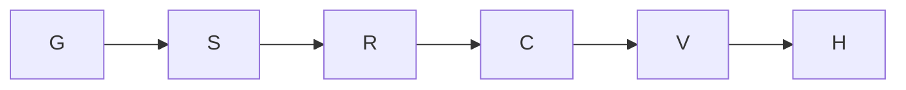

Goal: deliver J1a on build/eval-x-j1a. Done when skeleton, assertion-red and
budget-clock green commits pass R-104. J1b–J1e implementation, campaign ledgers,
the whole suite and the Leader's join gate are excluded. Tier T2; agent fan-out 0.

Compiled contract: al-01M469GTXG8T4MPEYQ7PN490WY. Verified base a26060c1,
integration head at dispatch, contains 37ec0585 and W0 revisions 6.10 and 6.11.
The current coordination plan names Leader epoch 18. The runner holds the tree
as x-j1a2-e1e4; the compiled commit/coord identity is x-j1a-e1e4. Reconciliation
request req-01M46A8G3E08H8Q1G54Q2GHTM9 preserves the runner hold.
Artifact seam: req-01M46A7GAWNG9GSM37RSE0JC9Z. This document is its fallback.

The domain model and invariants are W1-J sections 2–4, unchanged: a Cell owns
one prompted attempt and one budget; turns and snapshots are append-only facts.
Surfaces: registry → fake agent → driver session → plan turns → engine loop →
archive skeleton → lifecycle cell-start predicate → status elapsed → tests.
No new module or dependency is required. Reuse and stdlib satisfy the ladder.

| Node | Goal / inputs | Exit / oracle | Tier | Capability | Dependencies |
|---|---|---|---|---|---|
| G | Ground binding files and base | integration ancestry and W0 observed | T2 | Reasoning | none |
| S | Registry, K1 options, K2 signatures and bugs | existing owned tests and eight guard files green; skeleton commit | T2 | Reasoning | G decision |
| R | Whole K3 table | assertion failures; no missing-name or lookup failures; four required red lines in commit | T2 | Reasoning | S data |
| C | Shared first-prompt clock | T-ENG-2 and T-STATUS-1 green; later tests strict xfail by turn | T2 | Reasoning | R data |
| V | R-104 worker gates | each specified command's output and exit read; failures repaired | T0 | Deterministic mechanics | C data |
| H | Evidence, audit and handoff | served model from native record; named commits and residuals | T1 | Reasoning | V data |

All gates, red-first evidence, surface proof and audits are immovable floors.
Naive and optimized graphs have six macro nodes, width one, and no fan-out.
Work and span are equal at width one. Duration is not estimated: no comparable
dispatch measurement establishes it. The optimization combines related reads
and uses one shared predicate; it removes no proof. Adversarial checks: the
Test Architect oracle rejects lookup-reds and vacuous fixtures; the Simplifier
rejects new layers; SRE rejects unmeasured speed claims. Independent author
review remains the Coordinator's join responsibility; it is not self-cleared.

Budget: 3,300 seconds this dispatch; 320 calls across five dispatches. Repair
loops decrease the count of observed unresolved gate failures, floor zero;
exit means every required gate passed. Budget exhaustion is a defect signal
and hands remaining work to the brief's Sonnet fallback; it never drops a gate.
Re-plan at skeleton guard results and K3 failure classification. Only real data
and decision edges remain. No planned test claims a result until executed.

## Delivery ledger

Execution in progress. Measured durations and results will be recorded here.
