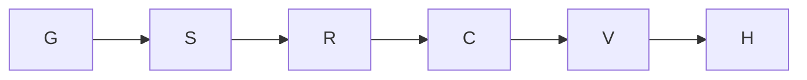

Goal: deliver J1a on build/eval-x-j1a. Done when skeleton, assertion-red and
budget-clock green commits pass R-104. J1b–J1e implementation, campaign ledgers,
the whole suite and the Leader's join gate are excluded. Tier T2; agent fan-out 0.

Compiled contract: al-01M469GTXG8T4MPEYQ7PN490WY. Verified base a26060c1,
integration head at dispatch, contains 37ec0585 and W0 revisions 6.10 and 6.11.
The current coordination plan names Leader epoch 18. The runner holds the tree
as x-j1a2-e1e4; the compiled commit/coord identity is x-j1a-e1e4. Reconciliation
request req-01M46A8G3E08H8Q1G54Q2GHTM9 preserves the runner hold.
Artifact seam: req-01M46A7GAWNG9GSM37RSE0JC9Z. This document is its fallback.

The domain model and invariants are W1-J sections 2–4, unchanged: a Cell owns
one prompted attempt and one budget; turns and snapshots are append-only facts.
Surfaces: registry → fake agent → driver session → plan turns → engine loop →
archive skeleton → lifecycle cell-start predicate → status elapsed → tests.
No new module or dependency is required. Reuse and stdlib satisfy the ladder.

| Node | Goal / inputs | Exit / oracle | Tier | Capability | Dependencies |
|---|---|---|---|---|---|
| G | Ground binding files and base | integration ancestry and W0 observed | T2 | Reasoning | none |
| S | Registry, K1 options, K2 signatures and bugs | existing owned tests and eight guard files green; skeleton commit | T2 | Reasoning | G decision |
| R | Whole K3 table | assertion failures; no missing-name or lookup failures; four required red lines in commit | T2 | Reasoning | S data |
| C | Shared first-prompt clock | T-ENG-2 and T-STATUS-1 green; later tests strict xfail by turn | T2 | Reasoning | R data |
| V | R-104 worker gates | each specified command's output and exit read; failures repaired | T0 | Deterministic mechanics | C data |
| H | Evidence, audit and handoff | served model from native record; named commits and residuals | T1 | Reasoning | V data |

All gates, red-first evidence, surface proof and audits are immovable floors.
Naive and optimized graphs have six macro nodes, width one, and no fan-out.
Work and span are equal at width one. Duration is not estimated: no comparable
dispatch measurement establishes it. The optimization combines related reads
and uses one shared predicate; it removes no proof. Adversarial checks: the
Test Architect oracle rejects lookup-reds and vacuous fixtures; the Simplifier
rejects new layers; SRE rejects unmeasured speed claims. Independent author
review remains the Coordinator's join responsibility; it is not self-cleared.

Budget: 3,300 seconds this dispatch; 320 calls across five dispatches. Repair
loops decrease the count of observed unresolved gate failures, floor zero;
exit means every required gate passed. Budget exhaustion is a defect signal
and hands remaining work to the brief's Sonnet fallback; it never drops a gate.
Re-plan at skeleton guard results and K3 failure classification. Only real data
and decision edges remain. No planned test claims a result until executed.

## Delivery ledger

Execution in progress. Measured durations and results will be recorded here.

Verified skeleton: 3cde5fc6. Eight-file guard gate: exit 0, 200 passed in
65.35 seconds. Existing driver/engine/archive/plan/error tests: exit 0,
400 passed in 218.73 seconds. No new runtime module was introduced; every
changed module already has an identity.CLASSES entry. No stored-plan reader
was added, so T-E19 needs no new entry.

Verified K3 red: afee24b4. 43 failed by assertion, 7 passed, 19.01 seconds.
JUnit contains no error nodes, and each failure is an assertion. Required
evidence: T-ENG-2 completed instead of timed_out; T-ENG-4 sum 7 instead of 12;
T-ENG-6 prompt_sent{2} present after max_tokens; T-DRV-1 session/new count 2.
The real CLI wiring row reaches its missing-snapshot assertion after real
plan and run. Windows junctions, rather than privileged symlinks, exercise
the link row. All transient fixture setup failures were corrected before
the red commit; they are not counted as bug evidence.

Seven green-on-arrival cases also pass with the integration base a26060c1's
source imported from an archive inside this assigned cwd: single-turn wrapper
success and EOF; final writer omission/hash; final-spelling hash/duplicate;
valid mid-turn HB-CELL-118; both archive-reader guard cases. Three other
CrashedTurnPredicate cases fail on that base, as expected. None was faked red.

K4(1) uses lifecycle.is_cell_start in both engine and status. Status keeps
the first matching row with setdefault. Owned test run: exit 0, 9 passed,
41 strict xfailed in 20.63 seconds. Each expected failure names J1b, J1c or
J1d; each later dispatch removes its own marker when the behaviour passes.

The installed pack references kb-graph-and-loop-engineering, but this tree
has no docs/knowledge directory or indexed artifact with that id. The
execution standard itself was read from .claude/knowledge. A dangling typed
link to the absent artifact was removed rather than inventing its identity.
Remaining independent review is the Coordinator's join, with fan-out zero.

Verified follow-up red fdaad48c: the native fixture's real extractor reported
5 instead of 12. Green e39f40c5 gives each prompt a distinct native message id
and exposes per-turn ACP totals. The final owned tests pass: 10 passed,
41 strict xfailed in 20.72 seconds; the two legacy golden-ledger cases pass.
The final eight-file guard run on e39f40c5 passes: 200 passed, exit 0, in
58.90 seconds. Ruff passes, exit 0. Docs graph validation passes, exit 0,
zero defects; 16 pre-existing review suggestions are advisory.

Defect class → sweep → derive → prevent (Coordinator owns the register):

* TEST-B: a fake can emit syntactically valid rows whose reused native ids
  make its real reader discard a later turn. Sweep: the fake's one native
  assistant writer and claude_code.read's seen_messages set; no second fake
  writer retains msg_1. Control: the real extractor must observe 5 + 7 = 12
  in test_k1_native_record_contains_both_turns_without_duplicate_message_ids;
  red fdaad48c, green e39f40c5. T-ENG-4 confirms a plan and seeds sealed
  native facts so a missing pass or skipped cross-check cannot count as proof.
* TEST-B fixture setup: Windows file symlinks require privilege, and a tiny
  CLI matrix cannot satisfy launch balance. The link fixture uses a real
  junction; the CLI fixture uses 20 repetitions. Their final K3 reds are the
  missing-link-row and missing-snapshot assertions, not setup failures.
* Documentation metadata: a required summary or an absent graph target can
  make a new artifact invalid. Sweep: this artifact's frontmatter and links.
  Control: docs-graph validate rejected both and now reports zero defects.

Native served model: gpt-6.1-sol, from turn_context.model in
rollout-2026-10-05T08-14-33-01a10ca1-8042-79b2-b585-fdd9c0bbbaf3.jsonl.
No model identity is inferred from the dispatch pin. The audit prompt was
captured verbatim from that native record, al-01M46C6M4Y1R4AY8P22N3EQ790.

Partial delivery at the README section 2's 85% stopping threshold (2,805 of
3,300 seconds). Engine mutations waited behind Leader PID 5944's full-suite
lock since 08:42:34 local time, with no mutant result. The owned tool session
was interrupted (exit 1); `mutate_check.py --restore` exited 0, reporting
"nothing to restore". Its terminated process tree and stale owned queue ticket
were checked; only that ticket was removed. The Leader's lock was untouched.
Driver mutations were not started, because they must follow engine mutations.
The worker gate is incomplete. Acceptance items 1 and 4 are verified green.

Completed: registry, K1, K2, assertion-red K3 table, K4(1) and all completed
gate results above. Remaining: engine.json and then driver.json mutations,
and the eight-file guard run on the eventual final handoff SHA (the recorded
green guard run is on the final runtime SHA e39f40c5). Next: the Owner/Leader
uses the same-tree fallback after releasing the suite lock, then joins with
the three open seam requests reviewed. J1b–J1e stay future dispatches.

Graph result: G, S, R and C reached their exits. V stopped at the shared
mutation lock, so H is a partial handoff rather than a claimed complete gate.
The elapsed budget stop is a defect signal: serialized readiness work consumed
the available wall time despite all completed checks passing. Preserve the
suite-lock floor and schedule the remaining worker checks after the batch.
