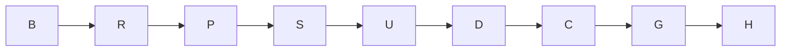

# X-J1b execution and proof plan

Goal: implement K4(2), K4(3), K4(4) on build/eval-x-j1b in this assigned checkout.
Done when: three fix commits remove only their J1b markers, all required worker gates pass, and evidence reaches the Owner.
Not in scope: J1c snapshots/recovery, J1d readers/lifecycle/plan, J1e mutant rows/spikes, status.py, atomic-site allowlist, whole suite, --touched, primary merges.
Tier: T2. Fan-out cap: 0. Budget: 3,300 seconds, within X-J1's 320 calls across five dispatches; stop at the binding 85% threshold with an honest partial report if necessary.

## Grounded facts

Verified base: be2df9cb359a9b03288efecb507def0adb5571c6 equals integrate/e2e4-18 at dispatch. W0 rev 6.11 is present at 4760e55e; a3cfbcfe is an ancestor (exit 0). Working tree was clean.
Verified native record: rollout-2026-10-05T11-06-32-01a10d3e-f42a-7182-a715-799dbf0e6c93.jsonl, cwd matches, model gpt-6.1-sol, effort high, CLI 0.160.0.
Verified base guard: eight named files, 200 passed in 66.30 seconds, exit 0. Named-file runs do not acquire the suite lock (tests/suite_lock.py).
Verified red: six named controls, seven assertion failures, 2.34 seconds, exit 1. No J1b control is green on arrival.
Graph traversal: design-eval-multi-turn -> design-eval-seam-contracts, spec-enterprise-evaluation, arch-evaluation-campaign, adr-0015-multi-turn-attempt-and-turn-snapshots. The context packet reported existing review-suggested neighbors; these are outside this worker's paths.
The optimize-graph skill's kb-graph-and-loop-engineering target and evidence directory are absent in this installation (Verified). The graph validator rejected that template link, so the unshared creation commit was amended to carry only verified targets. Class: stale template references; control: docs-graph.py validate fails on dangling links. No new knowledge artifact is invented to hide the missing dependency.

## Domain and surfaces

Bounded context: evaluation execution. Session is the attempt's channel aggregate, with invariant one handshake and one stdin close. TurnRecord is a returned-response value object, referenced by turn number within the attempt. Existing ledger facts remain append-only.
Grain: one cell.turn_ended event is exactly one returned prompt response. A failed send returning None has no such event. Usage and turn_seconds are additive over returned turns; stop_reason and next are non-additive. Existing historical rows keep their original meaning; legacy single-turn cross-checks retain the process-ended fallback.
Surface list: driver TurnRecord/result.turns -> engine usage and decision loop -> events/turn_usage facts -> views._token_cross_check -> CellView warnings and views.verify. Outcome turn_ms and stop_reason keep their last-turn units; agent time is derived from turn rows. CLI wiring and full lifecycle replay remain J1d, not claims of this dispatch.
Operators read duration from turn_seconds, volume/spend from usage, path from next, and failure from cell.outcome cause. Existing trace-stamped ledger records emit these on the normal path. No new personal-data, credential, permission or subprocess-launch contract is introduced.
Ladder: reuse landed interfaces and normalization; stdlib summation and existing ledger writes. No dependency, second domain representation, new snapshot call or parallel agent.

## Execution graph

| Node | Goal and inputs | Exit/oracle | Tier | Capability | Dependency |
|---|---|---|---|---|---|
| B | Base identity, design/ownership grounding | Required SHA checks and served-model read succeed; otherwise stop | T0 | Deterministic mechanics | none |
| R | Base guards and six controls, immovable | 200 guards green; assertion reds recorded | T0 | Deterministic mechanics | B, data |
| P | This create-only plan and HTML | Named-path plan commit; no overwrites | T2 | Reasoning | R, data |
| S | Narrow compatibility/index seams | Request ids in separate green fallback commits | T1 | Deterministic mechanics | P, data |
| U | K4(2) returned-turn usage and success rows | T-ENG-4 both sources/no HB-VAL-005, T-ENG-11 green | T2 | Reasoning | S, data |
| D | K4(3) returned response before decisions | T-ENG-6/10 green; only end_turn continues; no None row | T2 | Reasoning | U, data |
| C | K4(4) session lifetime | T-DRV-1/2 green; stdin closed once, closed send sets cause | T2 | Reasoning | D, data |
| G | Final guards, runtime tests, mutations, lint, graph, source grep; immovable | Each explicit command exit read; every mutant killed or survivor explained | T0 | Deterministic mechanics | C, data |
| H | Audit/evidence and independent join review | Report SHAs/red/gates/seams/cost; Leader owns merge and review | T2 | Independent review | G, data |

Before/after: nine logical nodes, width one, same rigor floors; independent shell reads may be batched, gates and edits remain serial. Inferred equal-weight model: work T1=9 units, span Tinf=9 units, ceiling at p=1 is 9 units. These are topology units, not duration predictions. There is no claimed speed improvement or measured bottleneck. Collapsed redundant grounding and preserved distinct commit/gate boundaries to reduce token cost. Fan-out overhead is avoided by the explicit zero cap.
Repair loop variant: number of unmet scoped assertions/gates; floor zero; exit all named criteria met; deadline is a circuit breaker, never proof of completion. Re-plan checkpoints: base drift, unexpected guard failure, strict XPASS outside J1b, mutation survivor, suite lock wait, leadership change. Failure containment: own checkout and named paths only; fallback is the specified Sonnet follow-on, never skipped gates.

## Red proof pack (all Verified on be2df9cb)

| Contract | Test in tests/test_multiturn.py | Observed failing assertion | Planned proof |
|---|---|---|---|
| K4(2), W1-J 4.5 | test_t_eng_4_usage_sums_every_turn[acp_turn] | assert sum(r["uncached_input"] for r in rows) == 12, rows (7 == 12), line 172 | real extraction, ledger and view cross-check |
| K4(2), W1-J 4.5 | test_t_eng_4_usage_sums_every_turn[native_record] | assert sum(r["uncached_input"] for r in rows) == 12, rows (7 == 12), line 172 | both token sources, no HB-VAL-005 |
| K4(2), W1-J 4.5 | test_t_eng_11_outcome_last_turn_and_total_agent_time | assert len(ended) == 2, "agent time requires every returned turn" (0 == 2), line 252 | additive turn time, last-turn outcome units |
| K4(3), W1-J 4.2 | test_t_eng_6_only_end_turn_continues | assert not row(events, "cell.prompt_sent", 2), "max_tokens must not send turn 2", line 191 | stopping response retained, next=stop |
| K4(3), W1-J 4.2 | test_t_eng_10_returned_turn_is_recorded_before_cancel | assert ended, "a returned response must be recorded before a cancel decision", line 242 | returned response retained, next=cancel |
| K4(4), W1-J 4.1 | test_t_drv_1_one_handshake_for_two_prompts | assert sum(r["kind"] == "session/new" for r in rows) == 1, rows (2 == 1), line 270 | real ACP pipe log |
| K4(4), W1-J 4.1 | test_t_drv_2_close_is_idempotent_and_closed_send_has_cause | assert error is None, "Session.close must close stdin exactly once", line 290 | repeated close, no send after close |

Additional boundary controls, if required, are observed red before their fix. Existing regression files remain green. J1c/d/e markers remain; strict XPASS is a finding, never silently unmarked.
Class -> sweep -> derive -> prevent: last-record-only aggregation loses history (engine usage and ACP comparison swept); existing T-ENG-4 controls both. Completed-outcome membership differs from continuation membership; T-ENG-6 controls this distinction. Cancel-before-record loses returned facts; T-ENG-10 controls ordering. Resource lifetime per turn repeats session initialization/close; T-DRV-1/2 control aggregate lifetime. Defect-register text is sent to the Coordinator, who owns the register.

## Review and delivery ledger

Peer lens: implement the previously gated W1-J rev 2 design using its landed names. Adversarial lens: incomplete usage must not turn into zero; stopping/cancelled responses must survive; closed stdin must not be closed twice. Test Architect, DS and SRE claims are bounded by the listed real-process controls and required mutation gate. Independent pre-merge approval belongs to the Leader/Coordinator; this worker does not self-approve it.
Rollback: revert the relevant named-path fix or seam commit. Seam requests: req-01M46M1XK94E5PEF7KMQRM6YGW (token-check caller) and req-01M46M3FXJ439W4F61Z5VH03J2 (derived index).
Create-only constraint: this file is not updated after its commit. Actual node outcomes, duration, tokens, tool-call count, rework and gate results belong to the closing audit record and final report. Not yet verified at plan creation: final gates, green commits, independent join review.
