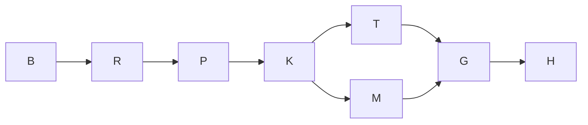

# J1c execution and proof plan

Goal: implement K4(5) snapshots/recovery, then single-turn turn_ended in a separate commit, on build/eval-x-j1c.
Done when: named worker gates pass, J1c markers come off with their fixes, S-J5 is measured or explicitly not run, and evidence reaches the Owner.
Not in scope: J1d readers, turn-keyed lifecycle and plan; J1e mutants/S-J4; atomic.py, W0, status.py; full suite and --touched.
Tier T2. Fan-out cap 0. Budget 3,300 seconds, within X-J1's 320 calls across five dispatches. The deadline is a circuit breaker, never proof of completion. The 85% checkpoint hands back named open work if required.

## Grounding

Verified base bdefbf0bb89a24ade04437ba511ce6fdf83ca75f: clean assigned branch, 60da1888 ancestor (exit 0), W0 rev 6.12 commit b8dc7cdd present. It is the integration dispatch head after J1b and Coordinator #36, not main. The integration ref subsequently advances independently; do not chase it.
Verified native record rollout-2026-10-05T15-19-20-01a10e26-6749-7ff2-9a8f-7a449d1326bf.jsonl: cwd matches, model gpt-6.1-sol, high effort, CLI 0.160.0.
Verified base guard: 200 passed, 76.34 seconds, exit 0. J1c reds: 13 assertion failures, 74.83 seconds, exit 1, no green-on-arrival J1c cases. No lookup/import errors count as reds.
Graph path: brief-eval-x-j1 -> design-eval-multi-turn -> design-eval-seam-contracts. The graph-engineering knowledge target is absent in this installed pack (previous dispatch's plan records the same gap); retain verified graph targets only.
Coord doctor reports three unrelated overdue requests; no live lease overlap. Observed leadership epoch is 18, matching the integration branch named by this dispatch; recheck at commits.

## Domain, surfaces and controls

Bounded context: evaluation execution. Cell is the aggregate, invariant one prompted attempt, one budget and one outcome. TurnRecord is a response value object. Snapshot is an immutable fact identified by cell and turn, not a new aggregate.
Grain: archive_files is one file/link per run, cell, archive attempt, snapshot and path. Snapshot event is one durable commitment per cell/turn. Rows and events are append-only; final rows omit snapshot. No backfill or duplicate hash definition.
Measures: file/byte counts and duration are additive; process gauges and hashes are non-additive. First-update baseline is read once; absent update means absent baseline. copy_retries is null because publish_dir returns fill's result, not rename retries.
Surface list: _Copy and snapshot_cell -> publish_dir/verify -> engine retry/recovery -> archive_files rows -> snapshot event -> next prompt barrier. Driver first update -> attempt baseline -> turn_ended{1}. Single-turn cells reach the same row producer in the second fix. J1d owns snapshot view keys, final filtering and turn-keyed replay; this dispatch does not certify them.
Operators read snapshot latency from duration_ms, volume from files/bytes, activity from the two gauges and baseline, failures from outcome Cause.archive or the existing cancellation cause. Existing trace stamping persists these on the normal path.
STRIDE: links are recorded and never followed; only ws is copied; credential exclusions remain. Immutable publish plus hash verification prevents incomplete final names. Wrong/released locks must refuse the sweep. Retry cannot send a prompt before the snapshot event or fabricate missing gauges. No permission or launch policy changes.
Testing trigger union: T1 deterministic decisions, T4 filesystem persistence, T7 event payloads, T8 existing fake boundary, T12 multi-step workflow; apply D0/D1/D4/D6/D7/A4. Real-process ACP tests and real atomic publication provide integration proof; required existing mutation files provide adversarial controls. No new dependency.
Ladder: reuse J1b names, _Copy, archive_hash, publish_dir, sweep_temps and existing ledger barrier. Reject direct copytree (partial published folder) and a second retry counter/hash implementation (DM7).

## Execution graph

| Node | Goal/inputs | Exit and oracle | Tier | Capability | Dependency |
|---|---|---|---|---|---|
| B | Base, contracts, native identity | Required SHA/revision/model observations succeed | T0 | Deterministic mechanics | none |
| R | Base guards and J1c reds, immovable | 200 guards green; 13 assertion reds recorded | T0 | Deterministic mechanics | B data |
| P | Create-only plan/HTML and seams | Named-path plan commit, seam ids recorded | T2 | Reasoning | R data |
| K | K4(5): ws copy, sweep/retry, recovery, baseline, one TABLE entry | J1c cases green; source caller scan/allowlist equality green | T2 | Reasoning | P decision |
| T | Single-turn row, separate commit | New assertion observed red; unified loop writes exactly one next=final row | T2 | Reasoning | K data |
| M | S-J5 real D1 publication at parallelism 3 | Cold/warm duration_ms beside 1.3s floor, or reason not run | T0 | Deterministic mechanics | K data |
| G | Final R-104 guards, named runtime tests, three mutations, ruff, graph | Each independent exit read; every survivor explained | T0 | Deterministic mechanics | T/M data |
| H | Closing audit/evidence; independent join | SHAs, reds, gates, seams, costs, residuals sent to Owner | T2 | Independent review | G data |

Before/after: eight logical nodes, width one, rigor floors preserved. Inferred equal-weight work T1=8 and span Tinf=7 topology units; at p=1 ceiling=8. These are not elapsed-time predictions. Collapse repeated grounding; pull base gates before implementation. Fan-out is forbidden by dispatch; measurement and edits run serially to avoid I/O contention. No bottleneck or speed claim is inferred.
Retry variant: remaining permitted source/ledger attempts, floor zero; success or cancellation exits; three total attempts with waits 1/2/4 after failures, then Cause.archive. This follows W1-J's "after third failure" and T-SNAP-6's three calls; req-01M472JWD2FZH6Q2TXW5Q1W7SH reports the contradictory "retry up to 3 times" wording.
Repair variant: unmet scoped assertions; zero is done; deadline is a defect signal. Re-plan only on unexpected guard failure, strict XPASS, mutation survivor, lock wait, base invalidity or leadership change. Do not silently drop gates.

## Base red proof (Verified on bdefbf0b)

All tests below are tests/test_multiturn.py, run with uv run pytest -q --runxfail and the named J1c selection.

| Control | Failing assertion | Oracle |
|---|---|---|
| T-ENG-5 | assert row(events, "cell.turn_snapshot_archived", 1), "snapshot must precede the suspend gap" | snapshot survives suspend |
| T-ENG-7 | assert not row(events, "cell.prompt_sent", 2), "snapshot cancellation must stop the next send" | cancel blocks second prompt |
| T-ENG-8/9, both parameters | assert row(events, "cell.turn_snapshot_archived", 1), "a failed second turn must retain snapshot 1" | failed send retains first tree |
| T-SNAP-1 | assert not (dest / "turn-1").exists(), "failed copy must leave no complete-looking final name" | fill failure exposes no final |
| T-SNAP-2 | assert code == "HB-LED-008", code | planted snapshot refused |
| T-SNAP-3 | assert archive.append_missing_rows(tmp_path, rows, rows[:1], "HB-LED-008") == rows[1:] | no duplicate row keys |
| T-SNAP-4 | assert not (result.folder / "home").exists(), "snapshots must exclude home" | only ws, no credentials |
| T-SNAP-5, both parameters | assert ended.get("job_active_baseline") is not None, "baseline must be recorded, never inferred as zero" | first update vs later daemon |
| T-SNAP-6 | assert next(iter(summary.outcomes.values()))["code"] == "HB-CELL-117" | exhausted copy fails by archive cause |
| T-SNAP-3 engine | assert row(events, "cell.turn_snapshot_archived", 1), "retry must commit a partially recorded snapshot" | partial ledger recovery |
| T-SNAP-7 | assert link.get("kind") == "link", link | link is a row, never traversed |

The engine recovery test's final views.verify assertion crosses into J1d's not-yet-built reader. Requested fallback pins real archive.verify plus event hash/count equality in its own seam commit; it does not change views or mute recovery coverage.
Class -> sweep -> derive -> prevent: incomplete publication (snapshot/final paths swept; shared atomic primitive and exact site allowlist); replaying rows duplicates immutable keys (shared append_missing_rows and conflict tests); advancing workflow bypasses a checkpoint (real event ordering/cancel/error tests); baseline sampled before lazy initialization (first-update callback and helper/daemon controls). Defect-register text goes to the Coordinator, who owns that file.

## Review and actual delivery

Peer author uses the already gated W1-J/W0 design. Adversarial Test Architect/DS/SRE/Simplifier lenses require durable order, no duplicate rows or guessed gauges, bounded cancel-aware waits and no copied links. No self-issued hard-veto approval; Leader/Coordinator independently review at join.
Rollback: revert named-path fix or seam commit. Planned commits: plan creation; any seam fallback; K4(5); red-only single-turn assertion; single-turn green; closing audit and derived view seam. Actual SHAs, gate outputs, benchmark values, wall time, native usage and rework are captured in the closing coordination-worker audit entry, keeping this artifact create-only.
