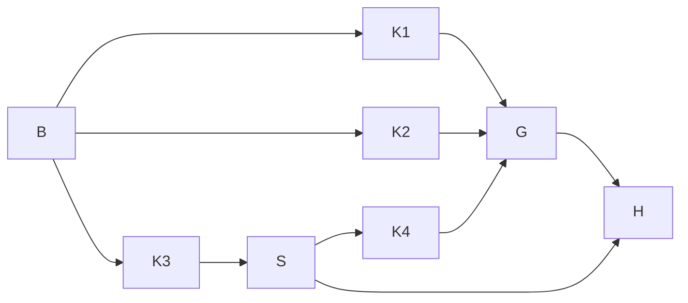

# X-J1d execution graph

Goal: deliver snapshot-aware readers, explicit task and repetition identity,
turn-keyed lifecycle conformance, and frozen plan turns in the assigned worktree.
The binding compiled dispatch is `al-01M474MM5JDCKN02JD02WHYRFT`.
Base: `2c4e2204`, the integration head after the J1c join. Verified: the required
ancestor, continuation markers, driver spy and W0 revision are present.
The skill's referenced `docs/knowledge/graph-and-loop-engineering/` and graph id
`kb-graph-and-loop-engineering` are absent in this checkout (file and id scans).
The execution standard is read from `.claude/knowledge/execution-graph-optimization.md`;
the plan links to the installed binding contracts rather than a missing graph node.

| Node | Goal and inputs | Exit oracle | Tier / Capability | Dependency |
| --- | --- | --- | --- | --- |
| B | Validate base and record all J1d red assertions | Required base checks and 200 guard tests pass; runxfail evidence retained | T0 / Deterministic mechanics | none |
| K1 | Read committed snapshots using landed archive contracts | T-VER tests and real RT-1/RT-2 controls pass | T2 / Reasoning | B, data |
| K2 | Project task and repetition from plan cells | Label/fields agree; every constructor swept | T2 / Reasoning | B, data |
| K3 | Extend landed TABLE entries and replay by turn | T-LIF rules, GOOD, SEEDED, engine replay pass | T2 / Reasoning | B, data |
| S | Measure context at lifecycle commit | K4 allowed only at <=110k; otherwise named hand-back | T0 / Deterministic mechanics | K3, decision |
| K4 | Freeze LF-normalized prompts with checked hashes | T-PLAN and T-WIRE pass | T2 / Reasoning | S, decision |
| G | Run R-104 named tests, five mutation files, lint and graph validation | Exit status and result state inspected per command | T0 / Deterministic mechanics | K1, K2, K3, K4, data |
| H | Record native model, usage, checkpoints and owner evidence | Audit entry and named-path commits available | T0 / Deterministic mechanics | G or S, data |

All verification and audit nodes are immovable floors. Execution width is one,
as authorized. K1 and K2 share views.py; separate named-path commits preserve
review boundaries. The surface list is archive facts and events → views keys
and verification → CellView → verdicts; turn events → TABLE/replay → mapping
rows; task prompts → frozen plan → confirmed reader → CLI engine wiring.
The existing domain grain is one archive file per cell, archive attempt,
snapshot and path, and one event per cell, kind and turn. No second archive
identity or hash producer is introduced.

Before/after: eight nodes, width one, no removed floors. Work and span in seconds
are not recorded: no comparable measurement supports an estimate. Serial
execution makes the scheduled span equal to work. Optimization groups red-base
evidence and keeps each green commit's focused proof local. The Simplifier and
Test Architect lenses require existing helper reuse and assertion-based red
evidence; independent clearance remains the Leader's join gate.

Budget: 3,300 seconds, within X-J1's 320-call allocation. Each verification loop
has remaining named failures as its decreasing variant, zero as floor, passing
assertions as exit, and the dispatch deadline as circuit breaker. No retry on
transport failure. Context is sampled from the session's native last token_count
before K-items, gates and long reads. No K-item above 120k; hand back after K3
unless <=110k; no new edit or gate at 170k. Unreadable context is not recorded and
requires the K3 hand-back. Open gates remain explicitly open.

Planned versus actual evidence is recorded in the closing audit entry, including
wall-clock, native usage, K-item context samples, rework and open items. This plan
is create-only under the dispatch; Markdown is canonical and HTML is its view.
