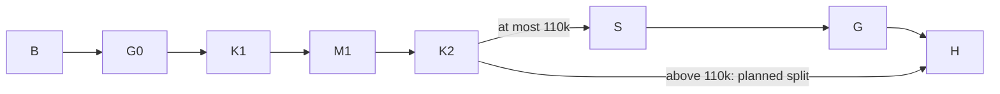

# X-J1e dispatch evidence

Goal: deliver J1e of X-J1 on build/eval-x-j1e, session x-j1e-e1e4, run w2-j1e-e1e4. Done when the assigned mutant rows, real-adapter S-J4 and R-104 proof are complete, or the compiled context split applies. Not in scope: source behavior changes, other mutation sets, W0/W1-J edits, the whole suite and --touched. Tier T2; fan-out zero; width one; deadline 3300 seconds; context ceiling 200000.

This is a planned partial delivery. K1 is 2a0cc8b4; K2 is f91d087f. Native rollout records served gpt-6.1-sol, effort high, cwd equal to the assigned tree. At the K2 hand-back sample, input_tokens was 128178, above the 110000 continuation threshold. K3 and the final gates were therefore not started. The Leader owns the Sonnet follow-on and join into integrate/e2e4-18. No independent hard-veto approval is asserted here.

## Grounding and boundaries

Verified base: clean build/eval-x-j1e at 34aad934b32d3504c7f0964b9992c460b0282b37; merge-base --is-ancestor 601424b8 HEAD exited 0. The J1d-reason grep printed nothing (exit 1). The required T-PLAN-1, T-PLAN-2 and T-WIRE-1 definitions printed exactly three lines. W0 rev 6.6 and 6.11 commit searches succeeded. Coordination doctor found unrelated expired requests; this session's inbox was empty. The compiled dispatch and named base take precedence over the README's older epoch/main wording.

The bounded context is mutation-proof authoring. A mutant row is a value object identified by its name and file/find/replace fault; an invariant requires a present, unique source anchor and named killers. One result fact is exactly one mutant execution on this checkout. Results are non-additive verdicts; counts are additive only within one execution set. The JSON catalogs are the existing representation; the append-only audit is the execution history. No source schema, durable entity, or competing definition is introduced.

Surface list: W1-J section-11 requirement -> existing source behavior -> engine.json or driver.json row -> mutate_check -> named test -> verdict -> this table and closing audit -> Leader join. M-FOLLOW reuses archive.json's existing `follow links` row. TABLE/registry mutations target their own key or entry rather than a union-line end. A scratch generator asserted each new anchor was unique; one non-unique driver anchor was rejected before writing and narrowed to send_turn. The runner restored all mutated source bytes; final status contained no source edit.

The solution ladder selects reuse of the existing JSON catalogs, named tests, runner, renderer and graph writer. There is no new dependency. Adversarial Test Architect lens: a kill is execution evidence, while an unrun or surviving row stays open. Simplifier lens: retain existing M-FOLLOW instead of copying it. SRE lens: do not guess counts, waits or token usage. Security/DS review remains the already gated W1-J design plus independent Leader/Coordinator join; this turn changes no production behavior.

Graph grounding path: this plan -> kb-graph-and-loop-engineering -> execution-graph-optimization standard via the installed optimize-graph skill. Prior J1c audit al-01M477JD6YKJ4BX23YDG01RFGJ records engine mutation proof but driver/archive proof blocked by the suite lock. That evidence supports separate owned sets and explicit partial-result handling; it does not provide a duration model.

## Execution graph

| Node | Goal and inputs | Exit / failure oracle | Tier | Capability | Dependency |
| --- | --- | --- | --- | --- | --- |
| B (floor) | Base SHA, joined J1d, native model/context | Explicit ancestry/marker checks; stop on wrong base | T0 | Deterministic mechanics | none |
| G0 (floor) | Eight named guard files on base | 200 passed, exit 0; failures block edits | T0 | Deterministic mechanics | B data |
| K1 | Section-11 engine/reader rows using landed names | Own JSON commit; every id represented or mapped | T2 | Reasoning | G0 decision |
| M1 (floor) | Full engine.json | Each row has observed verdict; survivors retained with reason | T0 | Deterministic mechanics | K1 data |
| K2 | M-NEWSESSION and M-CLOSE2, full driver.json proof | Separate commit and native context checkpoint | T2 | Reasoning / Deterministic mechanics | K1 data; M1 decision for exclusive mutation execution |
| S | Real-adapter S-J4 and recorded S-J5 | Three counts per adapter, or explicit reason not run | T2 | Deterministic mechanics | K2 context decision |
| G (floor) | Final R-104 guard/runtime/mutation/lint/docs checks | Read each exit and result; never claim unrun checks passed | T0 | Deterministic mechanics | S decision |
| H (floor) | Full prompt, table, HTML, index, native usage, open items | Named-path commits, closing audit and Owner hand-back | T0 | Deterministic mechanics | K2 split decision or G data |



Naive and optimized graphs both have eight logical nodes, width one, six mechanical nodes, and all floor nodes. The span is serial under this dispatch's no-fan-out contract: modeled T1 = T-infinity = the sum of executed node durations, and the width-one ceiling equals that sum. No unmeasured numerical duration estimate is offered. The optimization removes repeated design loads and duplicates, never a proof obligation. Gates still open at a split are handed forward explicitly. A single source snapshot feeds row generation; independent gate runs are kept sequential because they transiently mutate shared source files.

Loop contract: the row queue decreases by one completed mutant until zero; timeout/not-run/survived are explicit exits, not silently retried. transient_retry=0. The source-anchor generator fails closed. Each pytest/mutation run gets its own fresh short TMP/TEMP: C:/t/j1e-1 (base guards), j1e-2 (engine), j1e-3 (driver). No shared ring-cache path was accessed. Re-plan checkpoints are wrong base, mutation survivor, K2 context split, and 170k hard stop. Caps are defect signals; the compiled split is the termination path.

## Acceptance items 1–10

Mapped tests are existing controls. Their mapping and mutation executions do not assert that the final named runtime group passed; that group is open.

| Item | Named evidence/control | This dispatch's status |
| --- | --- | --- |
| 1 budget clock | T-ENG-2 / M-CLOCK | mutant killed; final runtime gate open |
| 2 summed spend | T-ENG-4 / M-LAST, M-XCHECK | both killed; final runtime gate open |
| 3 stopping-turn record | T-ENG-6, T-ENG-10 / M-STOP, M-CANCELFIRST | both killed |
| 4 first status prompt | T-STATUS-1 / M-LASTWINS | killed |
| 5 first-update baseline | T-SNAP-5 / M-ZERO, M-EARLY; no-update baseline test | both killed; real-adapter baseline not validated |
| 6 shared missing-row helper | T-SNAP-3 / M-DUP, M-CODE | both killed |
| 7 snapshot recovery | T-SNAP-2, T-SNAP-3 engine recovery; M-MERGE | M-MERGE killed; final recovery runtime proof open |
| 8 spikes | S-J5 audit below; S-J4 below | S-J5 recorded from J1c; S-J4 deferred by split |
| 9 two counts and names | T-SNAP-5 checks job_active_processes/job_active_after/copy_retries | zero/early mutants killed; final runtime proof open |
| 10 complete exit proof | section-11 table, T-SWEEP-1, all R-104 gates | table delivered; survivors, M-FOLLOW proof and final gates open |

## Section-11 mutation mapping

Each table row points to its catalog row by exact name and its named test. These are mutate_check verdicts, not an assertion-only red classification. Existing engine baseline rows were 66/66 killed in this run; the full engine set is 109 rows. The full driver set is seven rows. There are 43 new engine rows, two new driver rows and one mapping to an existing archive row.

| W1-J mutant / exact row name | Catalog / source | Named section-11 killer | Observed result |
| --- | --- | --- | --- |
| M-ORDER snapshot after next send | engine.json; src/harness_bench/engine.py | test_t_eng_1_order_snapshot_and_one_session | killed |
| M-ONCE session_opened per turn | engine.json; src/harness_bench/engine.py | test_t_eng_1_order_snapshot_and_one_session | killed |
| M-CLOSE process ends after turn one | engine.json; src/harness_bench/engine.py | test_t_eng_1_order_snapshot_and_one_session | killed |
| M-CLOCK budget resets each prompt | engine.json; src/harness_bench/engine.py | test_t_eng_2_one_budget_across_turns | killed |
| M-LAST spend reads last turn | engine.json; src/harness_bench/engine.py | test_t_eng_4_usage_sums_every_turn | killed |
| M-XCHECK cross-check reads last turn | engine.json; src/harness_bench/views.py | test_t_eng_4_usage_sums_every_turn | killed |
| M-RESET recreate suspend detector at samples | engine.json; src/harness_bench/engine.py | test_t_eng_5_suspend_during_turn_two_keeps_snapshot | survived |
| M-STOP completed reasons continue | engine.json; src/harness_bench/engine.py | test_t_eng_6_only_end_turn_continues | killed |
| M-NOCHECK cancel guard before next turn removed | engine.json; src/harness_bench/engine.py | test_t_eng_7_budget_cancel_during_copy_never_sends_next | killed |
| M-SLEEP non-cancellable retry wait | engine.json; src/harness_bench/engine.py | test_t_eng_7_budget_cancel_during_copy_never_sends_next | survived |
| M-SWALLOW failed turn treated as success | engine.json; src/harness_bench/engine.py | test_t_eng_8_9_failed_second_turn_keeps_snapshot | killed |
| M-CAUSE second-turn error becomes adapter_crash | engine.json; src/harness_bench/engine.py | test_t_eng_8_9_failed_second_turn_keeps_snapshot | killed |
| M-CANCELFIRST cancel before returned-turn record | engine.json; src/harness_bench/engine.py | test_t_eng_10_returned_turn_is_recorded_before_cancel | killed |
| M-SUM agent-time rows read last only | engine.json; src/harness_bench/engine.py | test_t_eng_11_outcome_last_turn_and_total_agent_time | killed |
| M-INPLACE snapshot copied at final name | engine.json; src/harness_bench/archive.py | test_t_snap_1_failed_copy_never_publishes_final | killed |
| M-MERGE planted snapshot adopted | engine.json; src/harness_bench/archive.py | test_t_snap_2_planted_snapshot_is_refused_without_merge | killed |
| M-DUP helper appends all rows | engine.json; src/harness_bench/archive.py | test_t_snap_3_only_missing_rows_are_returned_and_conflicts_use_folder_code | killed |
| M-CODE snapshot conflict uses final code | engine.json; src/harness_bench/archive.py | test_t_snap_3_only_missing_rows_are_returned_and_conflicts_use_folder_code | killed |
| M-HOME snapshot includes home | engine.json; src/harness_bench/archive.py | test_t_snap_4_snapshot_copies_ws_only_and_excludes_credentials | killed |
| M-ZERO baseline constant zero | engine.json; src/harness_bench/engine.py | test_t_snap_5_baseline_measured_at_first_update | killed |
| M-EARLY baseline at session open | engine.json; src/harness_bench/engine.py | test_t_snap_5_baseline_measured_at_first_update | killed |
| M-RETRYALL unbounded snapshot retry | engine.json; src/harness_bench/engine.py | test_t_snap_6_locked_source_exhausts_bounded_retry | timeout |
| M-KEY snapshot removed from archive key | engine.json; src/harness_bench/views.py | test_t_ver_1_snapshot_and_final_may_share_path | killed |
| M-FILTER final archive includes snapshot rows | engine.json; src/harness_bench/views.py | test_t_ver_4_final_hash_ignores_snapshot_rows | killed |
| T-VER-2-file skip snapshot file verify | engine.json; src/harness_bench/views.py | test_t_ver_2_snapshot_corruption_is_hb_led_008[file] | killed |
| T-VER-2-hash skip snapshot hash | engine.json; src/harness_bench/views.py | test_t_ver_2_snapshot_corruption_is_hb_led_008[hash] | killed |
| T-VER-2-counts skip files and bytes | engine.json; src/harness_bench/views.py | test_t_ver_2_snapshot_corruption_is_hb_led_008[files] | killed |
| T-VER-2-empty skip event without rows | engine.json; src/harness_bench/views.py | test_t_ver_2_snapshot_corruption_is_hb_led_008[empty] | killed |
| M-FINALKEY final writer adds snapshot | engine.json; src/harness_bench/engine.py | test_t_ver_5_final_writer_omits_snapshot | killed |
| M-ROWS snapshot verifier iterates uncommitted rows | engine.json; src/harness_bench/views.py | test_t_ver_6_live_snapshot_rows_without_event_are_ignored | killed |
| M-RAWKEY raw snapshot key | engine.json; src/harness_bench/views.py | test_t_ver_7_final_spellings_share_hash_and_duplicate_key | killed |
| M-LEGACY absent snapshot is non-final | engine.json; src/harness_bench/archive.py | tests/test_verify.py::test_a_golden_ledger_keeps_its_hashes_and_row_counts | survived |
| T-LIF-2-PromptOncePerTurn TABLE prompt not turn keyed | engine.json; src/harness_bench/lifecycle.py | test_t_lif_2_each_rule_names_its_own_violation | killed |
| T-LIF-2-SnapshotBeforeNextTurn TABLE prompt prerequisite removed | engine.json; src/harness_bench/lifecycle.py | test_t_lif_2_each_rule_names_its_own_violation | killed |
| T-LIF-2-SnapshotAfterTurnEnd TABLE snapshot prerequisite removed | engine.json; src/harness_bench/lifecycle.py | test_t_lif_2_each_rule_names_its_own_violation | killed |
| T-LIF-2-TurnEnd TABLE prompt prerequisite removed | engine.json; src/harness_bench/lifecycle.py | test_t_lif_2_each_rule_names_its_own_violation | killed |
| T-LIF-3-M-CODE swap crashed-turn code | engine.json; src/harness_bench/lifecycle.py | test_t_lif_3_crashed_turn_predicate | killed |
| M-CRLF extra-turn raw-byte hash | engine.json; src/harness_bench/plan.py | test_t_plan_1_turn_text_hash_is_normalized_and_confirmed | killed |
| T-PLAN-1-M-NOCHECK turn hash check removed | engine.json; src/harness_bench/plan.py | test_t_plan_1_turn_text_hash_is_normalized_and_confirmed | killed |
| M-BOUND extra-turn bound removed | engine.json; src/harness_bench/plan.py | test_t_plan_2_more_than_one_extra_turn_is_refused | killed |
| M-LASTWINS status clock reads last prompt | engine.json; src/harness_bench/status.py | test_t_status_1_first_prompt_matches_engine_budget_clock | killed |
| T-WIRE-1 turns line removed | engine.json; src/harness_bench/engine.py | test_t_wire_1_real_cli_plan_and_run_carries_turns | killed |
| M-ADD unregistered archive reader | engine.json; src/harness_bench/status.py | tests/test_archive_readers.py::test_t_sweep_1_exact_reader_and_exception_set | killed |
| M-NEWSESSION send_turn re-handshakes | driver.json; src/harness_bench/driver.py | test_t_drv_1_one_handshake_for_two_prompts | killed |
| M-CLOSE2 close without idempotence guard | driver.json; src/harness_bench/driver.py | test_t_drv_2_close_is_idempotent_and_closed_send_has_cause | survived |
| M-FOLLOW -> existing `follow links` | archive.json; src/harness_bench/archive.py | T-SNAP-7 / existing tests/test_archive.py | not run here: existing row is outside the two owned mutation sets; Leader proof remains open |

T-VER-2 has four branch rows; the counts row skips both files and bytes checks and its named `files` parameter killed it. T-LIF-2 has four rows: prompt turn-keyed TABLE flag, SnapshotBeforeNextTurn direct replay guard, snapshot TABLE prerequisite, and TurnEnd TABLE prerequisite. SnapshotBeforeNextTurn is implemented outside TABLE in the landed code, so its mutant targets that actual guard; this is a disclosed representation difference from the design's TABLE-row wording. T-LIF-1 has no mutant in section 11. TLC mutants are excluded by dispatch.

M-RESET recreates the local scheduler detector at each sample, including inter-turn sampling; this is broader than only recreating it between turns. M-SUM makes the returned-turn ledger include only the last turn, killing T-ENG-11's explicit `len(ended) == 2` control; it does not introduce a stored total. M-ADD inserts archive access in status.py, thereby adding a reader identity to the scan without creating a permanent new source file. These concrete fault shapes are visible in the catalogs for independent join review.

## Survivors and open proof

Observed output is preserved verbatim:

```text
survived M-RESET recreate suspend detector at samples
survived M-SLEEP non-cancellable retry wait
timeout  M-RETRYALL unbounded snapshot retry
survived M-LEGACY absent snapshot is non-final
survived M-CLOSE2 close without idempotence guard
```

- M-RESET: the landed T-ENG-5 directly invokes Engine._kill on prompt 2. It never exercises SleepDetector history, so replacing the detector cannot distinguish this control. Add a real/injected detector-history control in the follow-on.
- M-SLEEP: T-ENG-7 replaces the whole _snapshot_turn implementation with cancelled_copy. The retry wait mutation is never reached. A follow-on needs a cancel during an actual retry wait.
- M-RETRYALL: the unbounded retry never returns, so the test's post-run `len(calls) == 3` assertion is unreachable; the row timed out at its declared 12 seconds. Add a bounded fourth-call sentinel or equivalent deterministic control.
- M-LEGACY: the named golden test uses ledger.verify_segment, checks hashes/row counts and does not execute archive.snapshot_of. A full legacy-reader assertion or supplemental existing snapshot-aware reader test is needed.
- M-CLOSE2: T-DRV-2 checks absence of ValueError, not number of closes. The real stdin permits repeated close in the observed run. A counting wrapper around the real stream can prove exactly once.

No source correctness defect was established; these are mutation-proof gaps. No survivor was removed or production code changed. The rows remain reviewable. Acceptance 10 is pending these proofs plus M-FOLLOW and final gates.

Class -> sweep -> derive -> prevent (Coordinator-owned register text): controls that assert an outcome while bypassing the implementation cannot distinguish adjacent lifecycle faults. Sweep the five survivor killers above; derive exact observation points (detector history, retry cancellation, bounded retry completion, full legacy reader, close count). Prevent with the retained mutants and observable real-path assertions. Additional process corrections: initial bounded brief reads preceded the first native sample; future reads/gates use the fail-closed native sampler. A non-unique driver anchor was rejected by the generator and narrowed before any write. No guessed contract or retrospective assumption is used to justify it.

## S-J4 and S-J5

| Spike / adapter | session/new count | first-update count | end-of-no-tool-turn count | Evidence |
| --- | --- | --- | --- | --- |
| S-J4 Claude adapter | not recorded | not recorded | not recorded | not run: K2 context split; launchability not investigated |
| S-J4 Codex adapter | not recorded | not recorded | not recorded | not run: K2 context split; launchability not investigated |
| S-J4 Copilot adapter | not recorded | not recorded | not recorded | not run: K2 context split; launchability not investigated |

Baseline not validated on real adapters. No guessed gauge, launchability claim or W0 read-point amendment. No seam request to move that point was raised because no S-J4 count was measured.

S-J5 is recorded from J1c closing audit al-01M473MWF0NFBY6FZNAFKZHJ4Y (docs/audit/audit-log.jsonl): real atomic.publish_dir at parallelism 3, D1 549 files / 5300189 bytes, first publication 3252–3290 ms, warm 3569–3589 ms. All are below 10000 ms. S-J2's 1300 ms remains a floor; its fixture was 560 files / 7072817 bytes, so it is not an identical-fixture comparison. Cold meant first publication of newly materialized cells, with no OS cache flush; other host activity was present. These are recorded prior measurements, not independently rerun in J1e.

## Gates, measurements and hand-back

| Command | SHA / state | Exit and observed evidence |
| --- | --- | --- |
| base eight-file R-104 guard | 34aad934 | 0; 200 passed in 62.27 s; green on arrival |
| full engine.json mutate_check | K1 2a0cc8b4, no source edits | 1; 105 killed, 3 survived, 1 timeout; no suite-lock wait line |
| full driver.json mutate_check | K2 row content later committed f91d087f | 1; 6 killed, 1 survived; suite-lock wait observed, duration not recorded |
| final eight-file guard | final delivery commit | not run: planned K2 context split |
| final eight-file runtime group | final delivery commit | not run: planned K2 context split |
| final ruff check src tests tools | final delivery commit | not run: planned K2 context split |
| final docs-graph validate | final delivery commit | not run: planned K2 context split |

Driver suite-lock logging named the holder in the X-J2c tree. The normal acquire path emits a wait line but no elapsed wait measurement was captured in this dispatch. That interval is explicitly not recorded; it is never reported as a zero wait. Named-file base pytest did not take the suite lock. Full final-commit mutation reruns remain open if the follow-on changes a killer or row.

Context samples from native payload.info.last_token_usage.input_tokens: first sample 40257; before K1 87834; engine gate 113106; before K2 115643; driver gate 126218; K2 hand-back 128178. All K-items started below 120000; no K3 was started. A sampler records literal `not recorded` if usage is absent and exits 17 at 170000.

Planned vs actual: B/G0/K1/M1/K2/H executed; S/G deferred by the explicit split. Width remains one and no delegate was spawned. Source-anchor correction: one fail-closed generator rerun, no source edit. Mutation proof gaps are the five retained rows above. The closing audit carries measured dispatch start/end, native cumulative tokens/tool calls and the final delivery SHA. No numerical model of time or tokens is substituted for usage.

Owner hand-back: join/review K1 and K2, then run the Sonnet follow-on under the same session/tree contract to close survivor proof, faithful detector/SUM representation review, M-FOLLOW proof, S-J4 and final R-104 gates. The Coordinator alone updates W1-J section 12 and campaign Tracks. The source restored cleanly; scratch files remain under C:/t, outside the repository.
