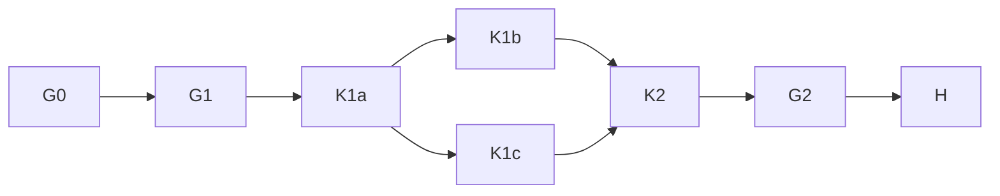

# X-K1a execution plan

Goal: land only W1-K K1 and K2 on `build/eval-x-k1a`, based on the integration
head after X-A3c. Done when the separate named-path commits and R-104 evidence
exist, or the compiled context split requires a named handoff. Tier T2; fan-out
cap 0. K3-K7, source behavior beyond the refusal skeleton, and other owners'
surfaces are outside this dispatch.

The supplied compilation is the scope authority. Verified base `c8c6390d`
contains both `1a837a5d` and `186ad7da`; `git grep -n "HB-PLN-005" -- src`
returned no hits. The checkout is clean and the branch matches the assignment.
The installed skill references `kb-graph-and-loop-engineering`, but the named
evidence directory is absent in this checkout. Its graph link is omitted to
avoid a dangling target; the installed execution-graph standard still governs.

## Graph and floors

| Node | Goal / inputs | Exit and oracle | Tier | Capability | Dependency |
| --- | --- | --- | --- | --- | --- |
| G0 | Read dispatch, native record, owned contracts | Required ancestors present; retired code absent; context readable | T0 | Deterministic mechanics | none |
| G1 | Run eight-file base guard | Gate exit 0; summary read | T0 | Deterministic mechanics | G0 decision |
| K1a | Refusal skeleton and own PLANNED deletion | Separate commit; today's HB-USR-002 preserved | T0 | Reasoning | G1 data |
| K1b | cmd_run delegation only | Separate commit; early-refusal test preserved | T0 | Reasoning | K1a data |
| K1c | Six confirmed registry rows | Separate commit; W0 meanings match | T0 | Deterministic mechanics | K1a data |
| K2 | Golden ledgers, independent tables, windows and refusals | Observed assertion/HB-USR-002 reds, then strict xfails naming K1b/c/d; N1/N2 recorded | T2 | Reasoning | K1b, K1c data |
| G2 | R-104 final guard, named runtime files, own cli mutations, ruff, docs validation | Every exit and summary read; survivor reasons recorded | T0 | Deterministic mechanics | K2 data |
| H | Owner/Coordinator join review and closing evidence | Independent review remains the Owner's join gate; no self-cleared veto | T2 | Independent review | G2 data |

G0/G1/G2, assertion-red observation, surface containment, and audit evidence
are immovable floors. The before and after graphs both have eight nodes and
width one. Removing incidental ordering between the delegation and registry
does not authorize concurrent writers. Inferred unit-node work is 8 and span
is 7; with one worker the execution ceiling is 8. No duration estimate is
claimed. The source contract is fixed by W1-K, so no new architecture council
or speculative implementation is added. The Owner independently reviews at
the join; this document does not claim that review already passed.

Surfaces: refusal entry point -> cmd_run composition -> existing BenchError
rendering; registry -> attribution/report readers; tests -> golden ledger and
ADR oracle. No new facts or stored measures are introduced in K1. Run is the
existing aggregate; cells remain referenced by identity. K2 fixtures must
reuse the landed FACTS, snapshot and archive APIs.

Scan scopes: base retirement check is recursive `src`, token HB-PLN-005,
no allowlist. Completed-reader scan is recursive `src`, token run.completed,
with its measured base hit count pinned by K2. The guard and window clauses
are jointly satisfiable: source preserves the refusal while future behavior
tests fail explicitly and remain strict-xfailed until the named next turn.

## Budget, checkpoints and containment

Budget: 3,300 seconds, 200k context ceiling, one dispatch; shared X-K1 main-line
budget 280 calls. No K-item starts above 100k; at 170k no edit or gate starts.
Unreadable context permits only K1. K1a ends after K2. A sequential Sonnet
follow-on in this tree is the compiled fallback for split-rule handoff.
There are no fan-outs or retry loops. A finite test-repair pass decreases the
set of observed failures; its floor is zero. Budget caps are defect signals,
never proof that the work is complete.

Verified K1 context sample: 91,048 input tokens; native model gpt-6.1-sol.
Verified pre-edit gate: 200 passed in 77.11 seconds. The latest pre-edit
sample is 99,455, so K2 requires a fresh sample before admission.

The CLI configuration seam is `req-01M489RF7YZQE1XE6D3BX77DCX`: the existing
early refusal precedes EngineConfig construction. K1a delegates with cfg=None
to preserve this behavior. K1c must wire the actual config before implementing
resume behavior. This is a temporary composition handoff, not a second config
definition. Scratch is C:/t/k1a-1; shared ring caches are untouched.

Planned versus actual evidence is recorded through audit-log.py at handoff,
including native usage, wall time, gate exits and any incomplete nodes. This
plan is create-only under the dispatch grant; its sibling HTML is derived.
