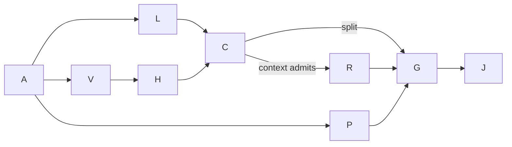

# X-K1b execution plan

Goal: deliver W1-K K3 and, if admitted, K4 on `build/eval-x-k1b`.
Done when each admitted behavior has assertion-red and green commits and the
R-104 worker gates have recorded results. K1c/K1d, other owners' behavior and
the resume engine are excluded. Tier T2; fan-out cap zero; deadline 3,300 s.
The supplied compiled dispatch controls scope and all stopping conditions.

Verified grounding: `fd8b5e61` is an ancestor, one `has_work` definition exists,
six K1b markers remain, and the base guards pass (200 tests, exit 0).
Native record identifies `gpt-6.1-sol`, effort high. K3 admission sample:
82,307 input tokens. The named graph-and-loop evidence node is absent from
the derived index; no dangling dependency link is invented.

## Surface and domain constraints

Bounded context: run engine. Run is the aggregate, cells are identities within
it. Append-only events retain their original meanings. The invariant is one
engine writer and no launch after an actual stop. Projection readers derive
completion from the latest resume boundary; no completion flag is stored.
Surface list: lifecycle table and replay → segment rows → completion helper
and views.load → verify abandoned heads → resume row classifier and has_work
→ existing status/alarm readers and assertion fixtures. Engine execution,
archive recovery, CLI wiring and alarm/status implementation remain deferred.

## Bounded graph

Every node is T2 work executed with deterministic mechanics or reasoning.
Floor nodes are immovable. Independent review is the Leader's join: this
worker may not spawn or message a reviewer or approve its own hard veto.

| Node | Goal and inputs | Exit / oracle | Capability | Dependencies |
| --- | --- | --- | --- | --- |
| A | Admission and base guards from assigned integration head | Three admission checks and 200 base guards green | Deterministic mechanics | none |
| P | Record bounded plan, render HTML and derive index | Valid frontmatter and separate named-path commits | Reasoning; Deterministic mechanics | A, data |
| L | K3 lifecycle from W1-K section 2 and D-K10 | Assertion reds; stop, resume, second-intent and outcome tests green | Reasoning; Deterministic mechanics | A, data |
| V | K3 segment rows and completed from D-K5 | Real segment grouping and resume boundary tests green; completed pin reconciled | Reasoning; Deterministic mechanics | A, data |
| H | K3 abandoned-head verify from section 3.6 | Cut ledger rejected as HB-LED-002 naming segment; valid unsealed head accepted | Reasoning; Deterministic mechanics | V, data |
| C | Sample at K3 boundary | K4 admitted only at or below 100k; unreadable means hand-back | Deterministic mechanics | L, V, H, data |
| R | K4 stop_recorded, classify and has_work | Independent prefix oracles, work tests and five classifier mutants | Reasoning; Deterministic mechanics | C, decision |
| G | R-104 final named gates and mutation files | Read actual summaries, exit codes and lock waits; record every survivor | Deterministic mechanics | admitted L/V/H/R, data |
| J | Hand-back with commits and closing audit | Served model, wall-clock, red SHAs, context, usage, open work reported | Independent review; Deterministic mechanics | G, data |

Naive and optimized graphs retain all nine nodes and all floors. Incidental
ordering between L and V is removed, but width remains one by dispatch.
Inferred work and span at width one are equal; no timing estimate is asserted
without measurement. Optimization batches relevant range reads and avoids
duplicate full-suite or mutation gates. No dependency or abstraction is added.
Reuse ledger verification and the existing views filter before new helpers.

Adversary lenses: Test Architect requires real filesystem abandoned-head
tests and independent classifier oracles; Simplifier requires one completion
definition and the existing has_work name; SRE requires measured context and
lock waits. These requirements remain gate inputs, with review at join.

Finite worklist variant: remaining admitted behaviors plus required gates,
floor zero; exit is verified evidence or explicit hand-back. No transient
retry and no fan-out. Deadline and context caps are circuit breakers, never
proof. At 170k no new edit/gate starts. Re-plan at each K-item and the K3
boundary; unreadable context stops after K3. No silent scope reduction.

The shared completion scan reads recursive `src/**/*.py`, counts matching
lines containing `run.completed`, and has no allowlist. Each removed reader
must call views.completed; the pin changes in that same commit with before
and after per-file counts. Mutant finds remain unique and name the same rule.
Actual delivery, measured duration, usage, red/green evidence and any rework
are recorded in the closing audit; the plan is create-only by dispatch.
