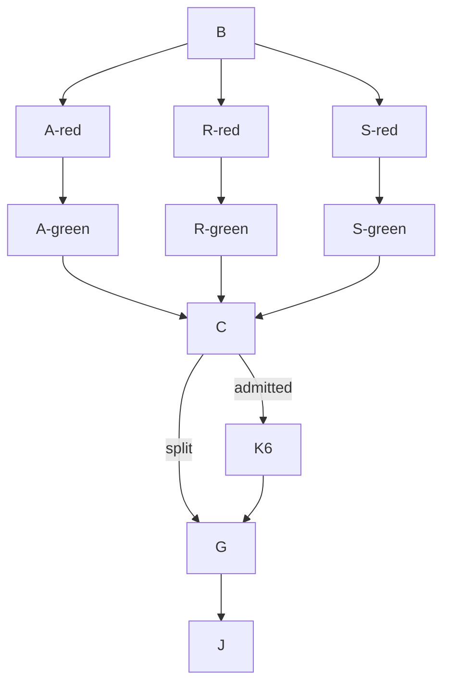

# Goal state

Goal: implement W1-K K5 and conditionally K6 on build/eval-x-k1c.
Done when: authorized red/green commits and R-104 gate evidence are delivered,
or the measured context split requires a hand-back after K5.
Not in scope: K6b, K7, other owners' surfaces, resume history, or new mutation sets.
Tier: T2. Fan-out cap: 0. Deadline: 3,300 seconds. Context ceiling: 200k.

## Execution graph

The compiled dispatch is the input contract (CO-S0). Seat: coordination worker.
The upstream gated design supplies architecture and independent design review;
the Leader supplies the independent join review. No worker spawns or messages an agent.

| Node | Goal and inputs | Exit condition / oracle | Capability | Tier | Dependencies |
| --- | --- | --- | --- | --- | --- |
| B | Validate assigned base and existing guards | ancestry, 26 markers, one completion definition; 200 base guards pass | Deterministic mechanics | T0 | none |
| A-red | Golden-ledger recovery tests for W1-K 3.3 / W1-B 5 | new tests fail on an assertion naming absent recovery behavior | Reasoning | T2 | B (data) |
| A-green | Recovery using append_missing_rows, no second row comparison | absent/partial/all rows, missing-folder refusal, source conflict pass | Reasoning | T2 | A-red (data) |
| R-red | Refusal/composition tests for W1-K 3.1 steps 1–3 | missing verifier and refusal assertions observed red | Reasoning | T2 | B (data) |
| R-green | Inject verifier and preserve ordered read-only refusals | six existing refusal markers pass, including five hash cases | Reasoning | T2 | R-red (data) |
| S-red | Caller sweep pairing for W0 4 | wrong run lock fails the unchanged raises assertion | Reasoning | T2 | B (data) |
| S-green | Sweep archive root and cell folders under matching lock | pairing test and deletion mutant killed | Deterministic mechanics | T2 | S-red (data) |
| C | Sample native context at K5 boundary | <=100k admits K6; higher/unreadable hands back | Deterministic mechanics | T0 | A-green, R-green, S-green (decision) |
| K6 | Engine segments, state rebuild, reconciliation, heartbeat, stopped tail | remaining 19 markers pass; only if C admits | Reasoning | T2 | C (decision) |
| G | R-104 guards, named suites, mutations, ruff, graph validation | read result summaries, survivor reasons and lock waits | Deterministic mechanics | T2 | C or K6 (data) |
| J | Leader adversarial review and integration | red-SHA replay and owned-path/import checks | Independent review | T2 | G (data) |

This graph exposes independent dependencies without fan-out: authoring shares
tests/test_resume.py and commits, and the dispatch prohibits concurrency.
The execution remains serial. Inferred node-weight model: unit-weight work 11,
span 7, p=1 ceiling 11; actual durations are measured in the audit and test logs.
The naive serial graph has the same 11 nodes, width 1, and span 11. No rigor floor
is removed: base guard, red observations, pairing mutant, refusal hash, final
guards, named suites, mutation files, graph validation, audit and join review.
The context checkpoint prevents admitting an item that cannot finish in the turn.

Grounding graph finding: this consuming repository does not index
`kb-graph-and-loop-engineering`. The normative standard is available at
`.claude/knowledge/execution-graph-optimization.md`; the plan links to the actual
dispatch brief instead of introducing a dangling knowledge id. Its traversal is
plan -> brief-eval-x-k1 -> design-eval-seam-contracts and plan -> design-eval-resume.

## Surfaces and invariants

Run is the aggregate; one lock protects one writer. Append-only facts retain
historical meaning. Archive recovery returns reconstructed rows and missing rows;
the engine remains the producer of archive facts/events. No second completion,
stop, classifier, or missing-row comparison is introduced.

Surface list: golden ledger/folders -> archive recovery -> resume refusals and
sweep -> EngineConfig verifier -> cmd_run composition -> real CLI and refusal
tests. K6, if admitted, adds engine event writers -> lifecycle TABLE -> ledger
readers -> grading callback and CLI exit. Run modules never import grade modules.

Testing Strategy union: deterministic logic, filesystem integration, structural
dependency direction, event schema, and boundary substitutes. Reuse the existing
append_missing_rows, archive_cell, RunLock, ledger readers, and injected callbacks
before adding code. Source comparison is required for unpublished row recovery;
verified complete rows permit recovery without a surviving workspace.

## Bounds and evidence

Each test loop decreases remaining named states; each gate loop decreases remaining
commands. Failure exits with the failing node and evidence; the deadline/context
cap is a defect/split signal, not proof of completion. Private scratch is
C:/t/k1c-6a; no shared ring cache is accessed. Every gate samples native input
tokens first and writes output to private files. Suite-lock waits are measured.

Observed base: build/eval-x-k1c contains 5ab2bfc3, 26 K1c markers, zero K1b
markers, one lifecycle.completed. Native served model: gpt-6.1-sol, high.
Base guard: 200 passed, exit 0, 65.28 seconds. K5 admission sample: 77,993
input tokens. Actual delivery and further samples are recorded in the closing
coordination-worker audit entry and named-path commit messages.

Independent-review residual: the worker does not self-clear the Leader's join
veto. The dispatch explicitly reserves that review for the Leader after hand-back.

## Finishing turn

Coordinator #45 rulings F1-F10, applied by session x-k1c-e1e4 in two parts (claude-sonnet-5-5).
Part 1 (F1-F6): the strict-xfail narrowing and five fixture corrections. Part 2 (F7-F10):
F7 resume_run refuses a passed plan whose plan_hash differs from the confirmed plan (red 1b8d12ea,
fix 3bb4406e); tests set plan parameters only through the stored-plan helper `_set_params`.
F8 test_spend_total_survives_resume rebuilt on golden5 (last K1c marker removed).
F9 segment.abandoned is a ledger row and the resume names it through lifecycle.check_writer
(red 2cf57765, fix 63b4ce42). F10 segment-order control test (green on arrival; b2cd87f2 holds the code).
Controls run from uncommitted TMP mutation files: M-NOBEAT (lock heartbeat dropped around the resume boot)
survived at pid_wait_s 1 = lock_staleness 1, so the heartbeat test now waits 3 s; it then killed the mutant.
Named untested simplifications carried to K1d: resume._redo_snapshot adopts a published folder by file scan only;
resume outcomes skip Engine._after_append; Engine.restore restores spend from turn_usage rows only; scripted-user
logs are not closed for reconciled cells; cli.py:300-304 returns before engine.configure_logging.
