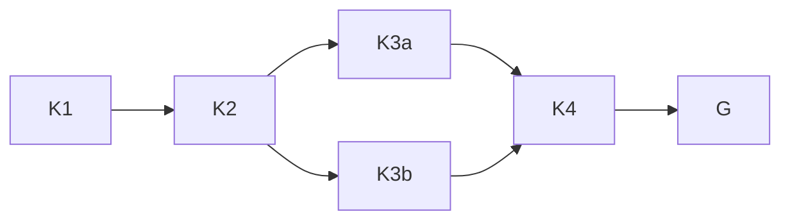

# X-LB1 execution plan

Goal: build the loopback fake on `build/eval-x-lb1`: `bench_check.listen()`, the shape (b)
grading path with the resilience strategy, readiness's exactly-one-shape rule and the four
`property.json` evidence pointers. Done when each behavior has a red and a green commit and
the R-104 worker gates are read. Not in scope: `discriminate.py`, the check-less helpers,
every task folder, the gate ring and the stamps. Tier T2; fan-out cap zero. The plan gives
two sessions; part 1 delivered K1 and K2, part 2 delivered K3, K4 and the closing items.

## Surface and domain constraints

Bounded context: the property grader. The check owns the fake; the deliverable is a client.
Surface list: `bench_check.listen()` (one function owns the whole socket lifecycle) -> the
check's `{fake_url}` substitution and fault span -> `grade/property.py` (`_load_cases`,
`STRATEGIES`, the `check.*` pointers) -> `property.json` -> `readiness.property_evidence`
-> `readiness._case_failures` (the shape rule) -> fixture and mutation files.

## Bounded graph

| Node | Goal | Exit / oracle | Dependencies |
| --- | --- | --- | --- |
| K1 | the listener on 127.0.0.1 with HB-CHK-005 | red then green; two parallel listeners get distinct ports | base guards |
| K2 | shape (b) path, resilience, `{fake_url}`, fault span | red then green; 503 then 200 end to end | K1 |
| K3a | exactly one of shape (a) or (b), HB-RDY-005 | red then green; both/neither refused, (a) not built | K2 |
| K3b | four pointers written; `property_evidence` reads them, `assume:` deleted | red then green; absent pointer fails closed | K2 |
| K4 | RS-shaped fixture through `bench discriminate` | record written with no discriminate change | K3 |
| G | mutants, ruff, docs-graph, R-104 gates | each exit read | K3, K4 |

K3a and K3b are independent in the data; width stays one by dispatch. The loop variant is the
finite K-item list; the context and time caps are circuit breakers, not proof.

Pointer design: `check.deliverable` and `check.cases` name `check/check.stdout`, which carries
both; `check.hosts` names `hosts.jsonl`; `check.clauses` names `clauses.json` or is null when
the check wrote none. Every pointer is relative to the run directory. Only `check.clauses` may
be null on read.

## Security conditions

A Security & Identity review passed X-LB1 with four conditions. All four are closed, each red first
where it adds a test, each in its own commit.

1. **Exclusive port.** `test_the_listener_is_exclusive_on_its_port` now reads
   `SO_EXCLUSIVEADDRUSE` from the listener (1 when set, 0 by default on this host). A second bind
   is refused either way, so it never discriminated. A mutation record deletes the `setsockopt`
   line and names that test.
2. **Outcome-set selector.** `test_each_check_kind_refuses_the_other_kinds_outcome` runs
   `_run_check` for a fault check that emits `blocked` and a probe check that emits `passed`;
   both are row 5 (`check output invalid`). A mutation record widens the selector to both sets.
3. **Fault fixture pass rule.** `fault_check.py` passes a case only when the response is `ok` AND
   the fake saw every request up to its first 200 AND at least one effect landed. A client that
   never calls the fake (`lazy_client.py`) scores `failed`. X-RS copies this shape.
4. **`{fake_url}` scope.** Substitution is restricted to `args` (W0 R6-17(c), ADR-0018 s3); a
   `{fake_url}` in `kwargs` passes through unsubstituted. A mutation record restores the wider
   form.

Not changed: `listen()`'s interface, HB-CHK-005's run code, a per-case URL token, ADR text.
