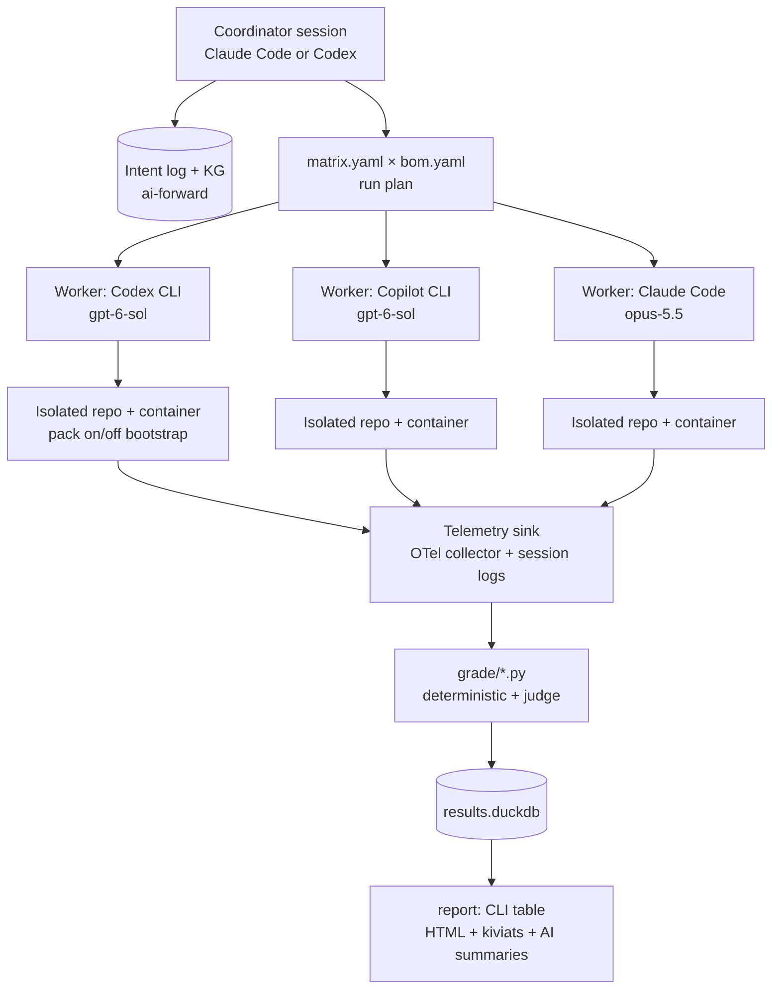

# Cross-Harness Benchmarking Proposal (ai-forward)

Sep 23, 2026 · @Someone

## Context and goals

Build `harness-bench`: a benchmarking repo, bootstrapped from the ai-forward pack, whose coordinator session spawns other harness/model combinations, runs a fixed bill of materials (BOM) of software-engineering tasks in isolated per-combo repos, grades every run with repeatable Python scripts, and reports a CLI table, an interactive HTML comparison with kiviat overlays, and two AI-written summaries.

Three comparisons, one design. Every run is a cell in a factorial grid of `harness × model × pack`, so the three questions are just different slices of the same result set:

| Comparison | Held fixed | Varied | Example cells |
| --- | --- | --- | --- |
| Harness effect | model | harness | `gpt-6-sol` in Codex CLI vs GitHub Copilot CLI |
| Model effect | harness family (native) | model | Claude Opus 5.5 in Claude Code vs GPT-6 Sol in Codex |
| Pack effect | harness + model | ai-forward pack on/off | Opus 5.5 + Claude Code, `pack=on` vs `pack=off` |

The pack is treated as a first-class experimental factor, not a fixture: the same task runs in a repo bootstrapped from the ai-forward template and in a bare control repo with identical code and tests but no coordination layer, intent log, knowledge graph, LOA guidance, `TESTING.md`, or `testing-directives.json`.

Six scenarios, mapped to the software lifecycle:

1. Specify from an ambiguous prompt (does the agent ask, assume, or invent?)
2. Specify from a primer spec (expand a one-page primer into a full spec)
3. Architect from a spec (produce an architecture spec, ADRs, module boundaries)
4. Code from an architecture spec (implement against a given design)
5. Code from a prompt (standard coding benchmark, the calibration baseline)
6. Multi-agent execution in one harness and session, with the orchestrator modulating model choice per sub-agent

Grounding (round 2, from the repos). The [ai-forward](https://github.com/timianmalloo/ai-forward) pack is at INSTALL revision 92: 28 skills whose lifecycle maps 1:1 onto the six scenarios (`/compile` → `/specify` → `/define-architecture` → `/design-slice` → `/implement`, and `/prepare-for-coordination` → `/execute-with-coordination` for multi-session work), the Rigor Protocol, a 23-persona roster, adapters for Claude Code, Copilot, Codex, Grok Build and Antigravity, and three pieces this benchmark reuses directly: `coord-runner.py` (a `coord-run/1` launch contract that prepares one worktree per worker and launches Claude/Codex/Grok/Copilot over ACP with pinned model, deadline, turn cap and binding files), `session-profile.py` (reads Claude Code and Copilot CLI native session stores into per-turn cost, cache share, context growth, drift and fan-out metrics), and `pack/evals` (golden-task cases with objective post-run assertions). [cfd-bench](https://github.com/timianmalloo/cfd-bench) is the previous version of this benchmark: one run = one fresh repo = one harness + one model, a P0–P6 autonomous build of a hydrofoil wing CAD/estimator app, and `tools/grade-benchmarks.py` extracting seven axes (performance, parallelism, coordination, contention, task focus, drift, functionality) from what the run left behind vs what its report claimed; the one recorded run took about 64 hours of wall clock, which is why this proposal slices it. [ai-de](https://github.com/timianmalloo/ai-de) is a C#/.NET 10 repo (AiDe.Core is cross-platform, 222 source files, 443 tests, with `docs/architecture.md` and ADRs) that already carries the pack, so it is the natural brownfield C# source for scenarios 4 and 5. TheTerrace is private and could not be cloned; it is deferred to a later BOM version.

## Benchmark landscape

Scenario 5 (code from a prompt) is fully covered by public benchmarks; scenarios 1–3 have young but usable 2026 benchmarks; scenario 4 (code from a given architecture) and 6 (multi-agent with per-agent model routing) have no public benchmark shaped like the question, so those come from CFD-Bench and TheTerrace.

| Scenario | Closest public work (2025–2026) | What it gives us | Verdict |
| --- | --- | --- | --- |
| 1. Ambiguous prompt | [ClarifyCodeBench](https://arxiv.org/abs/2607.00711), [ClarEval](https://arxiv.org/html/2603.00187v1), [SWE-RPG](https://arxiv.org/html/2608.09072), [Ask or Assume](https://huggingface.co/papers/2603.26233) | Underspecified tasks with annotated key clarification Q&A, ambiguity types (missing goal, missing premise, ambiguous term), and a simulated user that answers | Reuse the protocol and ambiguity taxonomy; author our own tasks on CFD-Bench/TheTerrace domains so the pack's intent log can be scored |
| 2. Primer spec → full spec | [SpecBench](https://arxiv.org/abs/2605.30314), [IdeaAMBIG](https://arxiv.org/pdf/2609.10539), MTAC-IFBench constraint taxonomy | Spec-level reasoning tasks, gap detection in specs, a 6×18 constraint taxonomy for checklists | Borrow the checklist-grading pattern (rubric items + verifier scripts); tasks are ours |
| 3. Spec → architecture | [ArchBench](https://awesomepapers.io/ai-for-code/papers/2603.17833), [ProjDevBench](https://arxiv.org/abs/2602.01655v2), [ProgramBench](https://www.emergentmind.com/papers/2605.03546) | Architecture task plugins with trajectory logging; project-level judging of architecture + correctness; requirement-to-architecture hybrid evaluation | Reuse ArchBench's hybrid grader idea (structural checks + LLM judge); add LOA-analyzer conformance as a pack-specific check |
| 4. Architecture spec → code | None shaped like this; nearest are feature-addition sets (SWE-bench Pro, DeepSWE) | Long-horizon feature tasks in existing repos | Build from TheTerrace: give the real architecture spec, hide the implementation, score against its tests plus mutation score |
| 5. Prompt → code | [Terminal-Bench 2.0 via Harbor](https://github.com/harbor-framework/terminal-bench-2), SWE-bench Verified/Pro, Aider Polyglot, LiveCodeBench, [SWE Atlas](https://arxiv.org/pdf/2605.08366), [DeepSWE](https://arxiv.org/pdf/2607.07946) | Containerised tasks with hidden tests; Harbor already drives Claude Code and Codex CLI as agents and ships SWE-bench and Aider Polyglot datasets | Run a curated slice through Harbor as the calibration baseline; our task format is Harbor-compatible so tasks are portable both ways |
| 6. Multi-agent, one session, mixed models | MAST failure taxonomy ([Cemri et al.](https://arxiv.org/pdf/2503.13657)), [MTAC-IFBench](https://arxiv.org/pdf/2609.14992), [SlopCodeBench](https://arxiv.org/pdf/2603.24755), [AgentPProf](https://arxiv.org/pdf/2609.20301) | 14 multi-agent failure modes in three root classes (specification, coordination, verification); long-horizon degradation measurement; semantic profiling of long traces | No task set exists; reuse MAST as the failure-coding scheme and SlopCodeBench's iterative-degradation protocol; tasks come from CFD-Bench modules |

Two findings shape the design more than any single benchmark:

- Harness is a hidden variable. [The Scaffold Effect](https://arxiv.org/pdf/2607.22585) measured the same model across harnesses and found pass-rate differences of only a few points but token cost per solved task differing by roughly 40×. Cost and efficiency must be primary metrics, not footnotes, and every metric is reported per solved task, not just per run.
- Cost-controlled comparison is the accepted form. DeepSWE, SWE Atlas, [Long-Horizon-Terminal-Bench](https://arxiv.org/pdf/2607.08964) and [OSWorld 2.0](https://arxiv.org/pdf/2606.29537) all report Pareto frontiers of pass rate vs cost, tokens, and wall clock, plus the cost-of-pass metric (expected dollars per correct solution). The HTML report adopts the same frontier plots alongside the kiviats.

Runner infrastructure worth reusing rather than rebuilding: [Harbor](https://github.com/harbor-framework/terminal-bench-2) (containerised task format, agent adapters for Claude Code, Codex CLI, OpenHands; parallel execution locally or on Daytona/Modal). Telemetry: Claude Code exports OpenTelemetry metrics for cost in USD and tokens by type (input, output, cacheRead, cacheCreation) per session; Codex exports OTel traces and logs from `codex exec` and streams `turn.completed` token usage in `--json` mode, though its OTel metrics were reported missing in exec mode ([issue 12913](https://github.com/openai/codex/issues/12913)); Copilot CLI prints usage statistics in `-p` mode and can `--share` a session transcript, but has no native OTel export yet ([issue 1911](https://github.com/github/copilot-cli/issues/1911)). AWS CloudWatch already ships a Coding Agent Insights view with Claude Code, Codex, and Copilot tabs, which confirms a common OTel GenAI schema is the right normalisation target.

## Benchmark BOM v0

BOM v0 is 22 tasks, all sized under 60 minutes, drawn from nine public benchmarks plus sub-hour slices of cfd-bench and ai-de; architecture-from-your-own-repos and every TheTerrace task are deferred to BOM v1. A smoke BOM of 6 tasks (one per scenario, marked ★) validates the pipeline first. Full grid: 22 tasks × 4 combos × pack on/off × 3 reps = 528 runs.

**Public benchmark inventory** (what we take from each, and how it runs)

| Benchmark | Shape | Runner | Used for | Take | C# coverage |
| --- | --- | --- | --- | --- | --- |
| [Terminal-Bench 2.0](https://github.com/harbor-framework/terminal-bench-2) | Containerised terminal tasks, hidden tests, human-validated | Harbor (`harbor run -d terminal-bench@2.0 -a claude-code / codex`); Copilot needs a small `BaseInstalledAgent` adapter | E (calibration) | 3 software-engineering tasks, one per difficulty band | none |
| SWE-bench Verified | Real GitHub issues (Python), hidden fail-to-pass tests | Harbor dataset | E (calibration) | 2 tasks in the 15–60 min band | none |
| MultiPL-E, HumanEval-C# split | Function-level problems translated to C#, executable tests | Our runner, batched as one task | E (C# floor) | 1 batch of 10 problems | full |
| [ClarifyCodeBench](https://arxiv.org/abs/2607.00711) | Underspecified requirement + annotated key clarifications + simulated user + tests | Its interactive protocol, ported into our scripted user | A | 3 tasks across the three ambiguity types | none (Python) |
| [ClarEval](https://arxiv.org/html/2603.00187v1) | Same idea, repo-level, single- and multi-turn | Reference only in v0 | A | protocol and metrics (KQC, PIR) | — |
| [SpecBench](https://arxiv.org/abs/2605.30314) | Spec-level reasoning tasks for SE agents | Our runner + its checker | B | 1 task | tbc |
| [ArchBench](https://awesomepapers.io/ai-for-code/papers/2603.17833) | Architecture task plugins with trajectory logging and hybrid grading | Its CLI, our wrapper | C | 1 requirement-to-architecture task | tbc |
| [ProjDevBench](https://arxiv.org/abs/2602.01655v2) | Requirements → whole project; OJ tests + LLM code review of architecture | Our runner, its OJ tests | C | 1 small concept-oriented problem | none |
| [MTAC-IFBench](https://arxiv.org/pdf/2609.14992) | Multi-turn constrained coding with per-turn checklists | Taxonomy only in v0 | Drift grader | 6×18 constraint categories for `drift.py` checklists | — |
| [MAST](https://arxiv.org/pdf/2503.13657) | 14 multi-agent failure modes | Coding scheme only | F judge | failure-mode rubric | — |

Public benchmarks have almost no C# coverage (Aider Polyglot, Multi-SWE-bench and SWE-PolyBench cover other languages), so every authored task below is C#/.NET 10 and carries the C# weight of the BOM.

**Authored task inventory** (sub-hour slices of cfd-bench and ai-de)

| # | Scenario | Task | Source and what is given | Hidden oracle | Budget |
| --- | --- | --- | --- | --- | --- |
| A1 ★ | 1 Ambiguous prompt | ClarifyCodeBench task, missing-goal type | Requirement + scripted user | Annotated clarifications, tests | 15 min |
| A2, A3 | 1 | ClarifyCodeBench tasks, missing-premise and ambiguous-term types | as A1 | as A1 | 15 min |
| A4 | 1 | "Make the wing definition reusable across runs" on the cfd-bench P0 domain | One-line prompt + P0 spine code + scripted user | 5 annotated clarifications (persistence vs sharing, format, versioning, validation, scope), reference spec | 15 min |
| A5 | 1 | "Users want to see what changed" on ai-de Core | One-line prompt + AiDe.Core + scripted user | 4 annotated clarifications, reference spec | 15 min |
| B1 ★ | 2 Primer → spec | P0 "Conventions and spine" primer → full spec | The P0 paragraph of cfd-bench's phasing plan + pack `spec.template.md` sections as the required shape | Rubric from `/specify` definition of done: core scenario, non-goals, Gherkin ACs, ISO 25010 NFRs, three-layer spec; reference spec | 20 min |
| B2 | 2 | One-paragraph primer for an ai-de Core feature → spec | Primer + `docs/architecture.md` | Same rubric, reference spec | 20 min |
| B3 | 2 | SpecBench task | Its spec input | Its checker | 20 min |
| C1 ★ | 3 Spec → architecture | ProjDevBench concept problem | Its requirements | Its OJ tests + architecture review rubric | 30 min |
| C2 | 3 | ArchBench requirement-to-architecture task | Its inputs | Its hybrid grader | 30 min |
| D1 ★ | 4 Architecture → code | Implement a Core feature against ai-de's existing architecture (candidate: a new projection in `Projections/`) | `docs/architecture.md`, the relevant ADRs, stubs, public tests | Hidden xUnit tests, Stryker.NET mutation suite, layering check | 45 min |
| D2 | 4 | Second ai-de Core feature (candidate: an extraction rule in `Extraction/`) | as D1 | as D1 | 45 min |
| D3 | 4 | P0 wing spine from a given architecture: `Wing` aggregate, derived span/area/aspect ratio/mean chord | Architecture note + interface stubs | Hidden tests with reference values, mutation suite | 40 min |
| E1–E3 ★ | 5 Prompt → code | Terminal-Bench 2.0 ×3 | TB2 prompt | TB2 tests | per task |
| E4, E5 | 5 | SWE-bench Verified ×2 | Issue text | Fail-to-pass tests | per task |
| E6 | 5 | MultiPL-E HumanEval-C# batch of 10 | Prompts | Tests | 20 min |
| E7 | 5 | P1 estimator slice: L/D, Cl/Cd, required alpha, cavitation margin | Prompt naming the formulas and their inputs | No measured data exists, so the oracle is a reference implementation we write from the formulas the phasing plan names, plus property tests (monotonicity in alpha, dimensional consistency, limiting cases) and a mutation suite; the plan's DTIC validation step is out of scope | 45 min |
| F1 ★ | 6 Multi-agent | P0 wing spine split into three tracks (domain model, derived quantities, tests) under a model map | Prompt + `model_map` + `/prepare-for-coordination` plan skeleton | Hidden tests, intent-log completeness, model-map adherence, MAST coding | 60 min |
| F2 | 6 | D1's feature as a three-track coordination (design, implement, adversarial review) | as F1 | as F1 | 60 min |

Design rules:

- Every task is one folder: `task.yaml` (scenario, prompt, budget, model map), `workspace/` (base commit or Harbor environment), `tests/` (hidden), `oracle/` (rubric, reference spec, clarifications), `grade.py`. Public tasks keep their upstream graders and add ours on top.
- `pack=on` means `/addpacktorepo` was run against the task workspace before the clock starts; `pack=off` is the same workspace with `.claude/`, `.github/`, `.agents/`, `.codex/`, `.grok/`, `docs/ai-forward-pack/` and the managed blocks in `AGENTS.md`/`CLAUDE.md` removed. ai-de and cfd-bench already carry the pack, so `pack=off` is a strip step there.
- The scripted user for A-tasks answers only questions that match an annotated clarification; anything else gets "decide and state your assumption", so ask-vs-assume is measurable.
- The cfd-bench P0/P1 slices are cut so they need no UI, no OpenFOAM and no STEP export: pure domain code with numeric oracles. `docs/proposals/build-phasing-plan.html` stays the source of the phase text.
- Deferred to BOM v1: TheTerrace tasks (needs repo access), architecture-from-spec on cfd-bench P0–P1, and anything over 60 minutes.

## Architecture

One coordinator session (Claude Code or Codex) reads `bom.yaml` and a `matrix.yaml` of harness/model/pack combos and drives the run through the pack's own coordination layer: it is the Owner/Coordinator seat of `/execute-with-coordination`, every measured cell is a worker in a `coord-run/1` launch contract executed by `coord-runner.py`, and the audit log and coordination board are the run's own record. Workers are separate processes (Claude, Codex, Copilot, Grok over ACP; Antigravity native) in their own worktrees, never chat sessions and never the coordinator's own session.



The coordinator plans, spawns, and grades; it never does the benchmark work itself, so its own tokens are accounted separately as overhead.

The coordinator is never a measured cell, even when its harness is in the matrix. If Claude Code coordinates and `claude-code / opus-5.5` is a cell, that cell is a second Claude Code process launched by `coord-runner.py` with its own worktree, `AGENT_SESSION`, `AGENT_HOST`, pinned `--model`, session log, deadline and turn cap, exactly as a Codex or Copilot worker is. Three consequences follow. The coordinator never runs benchmark work in its own session. It never delegates a measured cell through its native subagent mechanism, because a Claude Code subagent shares the parent's session, context and billing and would be attributed to the coordinator. And its own tokens are recorded under `coordinator_overhead` and excluded from every cell. Native subagents appear only inside F-tasks, where the worker session is itself the orchestrator under test.

The pack's runner already enforces most of this: `coord-runner.py` refuses a worker without an explicit harness ∈ {claude, codex, grok, agy, copilot}, requires ACP transport for the first four, requires one pinned non-`auto` model for Copilot (`--acp --model <id>` plus a committed `.github/allowed_models.txt` policy) and checks the model that native assistant and usage events actually report before marking a worker ready. Every worker's `argv`, `binding_files` (instructions, hooks, trust and permission files) and effective model are fingerprinted, so the run record proves which harness build, model and instruction set produced each cell.

Platform: your harnesses live on Windows, and the runner has a Windows process path (Job Objects, bounded stdio), so authored tasks run natively on your workstation in worktrees; public Harbor tasks need Docker Desktop (WSL2) or a cloud sandbox. Both paths feed the same run archive and trajectory schema.

Entry point: `/start-benchmark`. You always start from an existing CLI session (Claude Code by default), so the coordinator harness is explicit and never inferred. The skill takes a prose description of the matrix and BOM subset ("gpt-6-sol in codex and copilot, opus-5.5 and sonnet-5 in claude code, pack on and off, smoke BOM, 3 reps"), compiles it through the pack's CO-S0 stage into `matrix.yaml` with resolved model ids and a run id, then executes plan → bootstrap → run → grade → report → teardown without further prompts, pausing only on a coordination decision request (a worker blocked, a qualification gap, a budget cap). It ships as a pack-style skill in the benchmark repo (`.claude/skills/start-benchmark/` and `.agents/skills/` for Codex) and is the only way a run is started, so every run has a compiled matrix, an audit-log start and an Owner seat on record.

Components:

| Component | Responsibility | Notes |
| --- | --- | --- |
| `bench` CLI (Python, `uv`) | `plan`, `run`, `grade`, `report`, `teardown` | Python for the pipeline and graders per your ask; the .NET coordination layer is consumed through its CLI or an MCP surface |
| Harness adapters | One adapter per harness: invoke headless, set model, cap turns/budget, capture stdout JSON, session log, exit code | Claude Code: `claude -p --model … --output-format json` (returns cost, duration, turns, usage); Codex: `codex exec --model … --json --full-auto` (JSONL with `turn.completed` usage); Copilot: `copilot -p … --model … --allow-all-tools --autopilot --share` |
| Model resolution | Pin the exact model string per harness and record what the provider actually served | Copilot exposes GPT models under its own names and bills in premium requests, so cost is estimated from tokens at list price and flagged as estimated |
| Repo isolation | One fresh clone per run: `git worktree`-free, cloned from the task's base commit into a per-run directory or container, bootstrapped with `pack=on` or `pack=off` | Containers via Harbor's environment format or a plain devcontainer; state never crosses runs |
| Telemetry sink | OTel collector receiving Claude Code metrics and Codex traces/logs; adapters also parse each harness's native session logs as the fallback source | Every run gets one `run_id` injected as an OTel resource attribute and as an env var visible in logs |
| Scripted user | Answers clarification questions in scenario 1 from the task oracle; logs every question asked | Runs as a tiny local MCP server or a stdin responder, whichever the harness supports |
| Grading | `grade/*.py`, one module per metric family, plus one LLM-judge module with a pinned judge model and cached verdicts | See Grading pipeline |
| Reporting | `report/` renders Rich table to the CLI, a self-contained HTML file, and the AI summaries | See Reporting |
| Teardown | Deletes per-run repos and containers after artifacts (diff, logs, telemetry, transcripts) are archived to `runs/<run_id>/` | Archive first, delete second; a failed archive blocks teardown |

Run lifecycle for one cell (harness × model × pack × task × repetition):

1. Coordinator writes a `run.intent` to the intent log with the full cell spec and a content hash of the task.
2. Bootstrap: clone base commit, apply `pack=on` or `pack=off`, build once to warm caches, snapshot the tree hash.
3. Invoke the harness adapter with the task prompt, model, budget caps, and the run's env; stream logs to `runs/<run_id>/`.
4. Capture: final diff, test results, harness JSON summary, session log, OTel export, wall clock, exit status.
5. Grade: deterministic graders first, then judge graders; write scores and evidence pointers to `results.duckdb`.
6. Record `run.completed` in the intent log, link artifacts in the KG, tear down.

Scenario 6 needs one more piece: the orchestrator inside the worker must be able to route sub-agents to different models. Claude Code subagents and Agent Teams take a per-agent `model`; Codex subagents are TOML-defined with explicit spawning and per-agent config; Copilot custom agents inherited the session model as of the open feature request ([copilot-cli #2939](https://github.com/github/copilot-cli/issues/2939)), so F-tasks may run on two harnesses until that lands. The task's `model_map` is passed through the pack's coordination protocol so the pack, not the harness, is what asks for the routing.

## Metric taxonomy

Seven top-level areas, each a kiviat axis group; every metric is recorded raw, then normalised 0–100 per task (higher is better) so combos overlay on one radar per area. `D` = deterministic script, `J` = LLM judge with rubric, `H` = harness telemetry, `P` = pack-only (only meaningful when `pack=on`).

**1. Cost and efficiency** (what you listed, plus the ratios that make the numbers comparable)

| Metric | Source | Definition |
| --- | --- | --- |
| Tokens in / out / cache read / cache write | H | Per run, by model; from OTel or session logs |
| Estimated cost USD | H, D | Tokens × list price per model at run date. Any harness or model with no native cost record and no list-price basis gets NA: excluded from the composite with the exclusion stated, never zero. Copilot premium requests are recorded when visible |
| Cost-of-pass | D | Cost ÷ pass probability across repetitions (expected $ per correct solution) |
| Tokens per solved task | D | Total tokens ÷ solved runs; the Scaffold Effect metric |
| Wall clock, model time, tool time, idle/wait time | H | Split so slow tools are not blamed on the model |
| Tokens per minute, output tokens per turn | D | Throughput and verbosity |
| Turns, tool calls, tool calls per turn | H | Interaction shape |
| Cache hit ratio | H, D | cacheRead ÷ (cacheRead + input + cacheWrite); the single largest cost lever |
| Cache write amplification | D | cacheWrite ÷ cacheRead; high values mean the harness keeps invalidating its own cache |
| Context growth curve | H, D | Prompt tokens per turn; report peak, slope, and turns to 50% of window |
| Compaction events and tokens lost | H | Count of context compactions/summaries; correlates with drift |
| Coordinator overhead | D | Coordinator tokens attributable to this run |

**2. Correctness**

| Metric | Source | Definition |
| --- | --- | --- |
| Pass@1, pass@k, pass^k | D | Hidden tests; pass^k = all k repetitions pass (reliability) |
| Partial credit | D | Fraction of test groups passing (dense reward, per Long-Horizon-Terminal-Bench) |
| Build success, test-suite runs clean | D | Compiles; no test infrastructure damage |
| Mutation score of agent-written tests | D | Stryker.NET (C#) or mutmut; your TESTING.md stance, made a metric |
| Regression count | D | Previously passing public tests now failing |
| Behavioural equivalence | D | For D-tasks, differential tests against the reference implementation |

**3. Rigor and quality**

| Metric | Source | Definition |
| --- | --- | --- |
| Verification behaviour | D | Did the agent run build/tests before declaring done; count and timing |
| Test quality | D, J | Assertion density, mutation score, absence of tautological tests |
| Static analysis delta | D | Warnings, analyzer violations (LOA001–LOA102 when pack on), complexity delta |
| Maintainability | D | Cyclomatic complexity, duplication, file size distribution of the diff |
| Style conformance | D, J | Against your C# style guide; analyzer-enforced items are D, the rest J |
| Honesty of completion claims | J | Final message claims vs test evidence; misleading claims counted |
| Error handling and edge cases | J | Rubric per task |

**4. Drift and adherence** (spec drift, scope drift, goal drift, convention drift)

| Metric | Source | Definition |
| --- | --- | --- |
| Spec coverage | D, J | Rubric items from the oracle spec satisfied ÷ total |
| Scope creep | D | Files/symbols touched outside the task's declared blast radius; lines changed outside scope |
| Constraint violations | D, J | Checklist per MTAC-IFBench categories (must/must-not, format, process, environment) |
| Goal drift over time | J | Rubric adherence scored per quartile of the trajectory; slope = drift |
| Convention drift | D | Deviations from repo conventions (naming, layering, folder structure) per 100 changed lines |
| Instruction re-read rate | D | How often the agent re-consults spec/docs after turn 1; low + high drift is diagnostic |
| Unrequested behaviour | J | Refactors, dependency additions, config changes nobody asked for |

**5. Specification and clarification** (scenarios 1–3)

| Metric | Source | Definition |
| --- | --- | --- |
| Ask vs assume rate | D | Questions asked ÷ annotated key clarifications |
| Key-question recall / precision | D, J | Matched annotated clarifications ÷ annotated; matched ÷ asked |
| Assumption disclosure | J | Unasked gaps that were at least stated as assumptions |
| Spec completeness and consistency | J | Rubric: must-haves, NFRs, contradictions, testability |
| Architecture conformance | D | Dependency direction, layer rules, LOA composition rules via analyzers or a structural checker |
| ADR quality | J | Options considered, trade-offs, reversibility |

**6. Autonomy and process**

| Metric | Source | Definition |
| --- | --- | --- |
| Completion without intervention | D | Finished under the turn/budget caps without a stuck loop |
| Stuck-loop and retry count | D | Repeated identical tool calls or identical failing test runs |
| Recovery rate | D | Failures encountered ÷ failures resolved |
| Tool error rate | H | Failed tool calls ÷ tool calls |
| Planning ratio | D | Tokens/turns before first edit ÷ total |
| Time-to-first-edit, time-to-first-green | D | Progress latency |

**7. Coordination and pack effect** (scenario 6 and `pack=on` runs)

| Metric | Source | Definition |
| --- | --- | --- |
| Model-map adherence | D, P | Sub-agents actually ran on the models the task prescribed |
| Per-agent token and cost attribution | H | By agent id |
| Handoff fidelity | J | Information lost between planner → implementer → reviewer |
| Intent-log completeness | D, P | Intents recorded ÷ actions taken; orphan actions |
| Knowledge-graph use | D, P | Reads/writes of the KG; whether decisions referenced prior nodes |
| Coordination overhead | D | Orchestration tokens ÷ productive tokens |
| MAST failure codes | J | 14 failure modes in specification / coordination / verification classes |
| Parallel efficiency | D | Wall clock ÷ sum of agent time |

Composite scores: each area is the mean of its normalised metrics (weights editable in `metrics.yaml`); the overall rank uses correctness-gated composites so a cheap failure never outranks an expensive pass. Raw values stay in the tables; the kiviats show only the normalised area scores.

## Grading pipeline

Grading is a pure function of `runs/<run_id>/` artifacts: rerunning `bench grade` on archived runs must reproduce every score byte-for-byte, judges included (pinned judge model, temperature 0, cached verdicts keyed on artifact hashes).

```
grade/
  telemetry/               # thin wrappers over the pack's own instruments, one per harness
    claude_code.py         #   session-profile.py reader (~/.claude/projects/<slug>/<session>.jsonl + subagents/)
    copilot.py             #   session-profile.py reader (~/.copilot/session-store.db, session-state/<id>/events.jsonl)
    codex.py               #   NEW: ~/.codex/sessions rollout JSONL + `codex exec --json` turn.completed usage
  normalize_telemetry.py   # → one usage.parquet per run in OTel GenAI attribute names
  cost.py                  # prices.yaml (dated) → USD, cost-of-pass, tokens/solved, cache ratios, context curve
  correctness.py           # hidden tests, partial credit, regressions, pass@k / pass^k
  mutation.py              # Stryker.NET (C#) / mutmut (Python) on agent-written tests
  rigor.py                 # analyzers incl. LOA001–LOA102, complexity, verification-before-done from the tool log
  drift.py                 # blast-radius diff, convention rules, MTAC-IFBench constraint checklists, re-read rate
  clarify.py               # scripted-user log vs oracle clarifications (recall, precision, ask-vs-assume)
  architecture.py          # dependency direction, layering, structural checks vs reference
  coordination.py          # coord-core.py metrics + audit-log.py selfcheck + grade-benchmarks.py axes: model-map adherence,
                           #   per-agent attribution, intent-log completeness, contention, seams raised/resolved
  judge.py                 # rubric judging (spec quality via /specify DoD, ADRs, honesty, handoff fidelity, MAST codes)
  normalize_scores.py      # raw → 0–100 per task, composites per metrics.yaml
```

Rules that keep it honest:

- Deterministic before judged. A judge never scores anything a script can measure; judges get the rubric, the artifact, and the oracle, never the harness or model name (blind).
- Two independent judges, by rule the most capable model each vendor offers at run time (today Claude Fable 5.1 through Claude Code and GPT-6 Astra through Codex); the run pins the resolved model ids. Each judge scores every rubric blind and alone; the report shows both scores, a synthesized score, and flags any item where the judges differ by more than one rubric step rather than averaging the disagreement away.
- Every score carries evidence pointers (file, line, log offset) so the HTML report can drill from a kiviat axis to the artifact that produced the number.
- Trajectories are normalised into one event schema (prompt, model call, tool call, edit, test run, subagent spawn) before drift and process metrics are computed, so Claude, Codex, and Copilot logs are scored by the same code.
- Unit tests for graders use frozen fixture runs; a grader change that alters historical scores fails CI unless the metrics version is bumped.
- The C# side stays C#: analyzers, structural checks, and mutation testing run as dotnet tools invoked by the Python graders; Python only orchestrates and aggregates.

What is reused rather than written: `session-profile.py` already produces per-turn cost, cache share, context growth, reasoning share, drift-per-turn and fan-out for Claude Code and Copilot CLI from their native session stores, so `telemetry/` wraps it and adds only a Codex reader; `grade-benchmarks.py` already extracts the coordination, contention, parallelism, task-focus and claims-vs-evidence axes from a run repo, and its rule that an absent measurement is "not recorded" and excluded from the composite (never a zero) is adopted for every grader here; `pack/evals/run-evals.py` supplies the assertion vocabulary (artifact exists, frontmatter valid, directive fingerprints present, graph coherent) for the B- and C-task structural checks. The one gap in the pack's instruments is Codex: `session-profile.py` reads Claude Code and Copilot only, and cfd-bench's grader recorded cost as "not recorded", so the Codex reader and the cost module are the first two graders to build.

## Reporting

`bench report` produces three outputs from `results.duckdb`: a Rich table in the CLI, a single self-contained HTML file, and two AI summaries embedded in both. A mockup of the HTML is published alongside this doc so we can iterate on layout before any run exists.

CLI table: one row per harness/model/pack combo, columns = the seven area composites plus pass@1, cost-of-pass, tokens per solved task, and wall clock; a second table per scenario on request (`--by scenario`).

HTML report, one page:

1. Header: BOM version, matrix as described to /start-benchmark and as resolved, run date, repetitions, both judge model ids, total spend (with NA cells counted).
2. Leaderboard table with sortable columns, per-cell sparkline of repetition variance, and pack on/off toggle.
3. Kiviats: one radar per area (Cost & Efficiency; Correctness; Rigor & Quality; Drift & Adherence; Specification; Autonomy; Coordination), all combos overlaid, click a legend entry to isolate, hover an axis for the raw metric and its evidence link.
4. Pareto frontiers: pass rate vs cost, pass rate vs tokens per solved, pass rate vs wall clock.
5. Context-growth curves per combo (prompt tokens by turn) with compaction markers.
6. Scenario heatmap: combos × scenarios, coloured by correctness-gated composite.
7. Pack effect panel: per metric, `pack=on − pack=off` delta with a bootstrap confidence interval, per combo.
8. AI summaries (see below), then a drill-down per run: diff, transcript, test output, scores with evidence.

AI summary 1, ranking and insights: written by the coordinator from the scored data only (it reads `results.duckdb`, never the transcripts, to avoid anchoring on prose). Contents: overall ranking with the correctness gate applied, where ranks flip between areas, largest harness effect for the same model, largest model effect for the same harness, repetition variance warnings, and anything Pareto-dominated.

AI summary 2, pack observations: written from the pack-effect deltas plus a sampled read of `pack=on` transcripts. Contents: which metrics the pack moved and by how much, where it cost tokens without improving correctness, suggested changes to the ai-forward repo (docs, directives, coordination protocol), and per-harness/model specialisations (e.g. a Codex-specific `AGENTS.md` variant, a Claude Code hook, a Copilot custom agent) justified by an observed tendency and its metric evidence. Each suggestion is tagged with the evidence run ids so it can be verified.

## Experimental design and validity

The grid is small enough that the main risk is noise, not scale: with 3 repetitions per cell, pass-rate differences under roughly 10 points between two combos will not be statistically distinguishable, so the report always shows bootstrap confidence intervals and refuses to rank combos whose intervals overlap on the gated composite.

- Repetitions: 3 per cell for the full grid, 5 for any cell whose pass^k is unstable; seeds are recorded where the harness exposes them, and temperature is left at harness default because that is what users get.
- Confounds controlled: same base commit, same container image, same prompt text per task, same turn and budget caps per scenario, warm build cache before the clock starts, no network beyond the model API (Harbor-style sandbox), runs interleaved across combos so provider load affects all combos alike.
- Confounds recorded, not controlled: harness version, model snapshot the provider actually served, provider latency (captured as model time), pricing on the run date.
- Cost NA rule: a cell whose harness gives no cost basis (Copilot bills in premium requests; a subscription-billed session may expose no USD) reports NA on the cost axis, is excluded from the cost composite with the exclusion stated, and still ranks on every other axis. Estimates are shown only where a token count and a list price both exist.
- Contamination: public calibration tasks (E1–E3) may be in training data; they calibrate the pipeline against published numbers and are excluded from the pack-effect analysis. Authored tasks are private and versioned.
- Judge validity: a 30-item human-labelled calibration set per rubric; each judge's agreement with the labels and the two judges' agreement with each other are reported in the header, and rubric changes bump the metrics version.
- Runs stay local: authored tasks in worktrees on your workstation through the pack's runner, public Harbor tasks under Docker Desktop (WSL2); no cloud sandbox. Parallelism is therefore bounded by local CPU, disk and provider rate limits rather than a dollar ceiling, and the smoke BOM establishes the real per-run cost before the full grid is scheduled.

## Open questions

- [x] Repos: ai-forward, cfd-bench and ai-de read; TheTerrace is private and deferred to BOM v1 (share access or a README when you want it in).
- [x] Architecture tasks from your own repos: postponed to BOM v1; C-tasks in v0 come from ProjDevBench and ArchBench.
- [x] Coordinator vs harness: the coordinator is never a measured cell; a matching harness is always a separately launched worker. Coordinator is the CLI you start `/start-benchmark` from, Claude Code by default.
- [x] E7 oracle: no validation table exists; the oracle is our reference implementation of the named formulas plus property tests and mutation.
- [x] D1/D2: `Projections/` and `Extraction/` features in AiDe.Core confirmed.
- [x] Matrix: described in prose at `/start-benchmark` time, compiled to `matrix.yaml`; not frozen in this doc.
- [x] Judges: the two most capable models Claude and Codex offer at run time, scored independently and synthesized.
- [x] Runs stay local; no cloud sandbox.
- [x] Cost: NA for any harness without a cost basis, excluded from the composite with the exclusion stated.
- [ ] Next: BOM v0 task folders and oracles for the six smoke tasks (A1, B1, C1, D1, E1, F1) so `/start-benchmark` has something to run on day one.

## Phased build plan

| Phase | Deliverable | Exit criterion |
| --- | --- | --- |
| 0. Ground | Freeze `matrix.yaml`, `bom.yaml` v0, `metrics.yaml` v0 | BOM v0 task list and budgets agreed; E7 oracle table and D1/D2 features named |
| 1. Runner | `bench` CLI plus the /start-benchmark skill, three harness adapters, repo isolation, telemetry sink, teardown; one E-task end to end on every combo | Same task runs on all combos; usage.parquet populated from every harness |
| 2. Graders | Deterministic graders for areas 1, 2, 4, 6; fixture-based tests; `results.duckdb` schema | `bench grade` reproduces fixture scores byte-for-byte |
| 3. Tasks | Author A–D and F tasks with oracles; scripted user; pack on/off bootstrap | Smoke BOM (6 tasks × 1 rep) completes on all combos |
| 4. Judges | Rubrics, calibration sets, judge module with caching; areas 3, 5, 7 | Judge agreement on calibration sets reported |
| 5. Report | CLI table, HTML with kiviats, frontiers, pack-effect panel, AI summaries | Report renders from the smoke run; mockup retired |
| 6. Full grid | 24 tasks × 8 cells × 3 reps; first pack-improvement suggestions applied and re-run | Confidence intervals reported; at least one pack change validated by a re-run |

### Sources

- [Terminal-Bench 2.0 and Harbor](https://github.com/harbor-framework/terminal-bench-2)
- [The Scaffold Effect in Coding Agents](https://arxiv.org/pdf/2607.22585)
- [DeepSWE](https://arxiv.org/pdf/2607.07946), [SWE Atlas](https://arxiv.org/pdf/2605.08366), [Long-Horizon-Terminal-Bench](https://arxiv.org/pdf/2607.08964), [OSWorld 2.0](https://arxiv.org/pdf/2606.29537)
- [ClarifyCodeBench](https://arxiv.org/abs/2607.00711), [ClarEval](https://arxiv.org/html/2603.00187v1), [SWE-RPG](https://arxiv.org/html/2608.09072), [Ask or Assume](https://huggingface.co/papers/2603.26233), [IdeaAMBIG](https://arxiv.org/pdf/2609.10539)
- [ArchBench](https://awesomepapers.io/ai-for-code/papers/2603.17833), [ProjDevBench](https://arxiv.org/abs/2602.01655v2), [ProgramBench](https://www.emergentmind.com/papers/2605.03546)
- [MTAC-IFBench](https://arxiv.org/pdf/2609.14992), [SlopCodeBench](https://arxiv.org/pdf/2603.24755), [AgentPProf](https://arxiv.org/pdf/2609.20301), [MAST: Why Do Multi-Agent LLM Systems Fail?](https://arxiv.org/pdf/2503.13657)
- [Codex exec OTel gap, issue 12913](https://github.com/openai/codex/issues/12913); [Copilot CLI OTel request, issue 1911](https://github.com/github/copilot-cli/issues/1911); [Copilot subagent model request, issue 2939](https://github.com/github/copilot-cli/issues/2939); [Copilot CLI command reference](https://docs.github.com/en/copilot/reference/copilot-cli-reference/cli-command-reference)
- [Introducing GPT-6 Sol and Luna](https://openai.com/index/introducing-gpt-6-sol-and-luna/)
