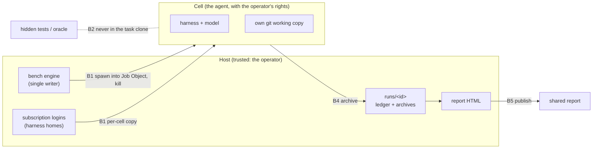

# Threat Model

*The repo-level rollup of every component's adversarial analysis (STRIDE-lite). **The register in
section 2 is generated**; refresh it with:*

```bash
python3 docs/ai-forward-pack/scripts/docs-graph.py rollup --heading "Adversarial analysis (STRIDE-lite)" --type design
```

*The rollup prints links relative to `docs/`; they are prefixed with `../` when pasted here.*

## 1. System trust-boundary map

One operator, one Windows workstation. Each cell is a native process tree in its own Job Object, working in its own git working copy with its own harness home (ADR-0013).



| # | Boundary | Less-trusted side | More-trusted side | Owning design |
| --- | --- | --- | --- | --- |
| B1 | Agent ↔ host | Agent in its working copy (running as the operator) | Host files, credentials | design-phase1-walking-skeleton (accepted, ADR-0013) |
| B2 | Agent ↔ oracle | Agent | Hidden tests and oracle | design-phase1-walking-skeleton |
| B3 | Agent ↔ git remote | Agent | The owner's remotes | design-phase1-walking-skeleton |
| B4 | Cell output ↔ host git | Archived workspace | Host git tooling | design-phase1-walking-skeleton |
| B5 | Credential ↔ published report | Report readers | The owner's tokens | design-phase1-walking-skeleton |
| B6 | TLA+ tools download ↔ CI | GitHub release asset | CI runner, check result | design-run-lifecycle-model |

## 2. Threat register (generated — see command above)

| source | Boundary | Threat | Disposition | Control | Test |
|---| --- | --- | --- | --- | --- |
| [design-phase1-walking-skeleton](../design/phase1-walking-skeleton.md) | Agent ↔ host | E/T: damage to host files or credentials | accept (owner, ADR-0013) | — | — |
| [design-phase1-walking-skeleton](../design/phase1-walking-skeleton.md) | Agent ↔ oracle | I: hidden tests in the agent's own tree | mitigate | The task clone never contains `tests/` or `oracle/`, in its tree or history | T-WS-oracle |
| [design-phase1-walking-skeleton](../design/phase1-walking-skeleton.md) | Agent ↔ git remote | T: push by accident | mitigate | No remote in the task clone (`gh` stays available; owner-accepted) | T-WS-noremote |
| [design-phase1-walking-skeleton](../design/phase1-walking-skeleton.md) | Cell output ↔ host git | E: run an agent-written hook | mitigate | `gitsafe.py` flags | T-B6-fsmonitor |
| [design-phase1-walking-skeleton](../design/phase1-walking-skeleton.md) | Credential ↔ published report | I: a token in a shared report | mitigate | Exact-value check before `bench report --publish`. The value set is built at publish time from the host's current credential files and every credential file in the archived cell homes (tokens rotated during a cell), each also in base64 and URL-encoded forms | T-SEC-report (positive controls: a planted host token, and a rotated token present only in an archived home, are both found, and publishing refuses) |
| [design-phase1-walking-skeleton](../design/phase1-walking-skeleton.md) | Everything else in the former analysis | — | accept (owner) | ADR-0012 | — |
| [design-run-lifecycle-model](../design/run-lifecycle-model.md) | The tla2tools.jar download | T: a substituted jar changes check results or runs code in CI | mitigate | Pinned release URL + sha256; delete on mismatch | `test_corrupted_tla_jar_is_deleted_and_refused` |
| [design-run-lifecycle-model](../design/run-lifecycle-model.md) | CI runner executing the jar | E: third-party code in CI | accept (ADR-0012) | Upstream TLA+ tools, pinned by hash; CI job permissions `contents: read` | — |

<!-- rolled up from 2 artifact(s) by docs-graph.py rollup on 2026-09-23 -->

## 3. Accepted-risk register

| Boundary / threat | Accepted by | Rationale | Residual risk | Revisit when |
| --- | --- | --- | --- | --- |
| Third-party task content (hostile repos, prompt injection in task files) | @timianmalloo (ruling, 2026-09-23) | Single trusted operator running chosen tasks locally; ADR-0012 | An agent is steered by task text, with the operator's rights | Tasks from sources the owner has not chosen, or the tool gets a second operator |
| An agent's reach outside its working copy: other repositories, the operator's logins, the bench repository and hidden tests, the host toolchain | @timianmalloo (rulings, 2026-09-23: "if an agent benchmark is operating in its own worktree, that's all we are looking for"; "that's a risk that I am not worried about") | ADR-0013 | Undetected; a hidden-test read would inflate a score | A result looks too good to be true: add the reach audit (ADR-0013 alternatives) |
| Supply-chain provenance (SBOM, image and package allowlists) | @timianmalloo (ADR-0012) | Pinned versions and digests suffice for a local tool | A compromised pinned upstream | The tool is distributed to other users |
| CI executing the pinned TLA+ jar | @timianmalloo (ADR-0012) | Upstream tool, hash-pinned; read-only job token | A compromised upstream release matching the pin is not credible | The pin changes |
| Git as an entry point | @timianmalloo (ruling, 2026-09-23) | Git is a mechanism here, not an entry point | — | The tool accepts runs or tasks from a remote |

## 4. Cross-cutting controls

- **Own working copy per cell** (ADR-0013): a bench-owned task clone with no remote and no hidden tests in its history. B2, B3.
- **Per-cell harness homes** (ADR-0003, ADR-0013): each cell gets its own home, with a copy of the Claude or Codex login deleted after use; Copilot uses the Windows credential store. B1.
- **Exact-value credential check** before publishing. B5.
- **Pinned hashes** for harness builds and tools. B6.

## 5. Gaps and flagged unknowns

- A3: OAuth refresh rotation may invalidate the host login when a cell refreshes a copied token (probe in the phase-1 design).
- Phase-2 designs (the Copilot profile, stop and decisions) have no analysis yet; they add rows when designed.
