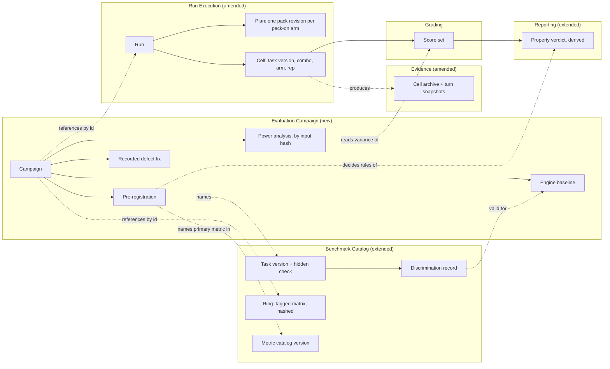
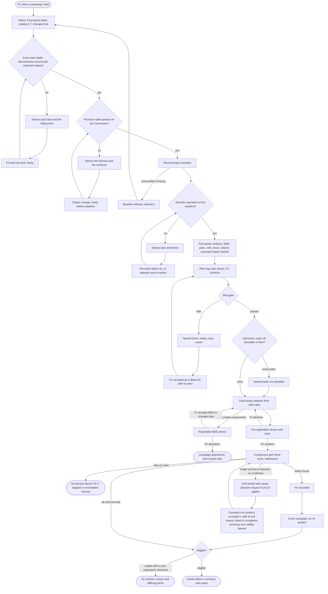
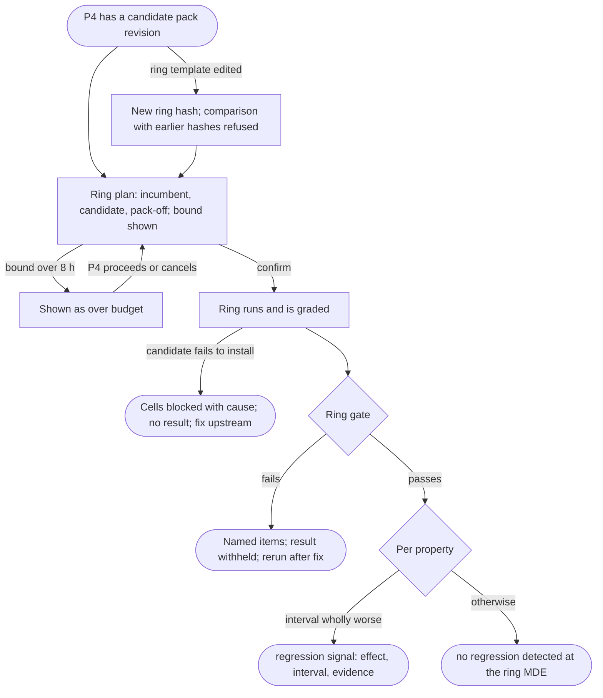
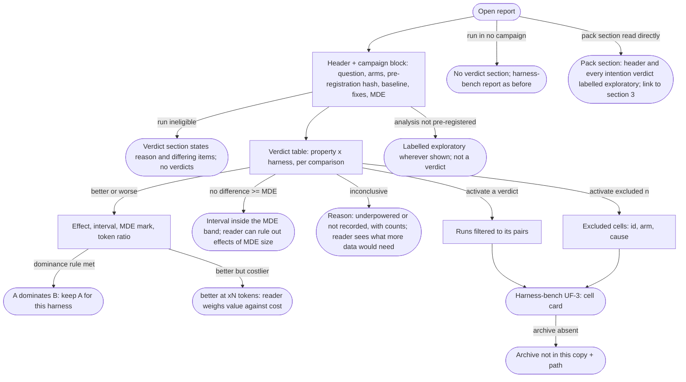

# Spec: Enterprise/Production evaluation

- **Status:** In review (gated). Passed the specify gate in two rounds on 2026-10-03 (see [Gate record](#gate-record)). The operator answered every decision request on 2026-10-03 ([Decisions](#decision-requests-decided-2026-10-03)). Awaiting the operator's acceptance.
- **Tier (cost-of-error):** T2. A wrong verdict misdirects pack changes for every harness and gets published. A campaign also commits about a day of unattended model time per grid (measured: a grid takes about 5 h to run and about 5 h to grade at parallelism 2).
- **Author / date:** Claude Code (Opus 5.5), the /specify author seat for @timianmalloo, 2026-10-03.
- **Refines:** [`harness-bench.md`](harness-bench.md) (accepted 2026-09-23). It reuses that spec's domain model, its stories (cited as US-n) and its report UX and UI. Where this spec changes anything there, the change is listed in [Conflicts with the harness-bench spec](#conflicts-with-the-harness-bench-spec). No change takes effect until the operator accepts it.
- **Implements:** [`benchmark-state-and-target.html`](../proposals/benchmark-state-and-target.html), sections "Proposed approach" A-D and "Sequence". Approach E (the slimmed pack itself) is upstream pack work (harness-bench NG10). This spec only requires the slimmed pack to exist as an identified pack revision.
- **Related:** [`enterprise-production-portfolio.html`](../proposals/enterprise-production-portfolio.html) (the task-family sketch), [`pack-onoff-analysis.html`](../proposals/pack-onoff-analysis.html), [`pack-improvement-section.md`](../design/pack-improvement-section.md) (the report's pack section and its per-intention verdicts).

Confidence labels, as in the harness-bench spec:
- **[Verified]:** read or computed in this session, with the source named.
- **[Inferred]:** reasoned, cited from another document and not re-derived, or read from an abstract.
- **[Flagged]:** unknown or at risk.

Story ids are **EV-n**, UX criteria **EVX-n**, UI criteria **EVU-n**. They do not reuse the US-n, UXA-n or UIA-n ids of the harness-bench spec.

---

## Part A — Functional specification

*Owner lens: Product Strategist. Domain Researcher for evidence. Data & Persistence Architect for the model.*

### Problem

The operator changes the AI-Forward pack and must decide whether each change is worth keeping. The pack claims that it improves Enterprise/Production outcomes: secure by default, resilient, less rework, no guessing and simpler code. Today the operator cannot check that claim. There are four reasons, each measured:

1. **The tasks give the pack's properties nothing to win on.**
   - In grid-4, both arms passed every pair on A1, A2, A3, C1, D1, D2, D3, E4, E5, E6, E7, F1 and F2. [Verified: the grid-4 report's "Inconclusive" list]
   - No task has a security, resilience, rework or no-guessing requirement with a mechanical check. [Verified: `bench/bom.yaml` 0.5 task titles; the portfolio's gap table]
2. **The quality metrics that might show it never record.** Nine judged metrics were NOT_RECORDED in all 108 applicable grid-4 score rows each, with reason `judge calls not allowed in this pass`. [Verified: `runs/grid-4/scores/grade-20261003T041421-a04357.jsonl`] The report still lists them.
3. **There is no power.**
   - Two repetitions over 23 tasks gave pass pairs of 86 vs 82 of 116 (p = 0.66). [Verified: grid-4 report, pack section]
   - Run-to-run drift is large. Pack-off tokens per cell on Claude Code rose 24% between grid-3 and grid-4 under the same arm. [Verified: computed, see [Power-analysis inputs](#power-analysis-inputs-descriptive-evidence)]
   - Nobody knows how many repetitions or tasks a stated effect needs.
4. **Every grid until grid-4 lost data to an infrastructure or grader defect.** The defect was found only after a full grid, at about 10 hours per grid. [Inferred: the proposal's "What does not work" point 3; the defect classes ORCL-A, ORCL-B, CAUSE-A, BND-A, HASH-A and SCAN-A in `docs/lessons/defect-classes.md` are the recorded instances]

The decision the operator must be able to make is: **"For each harness, does pack revision X give better Enterprise/Production outcomes per unit of cost than pack-off, and than pack revision Y? Keep X, revert to Y, or turn the pack off for that harness."** The answer must come with a stated confidence and a stated minimum effect it could have seen. A pack change must also be checkable for regressions within a working day.

### Target users & personas

| Persona | Who | Job to be done | Evidence |
| --- | --- | --- | --- |
| **P1 Benchmark Owner / operator** (primary) | As in the harness-bench spec. Here P1 is in the role of deciding on pack changes. | When I have a pack revision to judge, get a per-harness, per-property verdict with an interval and a minimum detectable effect, so I can keep, revert or turn off the pack with evidence I can defend. | The proposal's target statement and decision requests; this request [Verified] |
| **P4 Pack Maintainer** (new) | The maintainer of ai-forward. Today this is the same person as P1, in a different job. | When I change the pack, learn within a working day whether the change broke a property on any harness, so a regression never reaches a release. | The proposal's "measure → fix upstream → re-measure" loop. PK-01, PK-02 and PK-05 were found and confirmed fixed this way [Verified: proposal table] |
| **P2 Task Author** | As in the harness-bench spec. | Build a property task whose hidden check passes the reference and fails a plausible naive solution, proven through the engine, so a task never reaches a grid with a broken oracle. | ORCL-A, HASH-A and SCAN-A were each found in a grid, not at authoring [Verified: defect register] |
| **P3 Report Reader** | As in the harness-bench spec. | Learn what the pack did to each Enterprise/Production property, per harness, and how sure the result is, without re-running anything. | Inferred, as in the harness-bench spec (R9 still open) [Flagged] |

### Core scenario

1. P1 starts a campaign for the question "pack ccc5160+3b (X) vs pack-off vs slimmed pack (Y), three harnesses".
2. Ten property tasks, two per property, are authored. Catalog 0.7 lands. The post-turn-message spike passes on all three harnesses. Changes here are free: the campaign is still a draft.
3. The campaign records an **engine baseline**: the bench commit, catalog version, BOM version, price list version, harness builds and pinned dependency set. From here on, a change is a recorded defect fix or nothing.
4. Each task has a discrimination record produced through the engine at the baseline: the reference passes the hidden check with its expected secondary values, and a seeded naive solution fails it.
5. A first power analysis, built from grid-3 and grid-4 variance, sizes the pilot.
6. The **pilot ring** runs every task once per arm and harness and is graded at once. It finds that one task's primary metric is NOT_RECORDED in every cell. That blocks the grid.
7. The fix is recorded as a defect fix against the baseline, and the pilot ring passes on its next run.
8. A second power analysis, built from the pilot's pack-off rates, says how many repetitions each property needs for the pre-registered minimum detectable effect, and what that costs in cells and hours.
9. P1 confirms the pre-registration.
10. The **comparison grid** runs all three arms in one run, with the launch order interleaved.
11. The report opens on the **property verdicts**: for each property and harness, X vs off, X vs Y and Y vs off. Each verdict is `better`, `worse`, `no difference ≥ MDE` or `inconclusive (reason)`. It shows the effect, its interval, the MDE, each task's own effect, and the token ratio beside it.
12. P1 decides per harness.
13. Later, P4 changes the pack. The **pack-regression ring** runs in under a working day and reports, per property, either "no regression detected at this ring's MDE" or a regression signal.

If this works end to end for the five properties, the benchmark answers the question it was built for. Everything else, such as more properties, control variants and more harnesses, scales it.

### In scope / Out of scope (explicit non-goals)

**In scope:**
- Ten property tasks: two per property, on different base trees (DR-T1, decided 2026-10-03). Each is unsaturated by design, multi-step, set in an existing codebase, and has a hidden mechanical check (EV-1..EV-6).
- The full first campaign: 5 properties × 3 harnesses × 3 arms (operator scope decision, 2026-10-03).
- Task readiness proven through the engine (EV-7). Calibration-based admission (EV-8). At most four saturated calibration tasks (EV-9, DR-T5).
- Catalog additions for the property metrics, and the rule that a metric shown is a metric recorded (EV-10, EV-11).
- A power analysis and a pre-registration per campaign (EV-12, EV-13).
- A pilot ring, a pack-regression ring and an engine freeze (EV-14..EV-16).
- One comparison grid of three arms (pack-off, pack revision X, pack revision Y) on three harnesses (EV-17, DR-T4).
- A per-property verdict and a value-beside-cost statement in the report (EV-18..EV-20).

**Out of scope (non-goals):**
- **EN1** Docker or any container, for any task or check (ADR-0013 Amendment 1). Every hidden check runs natively.
- **EN2** Vendor API keys. Harnesses and any enabled judge use subscriptions, through the existing gateway backend (ADR-0009).
- **EN3** New harnesses. Claude Code, Codex CLI and Copilot CLI stay the measured set (harness-bench NG4).
- **EN4** A public leaderboard or hosted service (harness-bench NG3).
- **EN5** Privacy, compliance, operability and drift families (portfolio families I, J, L, P), and control variants. Each is a later family.
- **EN6** Building the slimmed pack (approach E). It is built upstream and enters as a pack revision (harness-bench NG10).
- **EN7** Parallel grading and other engine speed-ups during a campaign. An engine change lands before the engine baseline or not at all (EV-16). Grading time is measured (NFR) so a later change can be judged.
- **EN8** A USD figure without a sourced, dated price (harness-bench NG8). Today `bench/prices.yaml` has no entries, and `cost_usd` was NA in 276 of 276 grid-4 cells. [Verified] Tokens are the cost axis until a price exists (DR-E3).
- **EN9** Re-scoring grids 1-4 under the new catalog. Historical scores keep their catalog version (US-4).
- **EN10** Generalising a verdict beyond its sampled tasks. With two tasks per property, a verdict covers two independent codebases and is stated as such: "on <task a> and <task b>". The report shows each task's own effect beside the pooled one. A verdict that holds on both tasks generalises beyond one task. It still does not reach "this property in every codebase" (R-E1).

### Conceptual domain model (DM1 / DM4 / DM14)

**Bounded contexts.** This spec adds one context and extends two of the harness-bench spec's five. It renames none of them.

- **Evaluation Campaign** (new). Turns a question about pack revisions into a pre-registered, powered and frozen plan of runs, and holds the record of what happened. It owns: campaign, pre-registration, power analyses (by input hash), engine baseline, recorded defect fixes and the ids of its ring runs.
- **Benchmark Catalog** (extended). Gains: property, latent requirement, hidden check (as part of the oracle), reference and naive solutions with their expected metric values, discrimination record, ring definitions (as tagged matrices), and the property metrics in the catalog.
- **Run Execution** (amended, DR-E1 decided). A plan carries **one pack revision per pack-on arm**. A cell's grain becomes one (task version, combo, **arm**, repetition) (C-E1).
- **Evidence** (amended, DR-E4 decided). A cell archive of a multi-turn task gains one **turn snapshot** per turn (C-E12).
- **Reporting** (extended). Gains: property verdict and value-beside-cost statement. Both are derived and never stored as truth.
- **Grading** is unchanged in kind.



**Ubiquitous language (additions).** These terms join the harness-bench glossary. A term defined there keeps its meaning there.

| Term | Meaning |
| --- | --- |
| **Property** | One of the five Enterprise/Production qualities a task checks: `security`, `resilience`, `rework`, `no-guessing`, `simplicity`. A property is what is measured. The pack's claim about it is an **intention** in the pack section's sense (conflict C-E5). |
| **Property task** | A task whose oracle includes a hidden check for exactly one property. |
| **Latent requirement** | The constraint a property task's prompt does not state but the base tree evidences, for example an ADR, a guard in a sibling handler or a timeout convention. Finding it tests grounding, not instruction following. |
| **Hidden check** | The part of a property task's oracle that decides the property: an attack probe suite, a fault-injection suite, second-turn tests, tests on a changed contract, or diff statistics against a reference. It is a part of the oracle, not a second name for it. |
| **Reference solution** | A solution the task author holds to be correct, including the latent requirement. |
| **Naive solution** | A plausible solution that meets the stated ask and misses the latent requirement. Seeded by the task author. |
| **Discrimination record** | The evidence, produced through the engine, that for one task version under one engine identity the reference passes the hidden check and the naive solution fails it. |
| **Primary metric** | The one metric a property's verdict is decided on, named in the pre-registration. Every other metric is secondary and exploratory. |
| **Property check pass** | The proposed primary metric shape: a per-cell binary that is 1 when the stated ask's hidden tests pass and the hidden check passes. A deliverable that does not build or run is a measured 0, not NOT_RECORDED (EV-1). |
| **Arm** | One treatment level in a run: `pack-off`, or `pack-on @ <pack revision>`. It generalises the harness-bench **pack setting**: a two-arm run with one pack revision is the old on/off run exactly (C-E1, resolved by DR-E1). |
| **Turn snapshot** | The tree at the end of one turn of a multi-turn cell, archived before the next turn starts. Append-only. The final tree stays the graded deliverable unless the task names a turn snapshot as a graded input (the rework task grades turn-1 tests on it). |
| **Pack revision** | As in the harness-bench spec, widened to any identified pack build (source and commit), released or a candidate. The request's "pack version" is this term (conflict C-E9). |
| **Campaign** | One pre-registered evaluation of one question. It owns its baseline, pre-registration, the input hashes of its prior and final power analyses, its defect-fix list and the ids of its ring runs and comparison grid. States: `draft` (authoring; changes are free), `baselined`, `piloted`, `registered`, `measuring`, `concluded`, `abandoned`. |
| **Engine baseline** | The identity a campaign freezes: bench commit, metric catalog version, BOM version, price list version, harness builds and pinned dependency set. |
| **Engine freeze** | The rule that no run counts toward a campaign's verdict unless its engine identity is the baseline, or the baseline plus recorded defect fixes. |
| **Recorded defect fix** | A change admitted under the freeze. It carries a defect-class id, the commit and the scores it can move. |
| **Ring** | A committed matrix template tagged with one purpose: `pilot` (catches defects before a grid), `pack-regression` (checks a pack change in under a working day) or `comparison` (the confirmatory run). It fixes tasks, harnesses, arms (as roles: pack-off, incumbent, candidate) and repetitions. Its identity is the content hash of the template. A ring is not a new entity: it is a tagged matrix variant (Simplifier finding, chosen 2026-10-03). |
| **Ring gate** | The mechanical checks a ring's graded result must pass before the next step. The checks are fixed per tag (EV-14), not per ring. |
| **Calibration task** | A saturated task kept for continuity and broad-regression detection. It is never used for a property verdict. |
| **Minimum detectable effect (MDE)** | The smallest true effect on a primary metric that a campaign's design detects with the stated power at the stated α. |
| **Power analysis** | The computation from recorded variance inputs to the repetitions and tasks a primary metric needs for its MDE, and the cells, hours and tokens that implies. A value object identified by the hash of its inputs. The campaign records which hash is its `prior` and which is its `final` analysis. |
| **Pre-registration** | The frozen statement of question, arms, primary metric per property, MDE, α, power, multiplicity correction, pairing unit, analysis method and exclusion rules, fixed before the comparison grid's first cell. |
| **Property verdict** | Per (property, harness, comparison): `better`, `worse`, `no difference ≥ MDE`, or `inconclusive (<reason>)`, with the effect and its interval. Derived. |
| **Value beside cost** | A property verdict shown with the arms' token ratio and its interval (and USD when priced). It includes `dominates` when one arm is no worse at the MDE and cheaper with confidence (EV-19). |
| **Eligible run** | A run whose engine identity and plan match its campaign's baseline and pre-registration. Only eligible runs yield verdicts. |

**Entities and value objects.**
- **Entities:** Campaign, Recorded defect fix, Discrimination record. From the harness-bench spec: Task, Task version, Run, Cell, Score set.
- **Value objects:** Property, Arm, Pack revision, Latent requirement, Hidden check (inside the task version), Expected metric values (inside the task version), Primary-metric designation, MDE, Pre-registration, Engine baseline, Power analysis (identified by its input hash; its output is a pure function of its inputs), Ring (a tagged matrix template identified by its hash), Turn snapshot, Ring gate result, Property verdict (derived), Value beside cost (derived), Eligibility (derived).

**Aggregates** (each with its root and the one invariant it protects):

| Aggregate (root) | Invariant |
| --- | --- |
| **Campaign** | Changes before the engine baseline is recorded are free (tasks, catalog, engine). From the baseline on, the only admitted change to the engine identity is a recorded defect fix, and the defect-fix list only grows. From the comparison grid's first cell start, the pre-registration never changes. Changing the question makes a new campaign, and the old grid's results become exploratory. |
| **Discrimination record** | A record is valid only for the exact (task version hash, engine identity, platform) it was produced under. It is never edited. A new task version or engine identity needs a new record. |
| **Task version** (harness-bench, extended) | Unchanged. The hidden check, the reference and naive solutions with their expected metric values, the latent requirement and the primary-metric designation are inside the content hash. |
| **Run** (harness-bench, amended by DR-E1) | Its plan is frozen at confirmation. A frozen plan holds exactly one pack revision per pack-on arm, and zero for the pack-off arm. |
| **Cell** (harness-bench, amended by DR-E1 and DR-E4) | One cell is exactly one (task version, combo, arm, repetition), replacing (task version, combo, pack setting, repetition). It has at most one prompted attempt, which may hold more than one turn, and reaches exactly one execution outcome. |

The **cell archive** (Evidence) stays immutable and hashed. For a multi-turn task it holds one turn snapshot per completed turn, archived before the next turn starts and never rewritten.

A **ring** has no aggregate of its own. Its template is content-hashed like a matrix, and results from different ring hashes are not compared (EV-15).

**Policies** (rules that span aggregates, not invariants of one):
- **Readiness policy:** a property task is ready for a campaign only with a valid discrimination record for that campaign's engine baseline. Records made during authoring are re-produced at the baseline (EV-7).
- **Admission policy:** a task enters the comparison grid only if its pack-off arm is neither saturated nor floor in calibration (EV-8).
- **Re-grade policy:** a recorded defect fix that can move any score of an eligible run forces a re-grade of every campaign run under the fixed engine before any verdict (EV-16).
- **Eligibility policy:** a run yields verdicts only if it is eligible (EV-20).

**Derived, never stored as truth:** property verdicts, effects, intervals, token ratios, dominance, power-analysis outputs (cached under the input hash, rebuildable), ring gate results (recomputed from the ring run's score sets), and eligibility. The stored inputs are the harness-bench facts (model calls, scores), plus the campaign record, discrimination records, ring templates and turn snapshots. The physical grain of the amended cell and archive is `/define-architecture`'s first decision. Additivity and history rules belong to `/design-slice`.

### User stories & acceptance criteria

Each criterion is written so that a test can fail it. "The engine" means the harness-bench run engine and grading pass at the campaign's engine baseline.

#### Epic EA — Tasks that can show value

**EV-1 — As P2, I want every property task to follow one contract, so that each one tests grounding on a latent requirement and decides its property mechanically.**
- **Given** a property task marked `ready` **When** `bench validate` runs **Then** it passes only if `task.yaml` names:
  - exactly one property;
  - the latent requirement in one sentence;
  - at least one evidence path that exists in the task version's base tree;
  - a primary metric present in the catalog with `kind: score` and source D or H (J only under DR-T2's rule);
  - a reference solution and a naive solution, each with its expected value for every metric its graders name.

  The evidence path's *relevance* is proven by EV-7, not here: the naive solution, which ignores that evidence, must fail.
- **Given** a campaign's BOM version **When** validated **Then** each property has exactly two ready property tasks, and the two have different workspace bases (different codebases, not variants of one tree). A property with one task, or two tasks on one base, fails, naming the property (DR-T1).
- **Given** a property task's `prompt.md` and the task's declared list of terms that would state the latent requirement **When** validated **Then** no listed term appears in the prompt. A hit fails, naming the term and the line.
- **Given** a cell whose deliverable does not build or start **When** the hidden check runs **Then** the primary metric is recorded as 0 with reason `deliverable did not build` (a measured failure). NOT_RECORDED is used only when the grading environment itself fails, with that reason (US-27).

*EV-2..EV-6 each apply to both tasks of their property. "The task" means each of the two.*

**EV-2 — As P1, I want security-by-default tasks, so that a solution that works but can be exploited scores as a failure.**
- **Given** a security task **When** its hidden check runs against the built deliverable in the grading copy **Then** it runs at least one injection probe, one authorization-bypass probe (a read across a tenant or user boundary) and one secret-leakage probe (a planted secret value in logs, responses or written artifacts). Primary metric = 1 only when the stated ask's hidden tests pass and every probe is blocked. The secondary `exploit_probes_blocked` = blocked ÷ probes.
- **Given** the reference solution **When** graded through the engine **Then** every probe is blocked and the primary metric is 1. **Given** the naive solution, which passes the functional tests without the guard **When** graded **Then** at least one probe succeeds and the primary metric is 0.
- **Given** one archive graded twice **When** the probe results are compared **Then** they are identical. The probes use fixed payloads and reach only the deliverable on the loopback interface.

**EV-3 — As P1, I want resilience tasks, so that code that hangs, retries without bound or duplicates effects under a failing dependency scores as a failure.**
- **Given** a resilience task **When** its hidden check runs **Then** the dependency is a check-controlled fake on loopback, driven by a fault schedule with a recorded seed. The schedule includes latency past the declared timeout, a burst of 5xx responses, a hang and duplicate deliveries.
- **Given** that schedule **When** the deliverable runs **Then** the primary metric is 1 only if:
  - no call waits longer than the declared timeout plus the declared tolerance;
  - retries per call are at most the declared maximum;
  - no duplicate delivery produces a duplicate effect;
  - the result is correct after the dependency recovers.

  The secondaries are `fault_suite_pass` (checks passed ÷ checks) and `idempotency_violations` (count).
- **Given** a deliverable that hangs **When** the check's own wall bound passes **Then** that case is a measured failure, and the check ends and records it.
- **Given** two grading copies of different cells checked in parallel **When** their fakes start **Then** each listens on its own port, and neither sees the other's traffic.

**EV-4 — As P1, I want rework tasks, so that a short-sighted first design costs measurable rework when the second requirement arrives.**
- **Given** a rework task **When** a cell runs **Then** it receives the turn-1 prompt and, once turn 1 ends, the turn-2 requirement as a second user message in the same attempt (DR-E4, decided). The turn-1 tree is archived as a turn snapshot before the turn-2 message is sent.
- **Given** the post-turn-message spike **When** the engine baseline is recorded **Then** the spike has delivered a second message after `end_turn` on Claude Code, Codex and Copilot, and the campaign record cites its evidence. Without it, the baseline is refused.
- **Given** a graded rework cell **When** scored **Then** it records turn-1 hidden tests on the turn-1 snapshot, turn-2 hidden tests on the final tree, and `rework_ratio` = turn-1-added lines that turn 2 changed or deleted ÷ turn-1-added lines (non-test files inside the blast radius). Primary metric = 1 only when turn-2 tests pass, turn-1 tests still pass, and `rework_ratio` ≤ the task's declared ceiling.
- **Given** the reference (a turn-1 design that anticipates turn 2) and the naive solution (a turn-1 design with the short-sighted shape, for example a hard-coded region) **When** both are graded through the engine **Then** the reference scores 1 and the naive scores 0, and the discrimination record shows that the declared ceiling separates them.
- **Given** a cell that ends during turn 1 (timeout, stop or failure) **When** graded **Then** the turn-2 metrics are NOT_RECORDED with reason `turn 2 not reached`, and the primary metric is 0.

**EV-5 — As P1, I want no-guessing (Spike Protocol) tasks, so that a solution written against the plausible guess of an API fails.**
- **Given** a no-guessing task **When** its base tree is inspected **Then** it vendors an authored, unpublished API. At least one member is renamed and one default differs from the common convention, and the true contract is readable in the tree (source or docs).
- **Given** the hidden tests **When** they run **Then** they exercise the changed members and the changed default. The reference passes. The naive solution, written against the conventional contract, fails.
- **Given** a graded cell **When** scored **Then** it records `hallucinated_symbol_errors` (build-log errors naming a member that does not exist) and `verified_before_use` (1 when a read of the API's source or docs, or a probe run, comes before the first edit that uses the API, by tool-call order). Both are secondary.

**EV-6 — As P1, I want simplicity tasks, so that an over-engineered solution that passes the tests scores as a failure.**
- **Given** a simplicity task **When** graded **Then** it records:
  - `size_vs_reference` = added product lines ÷ the reference's added product lines (non-test files inside the blast radius; pack files excluded);
  - `new_abstractions` (new types and interfaces);
  - `new_dependencies`.

  Primary metric = 1 only when the hidden tests pass and each value is within the task's declared ceiling.
- **Given** the reference **When** graded **Then** the primary metric is 1. **Given** the naive solution, which passes the tests with an unrequested configuration layer **When** graded **Then** the primary metric is 0.
- **Given** a deliverable that adds files outside the blast radius **When** sized **Then** they are counted by the existing `scope_creep` (US-30), not by `size_vs_reference`, so one line is never counted twice.

**EV-7 — As P2, I want a task ready only when the engine itself has shown that its hidden check discriminates, so that no grid finds a broken oracle (ORCL-A, ORCL-B, HASH-A, SCAN-A).**
- **Given** a property task version **When** its discrimination record is produced **Then** the reference and naive solutions are each the final tree of a synthetic cell. The working copy is built by the engine's own path (`workspace.task_source`, `workspace.cell_working_copy`) and graded by the engine's grading pass in a grading copy under the cells root. The record holds the task version hash, the engine identity, the platform and both score sets.
- **Given** a property task marked `ready` **When** `bench validate` runs **Then** it fails unless all of the following hold, naming each item that fails:
  - a discrimination record exists whose task version hash equals the current hash;
  - its engine identity equals the current engine (or the campaign baseline, when validating for a campaign);
  - the reference's primary metric is 1;
  - every other metric the reference's graders name **equals its expected value** declared in `task.yaml`, within the metric's catalog scale. Being recorded is not enough;
  - the naive solution's primary metric is 0, and each of its secondary metrics with a declared expected value equals that value.
- **Given** a secondary check that wrongly zeroes a metric on the reference (the SCAN-A shape: a scan that counts a tool's mandated output as a violation) **When** the record is produced **Then** readiness fails, naming the metric, the expected value and the observed value. A fixture task with exactly that defect is red under this criterion.
- **Given** an expected value in `task.yaml` **When** reviewed **Then** its provenance comment says how it was derived independently of the grader's output (GLD-A). An expected value copied from a grader run is not provenance.
- **Given** a frozen value in the task (a statement hash or a reference size) **When** validated **Then** it equals the output of the canonical function the grader calls. A value derived by hand fails (HASH-A).
- **Given** a hidden check whose declared tools include a container runtime or a tool that runs only on Linux **When** validated **Then** it fails, naming the tool (EN1; tasks run natively on Windows and macOS).

**EV-8 — As P1, I want a task admitted to the comparison grid only if its control arm can still move, so that no grid repeats grid-4's saturation.**
- **Given** the pilot ring's graded cells for a property task **When** the pack-off arm's primary metric is 1 in every cell (`saturated`) or 0 in every cell (`floor`), by exact equality as in R-85 **Then** the task is not admitted, and the campaign record names the task and the reason.
- **Given** admission **When** it is decided **Then** it reads the pack-off arm only. A test that changes only pack-on values leaves admission unchanged.

**EV-9 — As P1, I want a few calibration tasks kept, never mixed into property verdicts, so that continuity with grids 3-4 costs little and misleads no one.**
- **Given** a comparison grid **When** its plan is built **Then** it has at most the DR-T5 number of calibration tasks (default 4) at the DR-T5 repetitions (default 1), and each is marked `calibration` in the plan.
- **Given** a calibration task's cells **When** property verdicts are computed **Then** none of them contributes. A test that removes every calibration cell leaves every verdict unchanged.

#### Epic EB — Metrics that record

**EV-10 — As P1, I want the property metrics added to the catalog under the existing version rules, so that historical scores do not move.**
- **Given** the property metrics (the proposed primary `property_check_pass` and the secondaries in EV-2..EV-6) **When** they enter the catalog **Then** the catalog version is bumped (0.7). Each metric has `kind`, `better`, an anchor and an anchor note in one of the three permitted forms, and the freeze record gains the new version.
- **Given** frozen fixture runs from grid-3 and grid-4 **When** graded under the new version **Then** every score of a metric that existed in 0.6 is unchanged, and the new metrics are absent for tasks whose graders do not name them (US-4).

**EV-11 — As P1, I want any metric the report shows to be one that a grading pass records, so that "shown but never recorded" cannot recur.**
- **Given** the pilot ring's grading **When** a metric that applies to a task is NOT_RECORDED in every cell of that task **Then** the pilot gate fails, naming the metric, the task and the reasons. The only exception is a metric the task declares `expected NA` with a reason.
- **Given** a discrimination record **When** a metric is recorded on the reference but differs from its declared expected value **Then** it counts as not recording correctly, and readiness fails (EV-7). Recorded-but-wrong is treated like not recorded.
- **Given** a run report **When** a metric has no recorded value in the run **Then** no section draws it as a measured axis, column or radar spoke, and the validity banner lists it under `not recorded in this run: <metric ids> (<reason>)`.
- **Given** a judged metric named as a primary metric (DR-T2) **When** the comparison grid is graded **Then** judge calls are allowed in that pass, and each judge's agreement with the human calibration labels and the inter-judge κ are reported (US-35). Otherwise the pre-registration is refused.

#### Epic EC — Enough power

**EV-12 — As P1, I want a power analysis before any comparison grid, so that I know which effect the grid can detect and what it costs.**
- **Given** variance inputs (source run ids, the cell population with its exclusions, per-arm rates or means, the paired discordance or SD, and the rep-to-rep spread) **When** the power analysis runs **Then** for each property's primary metric it outputs: α, power, MDE, pairing unit, multiplicity correction, the required pairs per harness and per comparison, and the implied cells, hours (from the measured mean wall per cell of the named source runs) and tokens.
- **Given** the same recorded inputs and seed **When** the analysis runs twice **Then** the outputs are identical.
- **Given** closed-form reference cases **When** the analysis computes them **Then** its α and power equal the inputs exactly, its required size is within ±1 of the reference, and its MDE (solved back from that size) is within 0.005. The reference cases:
  - **Unpaired two proportions** (the normal-approximation formula without continuity correction, as in Fleiss, Levin & Paik, *Statistical Methods for Rates and Proportions*, 3rd ed.): p₀ = 0.50, p₁ = 0.70, two-sided α = 0.05, power 0.80 → **93 per arm**.
  - **Paired binary** (Connor 1987, McNemar sample size): discordant proportion ψ = 0.28, difference δ = 0.20, the same α and power → **53 pairs**. With α = 0.05 / 45 (Bonferroni over the campaign's 45 tests) → **115 pairs**.
  - Each reference value is also reproduced by an independent implementation named in the test (for example `statsmodels` or a hand-coded formula in the test itself), so the analysis is not checked against itself.
- **Given** a reference case altered so that its formula is wrong (for example z for one-sided α) **When** the reference test runs **Then** it fails. This is the seeded-wrong variant that proves the test discriminates.
- **Given** a property with no measured control rate (before its pilot) **When** the prior analysis runs **Then** it uses the maximum-variance assumption (rate 0.5 for a binary metric), labels that input `assumed`, and the final analysis replaces it with the pilot's pack-off rate.
- **Given** a planned comparison grid whose pairs per (property, harness, comparison) fall below the requirement **When** the plan is presented (US-6) **Then** it shows the MDE the plan can reach instead, and the grid can be registered only after P1 accepts that MDE or changes the plan.

**EV-13 — As P1, I want the question and its analysis fixed before the grid's first cell, so that a verdict is never chosen after seeing the data.**
- **Given** a campaign in state `piloted` **When** P1 confirms the pre-registration **Then** it records the question, arms (each pack revision by source and commit), primary metric per property, MDE, α, power, multiplicity correction, pairing unit, analysis method, exclusion rules and the minimum recorded pairs per verdict, with a content hash. The campaign becomes `registered`.
- **Given** a registered campaign **When** any of those fields changes after the comparison grid's first cell started **Then** the change is refused. P1 can abandon the campaign or start a new one, and verdicts from the earlier grid are labelled `exploratory`.
- **Given** a report of a comparison grid **When** it shows any analysis not named in the pre-registration **Then** that analysis is labelled `exploratory` wherever it appears.

#### Epic ED — A faster, more stable loop

**EV-14 — As P1, I want a pilot ring before every comparison grid, so that a grader or engine defect costs one small run and not a grid.**
- **Given** a baselined campaign **When** the pilot ring runs **Then** it runs every admitted-candidate task × every arm × every harness × 1 repetition at the engine baseline, and grading starts as soon as its last cell is terminal.
- **Given** the pilot's graded result **When** the ring gate is evaluated **Then** it fails, naming each item, if any of the following occurs:
  - a cell ends `blocked`, `failed` or with an infrastructure-classified cause;
  - a grader raises an error;
  - a metric fails EV-11;
  - a primary metric is NOT_RECORDED in any cell;
  - a cell is lost to a protocol bound (BND-A);
  - a task has no defined primary metric (the grid-4 G2 shape).
- **Given** a failed pilot gate **When** P1 tries to register the campaign **Then** registration is refused until a later pilot ring at the same baseline (plus recorded fixes) passes.
- **Given** a pilot ring **When** it ends **Then** its run and grade durations are recorded and shown with the plan's bound.

**EV-15 — As P4, I want a pack-regression ring, so that I learn within a working day whether a pack change broke a property.**
- **Given** a committed `pack-regression` ring template (fixed tasks, harnesses, arm roles = pack-off, incumbent and candidate, and repetitions) **When** it runs for a candidate pack revision **Then** run plus grading completes within 8 hours, measured and recorded. A plan whose bound exceeds 8 hours is shown as over budget before confirmation.
- **Given** the ring's result **When** reported **Then** each property shows `regression signal` (the candidate's interval against the incumbent lies entirely in the bad direction) or `no regression detected at <ring MDE>`, with the ring MDE taken from the power analysis. It is never shown as a campaign verdict.
- **Given** a change to the ring template's tasks, harnesses, arm roles or repetitions **When** saved **Then** its content hash changes, and a comparison of results from two different ring hashes is refused, naming the differences (as US-52 refuses on a BOM difference).

**EV-16 — As P1, I want the engine frozen during a campaign, so that every arm and every run is measured by the same instrument.**
- **Order (DR-T3, decided 2026-10-03):** author the property tasks → catalog 0.7 → the post-turn spike (EV-4) → record the engine baseline → reproduce discrimination records at the baseline (EV-7) → pilot ring → comparison grid. In `draft`, changes to tasks, catalog and engine are free and are not defect fixes.
- **Given** a campaign moving to `baselined` **When** the baseline is recorded **Then** it holds the bench commit, catalog version, BOM version, price list version, harness builds and pinned dependency set (US-50). It is refused unless every property task is authored, catalog 0.7 is frozen, and the post-turn spike has passed.
- **Given** a campaign run **When** its engine identity differs from the baseline by any change that is not a recorded defect fix **Then** the run is ineligible (EV-20), and the campaign record names the differing items.
- **Given** a recorded defect fix that can move any score of an eligible run **When** it is admitted **Then** every campaign run is re-graded under the fixed engine before any verdict is shown, and each verdict names the fixes it was computed under.
- **Given** a recorded defect fix **When** it is admitted **Then** it names its defect class in `docs/lessons/defect-classes.md` and the commit. A fix without a class is refused.

#### Epic EE — Compare and decide

**EV-17 — As P1, I want pack-off, pack revision X and pack revision Y in one comparison grid, so that drift between runs cannot pose as a pack effect.** (DR-E1, decided 2026-10-03.)
- **Given** a registered campaign **When** its comparison grid's plan is built **Then** it carries the three arms, with exactly one pack revision for each pack-on arm and none for pack-off. Every (admitted task, combo, repetition) has exactly one cell per arm, so one cell is one (task version, combo, arm, repetition).
- **Given** an existing two-setting matrix (`packs: [on, off]`, one pack) **When** planned under the amended model **Then** it yields the same cell list as before, as a two-arm run. Grid-4's matrix re-planned gives the same (task, combo, arm, repetition) set as its frozen `plan.json`, with `on`/`off` read as the two arms.
- **Given** the plan **When** it is frozen **Then** the launch order is a seeded permutation recorded with its seed. The mean launch position of each arm differs from the run's mean position by less than 5% of the cell count.
- **Given** a cell from any arm **When** its workspace is compared with the same task's pack-off workspace **Then** they differ only in the paths and managed blocks of that arm's pack revision manifest (US-9, per arm).

**EV-18 — As P1, I want a verdict per property, harness and comparison, so that I can decide per harness without reading raw tables.**
- **Given** an eligible comparison grid **When** verdicts are computed **Then** for each (property, harness, comparison ∈ {X vs off, X vs Y, Y vs off}) the effect on the primary metric is estimated paired by (task, harness, repetition), with the pre-registered interval method and corrected level. The verdict is:
  - `better` when the interval's lower bound is above 0;
  - `worse` when its upper bound is below 0;
  - `no difference ≥ MDE` when the interval lies within (−MDE, +MDE);
  - otherwise `inconclusive (underpowered)`;
  - and `inconclusive (not recorded)` when the primary metric is recorded in both arms in fewer pairs than the pre-registered minimum.

  The rules are applied in this order.
- **Inference unit (DR-T1 decided):** with two tasks per property, resampling is **stratified by task**: repetitions are resampled within each task, and the pooled effect weights the two tasks equally. A cluster bootstrap over two tasks is not used, because it has only three distinct resamples. The verdict also shows each task's own effect and interval. `better` or `worse` is stated as holding "on both tasks" only when each task's own interval agrees in direction.
- **Given** a reference case of 400 synthetic pairs with a known true difference **When** the interval is computed **Then** its bounds are within 0.01 of the normal-approximation interval for that case.
- **Given** 1,000 simulated datasets drawn with a known true effect at the campaign's design size, from a generator seeded with a recorded seed **When** the 95% intervals are computed **Then** between 93% and 97% of them contain the true effect (coverage).
- **Given** a hand-computed table of interval bounds and MDEs **When** the verdict rule is applied **Then** each row yields its tabulated verdict. The table includes the boundary rows lower bound = 0 (not `better`), upper bound = 0 (not `worse`) and an interval touching ±MDE (not `no difference ≥ MDE`).
- **Given** the same results and seed **When** recomputed **Then** every interval is identical (US-36's reproducibility).
- **Given** a calibration task, an excluded task, an invalid cell, or a cell lost during the grid (`blocked`, `failed`, `timed_out` with no primary metric, `stopped`) **When** verdicts are computed **Then** it does not contribute. The verdict shows the excluded count, and each excluded cell is listed with its id and reason, one activation away. The same list appears in the run's completion summary and the validity banner (US-43). A fixture with one blocked cell shows `excluded 1` and that cell's id and cause in all three places.

**EV-19 — As P1, I want value shown beside cost, so that "better per unit of cost" is a stated rule and not a reading of two tables.**
- **Given** a verdict **When** shown **Then** it carries the token ratio of the two arms (Σ tokens over the same pairs) with a 95% bootstrap interval, and the wall-clock ratio. USD appears only under US-23's sourced-price rule (EN8, DR-E3).
- **Given** arms A and B for a (property, harness) **When** A's verdict against B is `better` or `no difference ≥ MDE` and the upper bound of A's token-ratio interval is below 1 **Then** the report states `A dominates B`. No other rule produces that word.
- **Given** a `better` verdict whose token-ratio interval lies above 1 **When** shown **Then** the report states `better at ×<ratio> tokens`, never `dominates`.
- **Given** a reference case of paired token sums with a known ratio **When** the ratio interval is computed **Then** simulated coverage over 1,000 datasets, drawn from a generator seeded with a recorded seed, is between 93% and 97%. **Given** a hand-computed table of (verdict, ratio interval) rows **When** the dominance rule is applied **Then** each row yields its tabulated statement, including the boundary row where the ratio's upper bound equals 1 (not `dominates`).
- *Why `dominates` is kept (Simplifier finding 8b):* it is the only pre-registered answer to "per unit of cost". It decides the proposal's success criterion that the slimmed pack is "no worse on value at materially lower cost". Reading two side-by-side intervals leaves that decision to the reader after seeing the data.

**EV-20 — As P3, I want the report to say which campaign a grid belongs to and whether its verdicts are eligible, so that I never read an exploratory or drifted result as a verdict.**
- **Given** a comparison-grid report **When** opened **Then** a campaign header names: the question, the arms with pack revisions, the pre-registration hash, the engine baseline, the recorded defect fixes, the MDE per property and the power-analysis id.
- **Given** an ineligible run (engine drift, a pre-registration mismatch, or a failed or missing pilot) **When** reported **Then** no property verdict is shown. The section states the reason and the differing items.
- **Given** a run that belongs to no campaign **When** reported **Then** the property-verdict section is absent, and the report is otherwise unchanged from the harness-bench report.

### Non-functional requirements (ISO/IEC 25010)

| Attribute | Requirement (measurable) |
| --- | --- |
| Functional suitability | Each EV, EVX and EVU id traces to a test or a check before its slice is done. Each property's discrimination record exists (EV-7). |
| Performance efficiency | The pilot ring's and each ring's run and grade durations are recorded on every run. The pack-regression ring completes run + grade in ≤ 8 h (EV-15). The pilot ring has no fixed budget until one is measured. Its estimate is shown at plan time (US-6), and the proposal's "an hour" is flagged as unlikely at this shape (R-E4). The report's budget is unchanged from harness-bench Part C (≤ 5 MB, `report-ready` ≤ 2 s) with the verdict section added. |
| Reliability | No comparison-grid cell is lost to a defect class that the pilot gate checks (EV-14). Counted per grid, the target is 0. Provider-caused outcomes (auth, quota) are reported, not hidden. A hidden check that hangs is bounded (EV-3). |
| Security | The harness-bench controls (US-46, US-47, US-49, US-50) are unchanged. Attack probes and fault fakes reach only the grading copy's deliverable on loopback. They never reach the network or another cell. Planted secrets are synthetic canaries, never real credentials. Hidden checks, reference and naive solutions stay outside every cell workspace and its history (US-3, US-8). |
| Usability | P1 can read every property × harness verdict from the report without scrolling past the campaign header at 1280×800 (EVX-2). Every refusal names the cause and an action (UXA-7 applies). |
| Compatibility | Native cells on the operator's host. Tasks and hidden checks run natively on Windows and macOS. No Docker (EN1). No API keys (EN2). The engine runs on Windows only today [Verified: ADR-0013 finding], so a campaign's platform is Windows until the macOS port exists. A campaign runs on one platform, which the header names. |
| Maintainability | Hidden checks are pure functions of a cell archive and a seed (US-26). Probes use fixed payloads; fault schedules use recorded seeds. The power analysis is a pure function of its inputs. Verdict rules are property-tested over generated paired results. |
| Portability | Covered by Compatibility. No further target. |

### Boundary set

- **Empty:**
  - a campaign with no admitted task (every task is saturated or floor);
  - a property with zero recorded pairs;
  - a pilot ring with no completed cell;
  - a ring result with one arm missing.
- **Max:**
  - three arms × three harnesses × five properties × the power analysis's repetitions (could exceed one night; see R-E2);
  - a probe suite that runs to its wall bound in every case;
  - a rework cell that uses its whole budget in turn 1.
- **Malformed:**
  - a discrimination record for an old task version or another engine identity;
  - a pre-registration naming a metric absent from the catalog;
  - a declared ceiling that does not separate reference from naive;
  - a prompt that states the latent requirement.
- **Hostile:**
  - an agent that edits or deletes the fake dependency's fixtures in its tree (they are hidden, so this has no effect and counts as scope creep);
  - an agent that hard-codes a probe's expected response (probes vary inputs within a fixed set; a reference-only shortcut fails the functional tests);
  - an agent that writes the planted secret into an artifact (that is the probe's failure case, and the egress scan withholds excerpts, US-47).
- **Concurrent:**
  - two grading copies of the same task checked in parallel (ports, EV-3);
  - a recorded defect fix admitted while the grid is running (re-grade policy);
  - a pack-regression ring started during a campaign's comparison grid (vendor exclusivity and parallelism rules from the run scheduler apply; the ring is not a campaign run).
- **Unhappy paths:**
  - the pilot gate fails twice on the same defect;
  - a power analysis whose requirement exceeds the operator's capacity;
  - a pre-registration change attempted after the first cell;
  - a slimmed pack revision that fails to install;
  - judges needed for a primary metric but the gateway is unavailable (the metric is NOT_RECORDED and the verdict becomes `inconclusive (not recorded)`).

### Power-analysis inputs (descriptive evidence)

These figures are inputs for the EV-12 deliverable. They are not its result. They were computed in this session from the latest grading pass of each run, by a read-only script. The population is all 276 cells per run. Validity and contamination are **not** filtered, which differs from the report's pack section (valid pairs, E1-E3 excluded). Tokens = `uncached_input + cache_read + cache_write + output` (the `views.sum_tokens` definition).

| Quantity | grid-3 | grid-4 | Confidence |
| --- | --- | --- | --- |
| pass@1, Claude Code off / on | 0.70 / 0.75 (n = 44 each) | 0.75 / 0.84 | Verified |
| pass@1, Codex off / on | 0.80 / 0.86 | 0.82 / 0.84 | Verified |
| pass@1, Copilot off / on | 0.82 / 0.70 | 0.77 / 0.73 | Verified |
| Repetition disagreement on pass@1 within (task, combo, pack) | 12 of 132 (9%) | 11 of 132 (8%) | Verified |
| Paired on/off pass, discordant pairs, all tasks with pass@1 | 14 of 132 (7 on-only, 7 off-only) | 15 of 132 (9 on-only, 6 off-only) | Verified |
| The same, excluding the 13 tasks saturated in grid-4 | 12 of 54 (22%) | 15 of 54 (28%) | Verified |
| Paired log(on/off) tokens: mean (× ratio), SD — Claude Code | 0.74 (×2.10), 0.59 | 0.78 (×2.18), 0.42 | Verified |
| — Codex | 1.48 (×4.39), 0.65 | 1.43 (×4.18), 0.76 | Verified |
| — Copilot | 2.68 (×14.60), 0.63 | 2.66 (×14.32), 0.59 | Verified |
| Repetition-to-repetition SD of log tokens per (task, combo, pack), across arms and harnesses | 0.24-0.96 (Copilot pack-off 0.96) | 0.21-0.33 | Verified |
| Pack-off mean tokens per cell, grid-3 → grid-4 | Claude Code +24%, Codex +9%, Copilot +3% | | Verified (this population) |

**Discrepancy, flagged.** The Leader's figures (grid-4 tokens on/off per cell: Claude Code 681k/232k and Codex 1.47M/372k; Codex pack-off drift −14%) do not match this population (858k/398k, 1471k/470k, +9%). Copilot matches (2873k/265k). The populations differ, so **the power analysis must name its population** (EV-12, first criterion). This is not resolved here (R-E5).

**Illustration of scale for the decided campaign: 10 property tasks × 3 harnesses × 3 arms [Inferred: arithmetic, not the deliverable].**

Formulas (z₀.₉₇₅ = 1.9600, z₀.₈₀ = 0.8416):
- Unpaired two proportions: n = (z_α·√(2p̄q̄) + z_β·√(p₀q₀ + p₁q₁))² / δ². For p₀ = 0.50 and p₁ = 0.70 this is (1.9600·0.6928 + 0.8416·0.6782)² / 0.04 = **93** per arm.
- Paired binary (Connor 1987): n = (z_α·√ψ + z_β·√(ψ − δ²))² / δ². For ψ = 0.28 (grid-4's discordant share on unsaturated tasks) and δ = 0.20 this is (1.9600·0.5292 + 0.8416·0.4899)² / 0.04 = **52.5 → 53** pairs. With Bonferroni over 45 tests (z = 3.2608) it is **115**.
- From pairs to cells: n is the pairs needed per (property, harness, comparison). Two tasks share them, so repetitions per task = ⌈n / 2⌉. Grid cells = 10 tasks × 3 harnesses × 3 arms × repetitions, plus 36 calibration cells (4 tasks × 3 × 3 × 1, DR-T5).
- Run hours = cells × 2.174 cell-minutes ÷ 2 slots ÷ 60. The 2.174 is grid-4's throughput (5 h × 2 slots ÷ 276 cells). Grading adds about as much again. Brownfield tasks will be slower than grid-4's mix, so these are lower bounds.

| Design (per-harness verdicts unless stated) | Pairs per (property, harness, comparison) | Repetitions per task | Property cells | Run hours (+ calibration) |
| --- | --- | --- | --- | --- |
| Unpaired, 0.50 → 0.70 | 93 | 47 | 4,230 | ≈ 77 |
| Paired, ψ = 0.28, δ = 0.20 | 53 | 27 | 2,430 | ≈ 45 |
| Paired, Bonferroni over 45 tests | 115 | 58 | 5,220 | ≈ 95 |
| Paired, harnesses pooled for the primary verdict | 53 across 3 harnesses | 9 | 810 | ≈ 15 |

The full per-harness design (2,430 to 5,220 cells, 45-95 h of run) does not fit one night. The decided scope is kept. The power analysis (EV-12) and the pre-registration (EV-13) must choose among the following, each stated before the grid:
- splitting the grid over several nights in one run (resume, US-18);
- a graded primary metric;
- a larger MDE;
- harness-pooled primary verdicts with per-harness verdicts as secondary.

This is risk R-E2.

### Comparables & user evidence (sourced)

| Claim | Source | Confidence |
| --- | --- | --- |
| Functional tests plus end-to-end exploits (black-box injection and path traversal; white-box secret checks) is an established way to score generated backends. About half of correct programs were exploitable | BaxBench, arXiv 2502.11844 (abstract and search summary read, 2026-10-03) | Inferred |
| Benchmarks of API change test whether a model uses an updated function's semantics without seeing its documentation | CodeUpdateArena, arXiv 2407.06249 (abstract read) | Inferred |
| A per-family sample size of about 39 / 81 / 138 cells per arm for 0.30 / 0.20 / 0.15 pass-rate differences; calibrate the control arm near 50% | `enterprise-production-portfolio.html`, "Sample sizes" | Inferred (its arithmetic re-checked for 0.6 → 0.8: 81) |
| Fixing the primary outcome and analysis before data collection prevents choosing the analysis after seeing results | Clinical-trial and OSF pre-registration practice (recalled) | Flagged |
| Paired binary outcomes are tested on discordant pairs (McNemar). The board already has a task-paired bootstrap and Fisher/Holm in the pack section | `pack-improvement-section.md` §4.1 [Verified]; McNemar (recalled) | Verified / Flagged |
| Judged metrics never recorded in grid-4: 9 metrics × 108 rows, all `judge calls not allowed in this pass` | `runs/grid-4/scores/…a04357.jsonl` | Verified |
| `cost_usd` NA in 276 / 276 grid-4 cells; `bench/prices.yaml` has `entries: []` | the same file; `bench/prices.yaml` | Verified |
| The plan carries one pack (`source`, `commit`) and `packs: ["on", "off"]` | `src/harness_bench/plan.py:342`; `runs/grid-4/matrix.yaml` | Verified |
| The operator needs a keep / revert / off decision per pack change per harness | The proposal's target and DR-T4; this request | Verified |

### Applicable governance lenses

- [x] **Quality attributes / NFRs:** the NFR table.
- [x] **Threat model (STRIDE), changes only.** The new trust boundary is hidden checks executing an agent-built deliverable on the host, with attack payloads and a fake dependency.

  | Threat | Control |
  | --- | --- |
  | Tampering | The deliverable cannot alter probes or fixtures: they are hidden and loaded only into the grading copy (US-3, US-8). |
  | Information disclosure | Planted secrets are synthetic canaries (EV-2). Egress-scanned before any judge or report use (US-47). |
  | Denial of service | Every check case has a wall bound (EV-3). |
  | Elevation of privilege | The deliverable runs with the operator's rights, as cells do (ADR-0013, accepted by the owner). |
  | Spoofing | A fake dependency binds loopback only, on a per-copy port (EV-3). |

  Residual: a deliverable under test runs code on the host during grading, as a cell already does.
- [x] **Privacy & data governance.** Task data is synthetic. No PII family in scope (EN5). Vendor egress is unchanged.
- [x] **Accessibility:** Part C.
- [x] **Performance budget:** Part C and the NFR table.
- [x] **Release / rollback / migration.** The catalog bump to 0.7 (EV-10), a BOM version bump for the new tasks, hashed ring templates and pre-registrations. No data migration. Grids 1-4 keep their versions (EN9).
- [x] **Observability.** Campaign state transitions, ring durations, gate failures with named items, power-analysis inputs and outputs, and the verdict's exclusion counts, all recorded on the normal path.

### AI-integrated allocation (LOA Part VI)

No new model-backed capability. If DR-T2 enables a judged primary metric, the harness-bench judge allocation applies unchanged (Adversarial Ensemble, two blind vendors, ADR-0009 gateway). Cells are the measured subject, not part of the benchmark's AI allocation.

### Conflicts with the harness-bench spec

C-E1 and C-E3 are resolved by the operator's decisions of 2026-10-03. The others are surfaced, and each needs the operator's acceptance in the harness-bench spec. Where a decision request applies, it is named.

| # | Conflict | Proposed handling | Basis |
| --- | --- | --- | --- |
| C-E1 | The harness-bench **Plan** holds one pack revision, and **Pack setting** is `on` / `off`. Three arms need one pack revision per arm. | **Resolved by DR-E1 (2026-10-03).** **Arm** replaces pack setting. A plan holds one pack revision per pack-on arm. One cell is one (task version, combo, arm, repetition). Two-arm runs keep their old cells (EV-17). Routed to `/define-architecture` first. | `plan.py:342` and `matrix.yaml` [Verified] |
| C-E2 | US-52 compares two runs. Measured between-run drift (Claude Code pack-off +24%) would be confounded with the pack revision. | The verdict comes from one run with interleaved arms (EV-17). US-52 stays for other comparisons. | Computed drift [Verified] |
| C-E3 | The **Cell** aggregate allows at most one prompted attempt. The portfolio's rework sketch uses a fresh second session. | **Resolved by DR-E4 (2026-10-03):** a second turn in the same attempt, delivered after turn 1 ends. The Cell invariant is kept, made explicit that an attempt may hold more than one turn. A post-turn spike on all three harnesses precedes the baseline. | harness-bench aggregate table; portfolio family M |
| C-E4 | US-2 has no discrimination criterion, although UF-5 draws a "reference passes, naive fails" step. | EV-7 adds the criterion for property tasks, proven through the engine. It refines US-2 and does not override it. | harness-bench US-2, UF-5 |
| C-E5 | The pack section's **per-intention verdict** (`hit` / `miss` / `process only` / `inconclusive`; any mapped metric decides) differs from a pre-registered **per-property verdict** on one primary metric. | Keep both, with different words. The property verdict is confirmatory. The intention verdict is exploratory and labelled so on campaign grids. DR-E2. | `pack-improvement-section.md` §5 [Verified] |
| C-E6 | The proposal's success line says "verdict (hit / miss)". `hit` / `miss` already have a meaning in the pack section. | Use `better` / `worse` / `no difference ≥ MDE` / `inconclusive` (EV-18). One name per concept (DM17). | DM17 |
| C-E7 | US-40 fixes the report's section order to the Part B IA. A verdict section must be inserted. | The new section is section 3 on comparison-grid reports only (Part B). US-40's list gains it conditionally. | harness-bench US-40 c2 |
| C-E8 | The catalog's judged metrics carry weight 1, but grid-4 records none. US-27 silently renormalises composites without them. | EV-11 makes it visible: an unrecorded metric is not drawn, and is listed. Weights are unchanged by this spec (catalog decisions stay with the catalog version). | grid-4 scores [Verified] |
| C-E9 | The request says "pack version"; the ubiquitous term is **pack revision**. | Use pack revision, widened to any identified pack build. | DM14, DM17 |
| C-E10 | "Per dollar" vs NG8 and an empty price list. | Tokens are the cost axis. USD only when priced. DR-E3. | `bench/prices.yaml` [Verified] |
| C-E12 | The harness-bench **Cell archive** holds one final tree. The rework task grades turn-1 tests on the turn-1 tree. | The archive gains an append-only **turn snapshot** per completed turn of a multi-turn task. The final tree stays the graded deliverable unless the task names a turn snapshot as a graded input. Archive verification (US-19) covers the snapshots. Routed to `/define-architecture` with C-E1. | Data & Persistence gate finding 6 |
| C-E11 | Harness-bench NG9 puts macOS hosts out of scope. ADR-0013 Amendment 1 requires tasks to run natively on Windows and macOS. | Property tasks follow the task contract (native on both). Campaigns run on Windows until the engine is ported. Inherited inconsistency, flagged for the harness-bench spec's owner. | ADR-0013 §4-5 [Verified] |

### Decision requests (decided 2026-10-03)

Every request was answered by the operator (@timianmalloo) on 2026-10-03. DR-T1..DR-T5 are from the proposal. DR-E1..DR-E4 were found while specifying.

| # | Question | Decision (2026-10-03) | Where it lands |
| --- | --- | --- | --- |
| Scope | How much of the approach the first campaign covers | **Full spec:** 5 properties × 3 harnesses × 3 arms. Overrules the Simplifier's soft veto on scope. | In scope; Gate record |
| DR-T1 | Which properties the first task family covers | Security, resilience, rework, no-guessing (Spike), simplicity, with **two tasks per property** (10 property tasks) on different base trees. | EV-1..EV-6, EV-12, EV-18, EN10, R-E1 |
| DR-T2 | Mechanical proxies or judge rubric | Default accepted: mechanical first. Judge only where no proxy exists, with a calibrated jury. | EV-1, EV-11 |
| DR-T3 | Engine freeze scope | **Freeze after authoring.** Order: author tasks → catalog 0.7 → record engine baseline → pilot ring → comparison grid. After the baseline, only recorded defect fixes. | EV-16, Campaign invariant, UF-E1 |
| DR-T4 | Comparison arms for the next grid | Default accepted: pack-off, current pack (ccc5160 + 3b), slimmed pack. | EV-17 |
| DR-T5 | Saturated calibration tasks | Default accepted: at most 4, one repetition each. | EV-9 |
| DR-E1 | Three arms in one run, or two runs compared with US-52 | **One run with interleaved arms.** | EV-17, C-E1, Handoff |
| DR-E2 | How the per-property verdict relates to the pack section's per-intention verdict | Default accepted: both stay. The property verdict is confirmatory. The intention verdict is labelled exploratory on campaign grids. | EV-18, C-E5 |
| DR-E3 | The cost axis for "per dollar" | Default accepted: tokens (always recorded). USD as a list-price equivalent only from a sourced, dated price list version. | EV-19, C-E10 |
| DR-E4 | Rework task shape | **A second turn in the same attempt**, delivered after turn 1 ends. The turn-1 tree is archived as a turn snapshot. A post-turn-message spike on all three harnesses precedes the baseline. | EV-4, EV-16, C-E3, C-E12 |

---

## Part B — UX specification

*Owner lens: UX Researcher / Information Architect.* The change has two user-facing surfaces: the **operator's run conversation and CLI**, extended with campaign and ring steps; and the **HTML report**, which gains a property-verdict section and a ring-result section. Other surfaces are unchanged from the harness-bench Part B.

### Personas & jobs-to-be-done (deepened)

- **P1 (operator deciding).**
  - **Context:** a campaign spans days: authoring, pilot, grid. P1 returns to it between sessions.
  - **Success:** "I never started a grid that the pilot could have saved. When the grid ended, I read one table and decided per harness."
  - **Constraint:** one workstation and one night per grid.
- **P4 (pack maintainer).**
  - **Context:** after a pack commit upstream, runs the regression ring and reads one result per property.
  - **Success:** "Within a working day I knew whether I broke something, and the ring never claimed more than it could detect."
- **P3 (reader).**
  - **Context:** reads the comparison grid report cold.
  - **Success:** "I could tell what was asked, whether it was decided in advance, and which verdicts are real."

### Information architecture

**Campaign steps (run conversation and CLI).** Each step's entry point is the canonical `/start-benchmark` conversation (US-5, US-6). Command names are `/design-slice`'s decision.

| Step | What P1 sees | Traces to |
| --- | --- | --- |
| 0. Authoring (`draft`) | Tasks not yet ready, catalog 0.7 status, post-turn spike status. Changes are free | EV-1..EV-7, EV-10, EV-4 |
| 1. Baseline | The engine identity being frozen, any precondition missing (EV-16), then any task whose discrimination record does not reproduce at the baseline | EV-16, EV-7 |
| 2. Prior power | Per property: MDE, required pairs, cells, hours and tokens, with `assumed` inputs marked | EV-12 |
| 3. Pilot ring | The plan (US-6), then a gate result: pass, or the named failing items | EV-14, EV-8 |
| 4. Final power | As step 2, from pilot rates. The reachable MDE if capacity falls short | EV-12 |
| 5. Pre-registration | The full frozen statement and its hash, for one confirmation | EV-13 |
| 6. Comparison grid | The plan (three arms, interleaved order), then the run as in UF-1 | EV-17 |
| 7. Verdicts | The report path, and the verdict table in the completion summary | EV-18..EV-20 |

**Report, comparison grid.** The harness-bench IA gains one section, inserted as **section 3**. Its reader question is "What did the pack do to each property, per harness, and how sure is it?". It traces to EV-18..EV-20. The campaign header is a sub-block of section 1. Every other section keeps its order and moves down one.

**Report, comparison grid: the pack section.** The pack section ("Pack on vs pack off — where to improve the pack") stays last and unchanged in content. On a campaign report it is labelled exploratory in two places, so a reader who jumps straight to it cannot take an intention verdict for a confirmatory one:
- its header line carries `Exploratory — see §3 Property verdicts for the pre-registered result`;
- every intention-verdict cell carries the inline badge `exploratory — not pre-registered`.

On a run outside any campaign, both labels are absent (DR-E2, C-E5).

**Report, regression ring.** Section 3 is **Regression check** instead: per property, `regression signal` or `no regression detected at <MDE>`.

**Labels (glossary seeds).** *property*, *property task*, *arm*, *pack revision*, *campaign*, *pre-registration*, *engine baseline*, *pilot ring*, *pack-regression ring*, *comparison grid*, *MDE*, *better*, *worse*, *no difference ≥ MDE*, *inconclusive*, *dominates*, *exploratory*, *eligible*.

Do not use *hit*/*miss* for property verdicts (C-E6). Do not use *pack version* (C-E9). Do not use *significant* for `better`.

### User flows

**UF-E1 — Run a campaign to a verdict** (realizes EV-4, EV-7, EV-8, EV-12..EV-14, EV-16, EV-17, EV-20).
Branches: task not ready · spike fails · baseline refused · record does not reproduce at baseline · pilot gate fails · task saturated or floor · capacity below requirement · pre-registration declined · defect found mid-grid · single cell lost · run stop or crash (UF-1) · ineligible run · verdicts shown.



**UF-E2 — Check a pack change on the regression ring** (realizes EV-15, EV-16).
Branches: candidate fails to install · over time budget · ring template changed · gate fails · regression signal · no regression detected.



**UF-E3 — Read the property verdicts** (realizes EV-18..EV-20; continues harness-bench UF-2 and UF-3).
Branches: not a campaign run · ineligible · exploratory · pack section read directly · better · worse · no difference · inconclusive (underpowered / not recorded) · excluded cells · dominates · value at a cost · drill to evidence · archive absent.



### Wireframe-level structure (Skeleton)

**Final power analysis (plain text in the run conversation):**

```
Power analysis pa-7 (final; inputs: pilot-1, grid-4; alpha 0.05, power 0.80, Holm over 45 tests)   [illustrative values]
  property     primary metric        pack-off rate   MDE    pairs/harness   cells   est. hours
  security     property_check_pass   0.50 (pilot)    0.30   44              396     ...
  rework       property_check_pass   0.33 (pilot)    0.30   47              423     ...
  ...
  plan as drafted reaches MDE 0.38 for rework.  Accept MDE 0.38 / add repetitions / abandon?
```

**Report section 3, Property verdicts (single column, inside the existing B3 layout):**

```
[Campaign block: question · arms (pack-off | X ccc5160+3b | Y <commit>) · pre-registration #hash · baseline · fixes (n) · power pa-7]
[Legend: better / worse / no difference >= MDE / inconclusive — text + shape; MDE band explained once]
[Verdict table: rows = property x harness; column groups = X vs off · X vs Y · Y vs off;
   each cell: verdict label · effect + interval bar with MDE band · per-task effects (task a, task b) · token ratio + interval · n pairs · excluded n]
[Dominance line per (property, harness), only when the rule holds]
[Exploratory note: the pack section's intention verdicts and secondary metrics are exploratory]
[▸ Table alternative for the interval bars]
```

### UX acceptance criteria (falsifiable)

- **EVX-1** UF-E1..UF-E3: every branch in each flow's inventory appears in its flowchart and ends in a node that states what happened and what P1, P4 or P3 can do next. **Automated check:** a test parses this spec's three Mermaid blocks and each "Branches:" line. It asserts that:
  - every inventory item maps to at least one edge label or node text (a mapping table in the test, so a renamed branch fails);
  - every node with no outgoing edge is a terminal stadium node `([...])`.

  The wording quality of the terminal nodes stays a review item at the gate.
- **EVX-2** At a 1280×800 viewport on a comparison-grid report, activating the header's jump link to Property verdicts shows the first verdict row without further scrolling.
- **EVX-3** Every `inconclusive` verdict shows its reason and counts in the same table cell, not behind an activation.
- **EVX-4** Every refusal and notice in UF-E1 and UF-E2 names the item, the cause and at least one action (UXA-7 applied). The list: task not ready, gate failed, pre-registration change, ineligible run, over budget, and a single cell lost during the grid (named in the completion summary and the report; never silent).
- **EVX-7** On a campaign report, every reader path to the pack section's intention verdicts (`hit`, `miss`, `process only`, `inconclusive`) passes an `exploratory` label before or at the verdict. Checked by EVU-7.
- **EVX-5** A P1 who has the campaign's pre-registration can reach, from any verdict, the cells behind it in at most two activations (UXA-3 applied).
- **EVX-6** On a regression-ring report, the words `better`, `worse` and `dominates` do not appear in section 3.

---

## Part C — UI specification

*Owner lens: UX & Accessibility.* The visual change is the report's section 3 (property verdicts on a comparison-grid report, regression check on a ring report) and the campaign block in the header. Everything else is the harness-bench Part C, unchanged, including the CLI conventions. `technical-ui-design.md` (TQ1-TQ12) applies, as it does to the rest of the report.

### UI Archetype Signature

- **Archetype:** B3 · Telemetry Bento Box, as recorded in the harness-bench Part C, with its deviations. There are no new deviations.
- **Selection:** inherited. This spec adds a section to an existing B3 surface. The JTBD (compare measured quantities with uncertainty, drill to evidence) is unchanged, so no re-selection is needed.

### Medium(s) & platform guidelines

As in the harness-bench spec: a self-contained HTML file from `file://` in Chromium-based browsers and Firefox; WCAG 2.2; WAI-ARIA APG for table, disclosure and tooltip. The verdict table is pre-rendered and readable with JavaScript off.

### Visual intent & tokens

- **Experience qualities:** *decisive, honest about doubt*. Opposites to avoid: *celebratory, falsely certain*.
- **Tokens:** only the report's existing tokens (`DESIGN.md` from S-10). No new colour, size or radius literal (UIA-10 applies).
- **Encodings:**
  - **Verdict:** text label plus a shape glyph (▲ better, ▼ worse, ═ no difference ≥ MDE, ○ inconclusive). Never colour alone.
  - **Effect:** an interval bar on a diverging axis centred on zero (PuOr or BrBG, as the pack-effect section). The MDE is a shaded band from −MDE to +MDE, drawn with a pattern as well as a tint.
  - **Token ratio:** a log-scale interval bar centred on 1×.

### Key screens & complete component states

| Component | Default | Hover / focus | Disabled (reason) | Empty | Error / partial | Overflow | First-run |
| --- | --- | --- | --- | --- | --- | --- | --- |
| Campaign block | all fields | field tooltip names its source | — | — (absent when not a campaign run) | missing field: `not recorded — <reason>` | long commit ids truncate with the full id on focus | — |
| Verdict legend | four labels + glyphs + MDE band note | focus ring | — | — | — | wraps below 480 px | — |
| Verdict table | rows by property × harness | row highlight; cell tooltip with exact bounds, n, resamples, seed | a comparison absent from the arms: `This grid has no <arm>.` | `No property task was admitted. See the campaign record.` | ineligible run: `No verdicts: <reason> (<items>).` | scrolls in its container; first column sticky | — |
| Verdict cell | label + glyph + effect bar + per-task effects as text + ratio bar | exact effect, interval, MDE, corrected level | — | zero recorded pairs: `inconclusive (not recorded) — 0 pairs recorded; excluded <n>` | `inconclusive (not recorded) — <k> of <min> pairs recorded` | — | — |
| Excluded-cells list (per verdict) | collapsed: `excluded <n>` | focus ring | — | `excluded 0` (no list) | each cell: id, arm, cause (e.g. `blocked (auth)`) | > 10 cells: scrolls in its container | — |
| Pack-section header (campaign report) | `Exploratory — see §3 Property verdicts for the pre-registered result` | link focus ring | — | — (absent on a non-campaign run) | — | wraps | — |
| Intention-verdict cell (pack section, campaign report) | verdict + badge `exploratory — not pre-registered` | — | — | — | — | badge wraps below the verdict | — |
| Dominance line | `X dominates off on security (Claude Code)` | link to the verdict cell | — | `No arm dominates another.` | — | lists wrap | — |
| Exploratory note | collapsed one-liner | focus ring | — | — | — | — | — |
| Regression-check table (ring report) | per property: `regression signal` / `no regression detected at <MDE>` | exact values | — | `This ring has no property tasks.` | gate failed: `Result withheld: ring gate failed (<items>).`; an arm absent from the run: `Result withheld: ring is missing <arm>.` | — | `No earlier ring result for this pack.` |

Loading: none at runtime (pre-rendered). Active and success states: not applicable to a static verdict; the sort and filter states are the harness-bench ones.

### Motion, copy, accessibility & performance

**Motion:** none (B3); `prefers-reduced-motion` honoured.

**Copy (load-bearing strings):**

| Situation | String |
| --- | --- |
| Better | `better — +0.24 [0.08, 0.40], MDE 0.30` |
| No difference | `no difference ≥ MDE — interval within ±0.30` |
| Underpowered | `inconclusive (underpowered) — interval crosses 0 and the MDE` |
| Not recorded | `inconclusive (not recorded) — 12 of 40 pairs recorded` |
| Dominance | `X dominates pack-off on security for Claude Code: no worse at MDE 0.30, ×0.62 tokens [0.51, 0.75]` |
| Costly gain | `better at ×4.2 tokens [3.6, 4.9]` |
| Exploratory | `Exploratory: not in the pre-registration.` |
| Ineligible | `No verdicts: engine differs from the campaign baseline (grade.formal changed, no recorded fix).` |
| Ring | `no regression detected at MDE 0.30 — this ring cannot see smaller effects.` |
| Ring missing an arm | `Result withheld: ring is missing <arm>.` |
| Zero pairs | `inconclusive (not recorded) — 0 pairs recorded; excluded <n>` |
| Pack-section header (campaign) | `Exploratory — see §3 Property verdicts for the pre-registered result` |
| Intention-verdict badge (campaign) | `exploratory — not pre-registered` |

**Accessibility (WCAG 2.2 AA).** The harness-bench rules apply. In addition:
- The verdict is a text label in the cell. The glyph is `aria-hidden`.
- The MDE band and interval bars carry `data-interval-lo`, `data-interval-hi` and `data-mde`, and the table alternative carries the same values.
- The table has row and column headers (`th` with `scope`), so a screen reader announces property, harness and comparison per cell.
- **Verdict-cell sub-structure, in DOM and reading order.** Each part is a labelled element whose visible or `aria-label` text names it:
  1. verdict word;
  2. effect, with its unit;
  3. interval (`95% interval <lo> to <hi>`);
  4. MDE (`MDE <value>`);
  5. per-task effects (`task <id>: <effect> [<lo>, <hi>]`, one per task);
  6. token ratio with its interval;
  7. pairs (`n <pairs>`);
  8. excluded (`excluded <n>`, a disclosure to the list).

  Bars are `aria-hidden`, because their values are in parts 2-6.

**Performance.** The section adds one row per (property, harness), at most 15 rows × 3 comparisons. The harness-bench budget holds (≤ 5 MB; `report-ready` ≤ 2 s on the 576-cell fixture plus the section).

### AI-UX

N/A — the verdict section holds no AI-generated content. If an AI summary cites a verdict, US-42's claim check applies, and a summary may not restate `inconclusive` as a finding.

### UI acceptance criteria (falsifiable)

- **EVU-1** Each verdict cell's DOM contains its verdict word as text. A check that removes all colour and glyphs still finds each verdict.
- **EVU-2** Every effect and token-ratio mark has `data-interval-lo` and `data-interval-hi`, and every effect mark has `data-mde`. A DOM check passes, and the table alternative holds equal values (UIA-13 applied).
- **EVU-3** The report generator, run on fixtures that induce each state in the state table above, renders each (component, state) pair. That includes the ring-missing-an-arm row, the zero-recorded-pairs row, the excluded-cells list and the two exploratory labels. One DOM assertion covers each pair (UIA-9 applied).
- **EVU-4** On a run with no campaign, the DOM contains no element of the verdict section, and the harness-bench report golden is unchanged.
- **EVU-5** axe-core (WCAG 2.2 AA) reports zero violations for the section in light and dark modes. The MDE band pattern and the bars meet 3:1 against the panel (UIA-12 applied).
- **EVU-6** No string in section 3 of a regression-ring report matches `better|worse|dominates` (EVX-6, checked at the UI layer).
- **EVU-7** On a campaign-report fixture, a DOM check finds the pack section's header text `Exploratory — see §3 Property verdicts for the pre-registered result`, and finds the badge `exploratory — not pre-registered` inside **every** intention-verdict cell (count of badges = count of intention-verdict cells, both > 0). On a non-campaign fixture, both counts of labels are 0 (EVX-7).
- **EVU-8** In each verdict cell, the DOM order of the labelled parts is the eight-part order above. Each part has a non-empty accessible name. A test reads the accessibility tree of one cell per verdict state and asserts the sequence.

---

## Flagged risks & residual unknowns

| # | Risk or unknown | Cheapest next probe | Owner |
| --- | --- | --- | --- |
| R-E1 | Two tasks per property (DR-T1 decided) let a verdict cover two codebases. But two tasks are two samples of "the property": a verdict generalises beyond one task, not to the property at large. A cluster bootstrap over two tasks is too coarse (three distinct resamples), so inference is stratified by task (EV-18). | Report per-task effects beside the pooled one; add tasks per property in later families | `/design-slice` of EV-18 |
| R-E2 | Per-harness verdicts need 2,430-5,220 property cells, about 45-95 h of run at grid-4's throughput, plus about as much grading [Inferred arithmetic]. That is more than one night. | The final power analysis (EV-12) chooses: multi-night run, graded primary metric, larger MDE, or pooled-harness primary verdicts | `/design-slice` of EV-12; P1 at pre-registration |
| R-E3 | ~~The freeze "at current main" blocks authoring.~~ **Closed by DR-T3 (2026-10-03):** the freeze starts after authoring (EV-16). | — | — |
| R-E4 | The proposal's "a grader defect costs an hour" does not fit a pilot of every task × 3 arms × 3 harnesses: 126 cells (10 property and 4 calibration tasks), about 2.3 h of run at grid-4's throughput plus grading, more for brownfield tasks [Inferred] | Measure the first pilot; set a budget from it | P1 |
| R-E5 | The token figures quoted for grid-4 (681k/232k Claude Code; Codex drift −14%) do not reproduce on the all-cell population. The population behind them is unknown here. | Recompute both from `views` with the valid-pair, E1-E3-excluded population, and name it in the power analysis | `/design-slice` of EV-12 |
| R-E6 | Whether each harness accepts a second message in the same attempt after `end_turn` (DR-E4 decided; the spike is now a baseline precondition, EV-4) | Spike: a scripted second user message after `end_turn` on Claude Code, Codex and Copilot | Spike before baseline |
| R-E12 | The amended Plan and Cell (arm, turn snapshots) change harness-bench aggregates that other code reads, for example the `cell_id` ingredients `pack` in `plan.py:75` [Verified] | `/define-architecture` first, with a two-arm equivalence check against grid-4 (EV-17) | `/define-architecture` |
| R-E7 | The pilot ring's control rates come from 3 pack-off cells per task. They are a weak estimate for the final power analysis. | Use the rate's interval, not the point, in the final analysis; or add calibration repetitions to the pilot | `/design-slice` of EV-12 |
| R-E8 | Teaching to the test: once published, the pack could add task-specific rules | Keep property tasks private and versioned. Rotate latent requirements in later families (portfolio risk 1) | P1 |
| R-E9 | Synthetic secrets in the security task match the egress scanner's key patterns, so excerpts are withheld in reports | Accept (withholding is correct), or give task canaries a shape the scanner names as `task canary` | `/design-slice` of EV-2 |
| R-E10 | A slimmed pack revision (Y) may not exist by registration time | DR-T4. Registration requires every arm's pack revision to install in the pilot | P4 |
| R-E11 | Comparables are read from abstracts only. Pre-registration and McNemar practice are recalled. | Read BaxBench §3-4 when authoring EV-2 | Domain Researcher |

**Residual risk.**
- Even with every story met, a verdict covers two authored tasks per property on three harnesses with today's builds, on Windows.
- Effects smaller than the registered MDE stay invisible, and the report says so (`no difference ≥ MDE` is not "no effect").
- Synthetic, authored tasks may not represent the operator's real repositories.

## Gate record

**Round 1 (2026-10-03).** Separate reviewers ran Stage 4 on the first draft. The findings handed to the author, and how this revision resolves each:

**Test Architect** (hard veto) — **BLOCK.**

| # | Finding | Resolution |
| --- | --- | --- |
| TA-1 | EV-12 checked only presence and determinism. A deterministic wrong formula would pass. EV-18 and EV-19 checked labels by construction only. | EV-12 gains closed-form reference cases (two proportions, 93 per arm; Connor paired, 53 and 115 pairs) with tolerances, an independent implementation and a seeded-wrong variant. EV-18 gains a normal-approximation reference, a coverage simulation (93-97%) and a hand-computed verdict table with boundary rows. EV-19 gains a ratio coverage check and a dominance table. |
| TA-2 | A SCAN-A-shaped false-positive secondary check could zero a secondary while the primary passes, and still pass EV-7 and EV-14. | Expected values per metric in `task.yaml` (EV-1). EV-7 requires reference and naive secondaries to **equal** them, with a SCAN-A fixture that must be red and GLD-A provenance. EV-11 treats recorded-but-wrong as not recorded. |
| TA-3 | EVX-1 named no automated check. The relevance of EV-1's evidence path was unstated. | EVX-1 gets a parser test over the Mermaid blocks and the branch inventories. UF-E3's open-ended nodes became terminal stadium nodes so the test can pass. EV-1 states that relevance is proven by EV-7. |

**Data & Persistence Architect** (model veto) — **conditional.**

| # | Finding | Resolution |
| --- | --- | --- |
| DP-4 | UF-E1 recorded the baseline before readiness converged. | UF-E1 reordered to DR-T3: author → ready → spike → baseline → reproduce records → pilot. The Campaign invariant now states that pre-baseline changes are free and post-baseline changes are recorded defect fixes only. EV-16 states the order and the baseline's preconditions. |
| DP-5 | Plan cardinality and Cell grain were not stated. | Run and Cell rows were added to the aggregate table: one pack revision per pack-on arm; one cell = (task version, combo, arm, repetition). C-E1 is marked resolved. EV-17 adds a two-arm equivalence check against grid-4. The Handoff is `/define-architecture` first. |
| DP-6 | The rework task needs a turn-1 tree, but the archive holds one final tree. | New C-E12 and the term **turn snapshot**: append-only, per turn; the final tree stays the graded deliverable unless the task names a snapshot. Stated in the domain model and routed with C-E1. |
| DP-7 | Power analysis read as a value object. | Modelled as a value object identified by its input hash. The campaign records its `prior` and `final` hashes. |

**Simplifier** (soft veto) — **BLOCK on scope, overruled by the operator (2026-10-03: full spec, 5 properties × 3 harnesses × 3 arms).** Its two non-scope points were applied:

| # | Finding | Resolution |
| --- | --- | --- |
| S-8a | Ring version could be a tagged plan/matrix variant. | Chosen: a ring is a committed matrix template tagged `pilot`, `pack-regression` or `comparison`, identified by its content hash. The Ring version aggregate is removed. EV-15 refuses comparisons across hashes. |
| S-8b | Keep `dominates` only if it adds a decision. | Kept. It is the only pre-registered answer to "per unit of cost", and it decides the proposal's slimmed-pack success criterion (EV-19 note). |

**Operator decisions applied in round 1:** scope, DR-T1..T5 and DR-E1..E4 (see [Decisions](#decision-requests-decided-2026-10-03)).

**Round 2 (2026-10-03).** The Test Architect re-checked its veto. The UX lenses reviewed the revised spec. Findings, all additive, and their resolution:

| # | Lens | Finding | Resolution |
| --- | --- | --- | --- |
| TA-R2 | Test Architect (minor) | The 1,000-dataset coverage simulations had no recorded seed. | EV-18 and EV-19 coverage criteria draw from a generator seeded with a recorded seed. |
| UXA-SV1 / IA-SV2 | UX & Accessibility (soft veto 1), UX Researcher / IA (soft veto 2) | The pack section's intention verdicts were not marked exploratory where they are read on a campaign report. | IA "the pack section" paragraph; UF-E3 branch `pack section read directly`; state-table rows (pack-section header, intention-verdict cell); copy rows; EVX-7; EVU-7 (DOM check for both the header line and a badge in every intention-verdict cell, and their absence off-campaign). |
| UXA-SV2 | UX & Accessibility (soft veto 2) | "A ring result with one arm missing" had no UI state. "Zero recorded pairs" had no row. | Regression-check row `Result withheld: ring is missing <arm>.`; verdict-cell empty state for zero pairs; copy rows; EVU-3 now names both. |
| IA-SV1 | UX Researcher / IA (soft veto 1) | UF-E1 had no branch for a single cell lost or blocked during the grid without a stop. | UF-E1 branch `single cell lost` (named, folded into excluded n, listed in summary and banner); EVX-4 notice list; EV-18 lists every excluded cell with id and reason in three places; state-table row "Excluded-cells list"; UF-E3 branch `excluded cells`. |
| UXA-m | UX & Accessibility (minor) | The verdict cell's screen-reader order was unspecified. | Part C Accessibility: eight labelled parts in DOM order; EVU-8 checks the order and the accessible names. |

**Security & Identity: not convened.** Why:
- The spec's scope has no identity, PII, money or irreversible external action. The benchmark's existing security controls (US-46..US-50) are unchanged.
- The new surface is the security-property tasks' attack probes and the resilience fault fakes. *assume:* they run only against the agent's own deliverable, in the cell's own grading copy, on loopback (NFR Security, EV-2, EV-3). If that is false, for example a probe reaches the network or another cell, the surface needs a STRIDE review before any grid.
- `/design-slice` convenes Security & Identity for the attack-probe and fault-injection harness.

**Final gate table:**

| Lens | Verdict | Notes |
| --- | --- | --- |
| Test Architect (hard veto) | **PASS** (re-check, round 2) | Round-1 BLOCK cleared by TA-1..TA-3. TA-R2 applied. |
| Data & Persistence Architect (model veto) | **PASS WITH CONDITIONS** (applied) | DP-4..DP-7. Physical grain of the arm and turn snapshots goes to `/define-architecture` first. |
| Simplifier (soft veto) | **PASS WITH CONDITIONS** | Scope overruled by the operator, 2026-10-03. Ring-version (S-8a) and `dominates` (S-8b) points applied. |
| UX Researcher / IA (UX veto) | **PASS WITH CONDITIONS** | IA-SV1, IA-SV2 resolved: UF-E1, UF-E3, IA, EVX-4, EVX-7, EV-18. |
| UX & Accessibility (UI veto) | **PASS WITH CONDITIONS** | UXA-SV1, UXA-SV2, UXA-m resolved: Part C state table, copy, Accessibility, EVU-3, EVU-7, EVU-8. Re-opens at `/implement` until EVU-1..EVU-8 pass. |
| Security & Identity | **Not convened** | Reason above. Convened at `/design-slice` for the probe and fault harness. |

`GATE specify · 2026-10-03 · 2 rounds · Test Architect, Data & Persistence Architect, Simplifier, UX Researcher/IA, UX & Accessibility (Security & Identity not convened: no identity/PII/money/irreversible action; probes assumed confined to the agent's own grading copy; convened at /design-slice) · criteria met: three layers present; domain model with aggregates and invariants (amended Plan, Cell, archive); 20 stories with falsifiable Gherkin including reference-case checks with recorded seeds; ISO 25010 walked; UX flows with unhappy paths and an automated branch check; UI states, copy, reading order; comparables labelled; lenses walked; risks stated · verdict: PASS (round 1: Test Architect BLOCK; round 2: veto cleared, conditions applied) · vetoes→resolution: TA-1..TA-3, TA-R2, DP-4..DP-7, S-8a/S-8b, IA-SV1/SV2, UXA-SV1/SV2/m resolved in the spec text; Simplifier scope veto overruled by the operator 2026-10-03 · authors did not self-clear: the Test Architect re-checked its own veto`

---
**Handoff:**
1. **`/define-architecture` first.** The decided arm model (C-E1: one pack revision per pack-on arm; the cell grain (task version, combo, arm, repetition)) and turn snapshots in the cell archive (C-E12) amend harness-bench aggregates. Each needs an ADR covering its physical grain, its ledger shape and its equivalence for two-arm runs.
2. **Then `/design-slice`**, for:
   - the campaign record and states;
   - the post-turn spike and second-turn delivery (EV-4);
   - the property tasks via `/new-bench-task`, with expected values and discrimination records;
   - catalog 0.7;
   - the power analysis with its reference cases;
   - the ring templates and their gates;
   - the verdict section with its reference cases.
