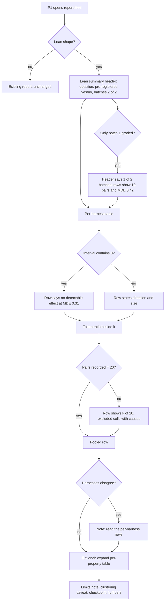

# Spec: Lean pack benchmark

*Status: in review. Sources: the operator-accepted proposal `docs/proposals/lean-pack-benchmark.html` (revision 2,
"perfect", 2026-10-09) and the strategy `docs/plans/strategy-lean-benchmark.md`. Every repo claim was read on
2026-10-09 at `a1cf7e95` (branch `integrate/finish-19`). Confidence labels: **Verified** means read or run here;
**Inferred** means modelled, with the model named; **Flagged** means unknown.*

## Part A — Functional specification

### Problem

The operator wants to know whether the AI-Forward pack improves each harness's enterprise-quality outcomes, and at
what token cost. E5, as specified in `docs/specs/enterprise-evaluation.md`, answers a finer question: 15 verdicts
(5 properties × 3 harnesses), each powered for a 20-point difference. That needs 53 pairs per verdict, which comes to
1,644 cells, about 31 h of run, about 32 h of grading, about 4 nights under an alarm, and 1.74B tokens
(`coordination-finish.md`, *E5 sizing*, Inferred from grid-4 rates).

The operator judged that out of proportion ("this has gotten WAY out of hand", 2026-10-09). They asked for about
2 h of run and about 2 h of grading. Nothing has been measured yet: no real-model cell has run the ten property tasks
(*E5 sizing*, "Gap that forces modelling", Verified by reading).

### Target users & personas

- **P1, the Benchmark Owner / operator** (primary, as in the enterprise-evaluation spec). They decide whether the pack
  is worth its tokens on each harness. They read one report and want an answer the same day.
- **P3, a reader of the report** (secondary): a pack author or reviewer, who needs the result's limits stated beside
  the result.

### Core scenario

1. P1 confirms one plan of 120 cells.
2. P1 commits a one-paragraph pre-registration.
3. Batch 1 runs: 60 cells, repetition 1, about 1.1 h at 3 slots (Inferred). Its real minutes and tokens per cell are
   read at the checkpoint.
4. P1 keeps batch 2, or stops.
5. Batch 2 runs: 60 cells, repetition 2. Both batches are graded.
6. The report opens on a **lean summary**. For each harness it gives:
   - the paired difference in `property_check_pass` (pack-on minus pack-off) with a 95% interval and the design's
     MDE;
   - a pooled row across harnesses;
   - per-property directions, labelled exploratory;
   - the on/off token ratio with its interval.
7. P1 reads the answer in one sitting.

### In scope / Out of scope (explicit non-goals)

**In scope:**
- one comparison: pack-off vs pack-on (the pack revision bound at plan time);
- the ten property tasks;
- three harnesses with pinned models;
- two repetitions in two batches, with a checkpoint;
- the lean summary;
- a pre-registration paragraph;
- a run report.

**Out of scope (non-goals):**
- **A campaign.** No `bench campaign` record, prior or final power analysis, admission loop, registration,
  dominance rule, forced defect fix or eligibility verdicts. The machinery stays in the code, unused.
- **Multi-night running**, the alarm task and the alarm drill. The run is under 4 h, so HB-CMP-011 never applies.
- **Calibration cells**, and the convergence re-run (resume table and TLC model check).
- **Verdict words** (`better`, `worse`, `no difference ≥ MDE`, `dominates`) on per-property rows.
- **Arm Y** or any third pack revision.
- **USD** (Ruling 115).
- **New metrics.** Catalog 0.7 is frozen; `property_check_pass` and `tokens_by_type` already exist.

### Conceptual domain model (DM1 / DM4)

**Bounded context:** Evaluation, as in the enterprise-evaluation spec. This spec adds two derived concepts and one
aggregate; it adds no stored quantity that the ledger does not already record.

**Ubiquitous language:**

| term | meaning |
| --- | --- |
| **Lean benchmark** | One answer to the pack-on/off question: one plan identity, its batches, its pre-registration and its lean summary. |
| **Batch** | One `bench run` of the lean plan's cells for one repetition (60 cells). Batch 1 is repetition 1; batch 2 is repetition 2. |
| **Pair** | The pack-off and pack-on cells of the same task, repetition and harness. The pairing unit. |
| **Primary metric** | `property_check_pass` (catalog 0.7, `bench/metrics.yaml:57`, Verified): "1 only when the stated ask's hidden tests pass and the property's check passes". Binary. |
| **Paired difference** | Pack-on minus pack-off on the primary metric, aggregated over pairs. Its interval is the existing two-stage percentile bootstrap: task, then repetition, task-balanced mean (`stats.py:21` `METHOD`, `stats.paired_delta`, Verified). |
| **Design MDE** | The smallest true difference the design detects with 80% power at α 0.05, given ψ = 0.28 (DR-E5). It is computed with the enterprise-evaluation spec's paired-binary formula, which reproduces that spec's n = 53 as 52.5 (Verified). Per harness: 20 pairs give 0.31. Pooled: 60 pairs give 0.19. |
| **Exploratory row** | A per-property direction with its pair counts: 4 pairs per harness, 12 pooled. It is not a verdict. |
| **Token ratio** | Pack-on total tokens over pack-off total tokens per harness, with its interval. Tokens come from `tokens_by_type` (catalog 0.7 `:31`). |
| **Checkpoint** | The read of batch 1's measured minutes per cell, grading minutes per cell and tokens per cell, set against the estimate before batch 2 starts. |
| **Pre-registration (lean)** | One committed paragraph: the question, the primary metric, the comparison, the pairing unit, the exclusion rule and the two MDEs. Written before batch 1's first cell. |

**Entities vs value objects:**
- Entities: the Lean benchmark and its Batches (each batch is an existing Run).
- Value objects: Pair, Paired difference, Exploratory row, Token ratio, Checkpoint, Pre-registration (lean).

**Aggregate:** *Lean benchmark* (root). **Invariant:** every pair compares two cells that share the same task,
repetition, harness, model pin, engine identity and pack-off workspace rule. Only the arm differs. Both batches come
from one confirmed plan identity, so no drift between plans can pose as a pack effect (EV-17's intent, kept).

### User stories & acceptance criteria

**LB-1. As P1, I want one plan of 120 cells, so that the run's size is fixed before any cell starts.**

**Erratum (L-DOCS, 2026-10-09; ADR-0022, *Spec drift*):** LB-1's one plan is superseded for the plan shape. Under ADR-0022, two `bench plan` calls on one lean ring, `bench/rings/lean.yaml` (`repetitions: 1`), with one arm binding, each list 60 cells: 10 per harness per arm. The size is still fixed before any cell starts: the two batches together are the 120 cells below (60 per batch, which the pooled view labels repetitions 1 and 2; 20 per harness per arm). The concrete-model-id and 0-instruction-file bullets hold for each plan.
- **Given** the lean matrix (10 tasks from `bench/rings/e5-pilot.yaml`'s subset, arms `off` and `on`, combos
  `cc-opus` `claude-opus-5-5`, `codex-sol` `gpt-6.1-sol`, `copilot-sol` `gpt-6.1-sol`, 2 repetitions)
  **When** `bench plan` runs with `--arm on=<pack source>@<40-hex commit>`
  **Then** it exits 0 and lists exactly 120 cells:
  - 60 per repetition;
  - 20 per harness per arm;
  - every cell carries its concrete model id;
  - every `off` cell has 0 instruction files (HB-PRE-008 and HB-PRE-009 hold).
- **Given** the `on` arm is not bound **When** `bench plan` runs without `--json` **Then** it refuses, naming the
  unbound role. A plan never runs `on` unbound.
- **Given** a pack-off cell whose base tree still carries an instruction file **When** the plan builds it **Then**
  HB-PRE-009 refuses (Ruling 116).

**LB-2. As P1, I want a pre-registration committed before batch 1, so that the analysis cannot be chosen after
seeing the data.**
- **Given** the pre-registration paragraph **When** it is read **Then** it names:
  - the question;
  - `property_check_pass` as the primary metric;
  - pack-off vs pack-on;
  - the pair (task × repetition × harness);
  - the exclusion rule (a cell with no recorded primary value is excluded from its pair, and the pair is dropped);
  - the per-harness MDE 0.31 and the pooled MDE 0.19.
- **Given** batch 1's first cell started at time T **When** the pre-registration commit's time is compared **Then**
  the commit is earlier than T. Otherwise the run report labels the result "not pre-registered".

**LB-3. As P1, I want a checkpoint after batch 1, so that a slower or costlier reality than the estimate costs one
batch, not two.**
- **Given** batch 1 is graded **When** the checkpoint is read **Then** it reports measured:
  - minutes of run per cell;
  - minutes of grading per cell;
  - tokens per cell, per harness and per arm;

  each beside the estimate (1.12 min, 1.16 min, 1.06M; Inferred).
- **Given** batch 1's projected batch-2 run time exceeds 2 h, or its tokens exceed the approved budget's half
  **When** the checkpoint is read **Then** batch 2 does not start without P1's explicit go.
- **Given** a harness whose batch-1 cells failed for an infrastructure cause (auth, rate limit) on more than 20% of
  its cells **When** the checkpoint is read **Then** it is named, with the cause, before batch 2.

**LB-4. As P1, I want a per-harness paired difference on the primary metric, so that I can decide per harness.**
- **Given** both batches graded **When** the report renders **Then**, for each harness:
  - a row shows the pack-on minus pack-off difference in `property_check_pass` as a point and a 95% interval, from
    `stats.paired_delta` over that harness's pairs (two-stage bootstrap, task then repetition);
  - the row shows the pair count and the design MDE 0.31;
  - the row's statement says `no detectable effect` when the interval contains 0 (`stats.no_detectable_effect`, the
    only definition of that label). Otherwise it states the direction and the size.
- **Given** a harness with fewer than 20 recorded pairs **When** the row renders **Then** it shows `k of 20 pairs
  recorded` and the excluded cells with their causes.
- **Given** a harness with 0 recorded pairs **When** the row renders **Then** it shows `not recorded (0 pairs)`,
  never a 0.

**LB-5. As P1, I want a pooled row across harnesses, so that I see the overall direction.**
- **Given** both batches graded **When** the report renders **Then** one pooled row shows the paired difference over
  all recorded pairs (60 at most) with its interval, the pair count and the design MDE 0.19.
- **Given** two harnesses' intervals lie wholly on opposite sides of 0 **When** the pooled row renders **Then** it
  carries the note `harnesses disagree: read the per-harness rows`.

**LB-6. As P3, I want per-property directions, so that I see where the pack helps or hurts, without reading them as
verdicts.**
- **Given** both batches graded **When** the report renders **Then** a per-property table shows, for each property
  and harness:
  - pack-off passes over recorded, and pack-on passes over recorded (e.g. `1/4 → 3/4`);
  - a direction (`up`, `down`, `same`);
  - a header that reads `Exploratory: 4 pairs per harness; not powered for a per-property finding`.
- **Given** the per-property table's text **When** it is swept for `better|worse|dominates` (case-insensitive)
  **Then** there are 0 matches (EVU-6's sweep pattern).

**LB-7. As P1, I want the token cost beside the effect, so that the answer includes what the pack costs.**
- **Given** both batches graded **When** the report renders **Then** each harness row shows the on/off token ratio
  as a point and a 95% interval (two-stage bootstrap over tasks and repetitions, as LB-4), from `tokens_by_type`
  totals.
- **Given** a cell whose tokens are not recorded **When** the ratio is computed **Then** that pair is excluded from
  the ratio, and the count of exclusions is shown. A missing value never becomes 0 (US-27).
- **Given** the rendered report **When** it is searched for `$`, `USD` or `cost_usd` labels **Then** there are 0
  matches (Ruling 115).

**LB-8. As P1, I want a run report, so that the result, its limits and its cost are on one page.**
- **Given** the run is done **When** the run report is written **Then** it states:
  - the per-harness and pooled results;
  - both MDEs and the clustering caveat (the true per-harness MDE lies between 0.31 for 20 independent pairs and
    0.42 for 10 tasks);
  - the checkpoint numbers;
  - total tokens per harness and arm;
  - the engine identity;
  - the pack revision;
  - whether the result was pre-registered.

### Non-functional requirements (ISO/IEC 25010 checklist)

| attribute | requirement | how it is checked |
| --- | --- | --- |
| Performance efficiency (time) | run ≤ 2.5 h and grading ≤ 2.5 h at 3 slots, for 120 cells | measured at the checkpoint and at the end; Inferred target from grid-4 rates |
| Resource (tokens) | ≤ 150M tokens total, against an Inferred 127M | `tokens_by_type` totals in the run report |
| Functional correctness | the paired difference and its interval are `stats.paired_delta`, nothing re-implemented (derive, don't store) | a test feeds known pairs and checks point and bounds against `paired_delta` |
| Reliability | a cell lost to infrastructure is excluded and named, never scored 0 | LB-4 and LB-7 criteria |
| Usability | P1 reads the answer from the lean summary without opening raw tables | Part B UX criteria |
| Accessibility | WCAG 2.2 AA, as the report's existing sections | Part C |
| Maintainability | no new metric, and no change to catalog 0.7; the change is confined to board and report | the catalog freeze check stays green |
| Security / privacy | no new egress; tokens and credentials are handled as today | unchanged surfaces |
| Portability | the report stays a self-contained HTML file | as the harness-bench spec |
| Compatibility | a run without the lean shape (not 2 arms) renders no lean summary and keeps its report golden byte-identical | a golden test |

**Erratum (L-DOCS, 2026-10-09; ADR-0022 §4, *Spec drift*):** In the Compatibility row, the lean shape is the ring tag `lean`, not "2 arms". A run without the `lean` ring tag renders no lean summary and keeps its report golden byte-identical.

### Boundary set

- Cells: exactly 120, which is 60 per batch, 20 per harness per arm, and 2 per task per harness per arm.
- Pairs per harness: 20 at most. Pooled: 60 at most. Per property per harness: 4 at most.
- A pair needs both cells recorded. One missing cell drops the pair (LB-2's exclusion rule).
- The primary metric is binary. A value other than 0 or 1 is a grading defect, never a pass.

### Comparables & user evidence (sourced)

| source | what it shows | label |
| --- | --- | --- |
| The enterprise-evaluation spec, *Power-analysis inputs* and DR-E5 | ψ = 0.28, and n = 53 for MDE 0.20 per verdict | Verified (read, and the formula reproduces 52.5) |
| Grid-4 (`runs/grid-4`, `coordination-finish.md` *E5 sizing*) | 1.68 min of wall per cell at 2 slots; grading 1.16 min per cell; median cell 1.5-2.4 min, p90 4.8-6.4 min | Verified as recorded there; the lean rates are Inferred from it |
| The enterprise-evaluation spec's token table (`:444-458`) | pack-on uses 2.2× (Claude Code), 3.1× (Codex) and 10.8× (Copilot) the tokens of pack-off | Verified for that population (flagged R-E5) |
| `stats.py` | two-stage percentile bootstrap (task, then repetition) and paired deltas, already behind the report's pack effect (`board.py:685`) | Verified |
| The operator's words, 2026-10-09 | "this has gotten WAY out of hand"; "further reduce: i want a target of about 2hr for run time and 2hr for grading"; "perfect" | Verified (session record, `docs/plans/strategy-lean-benchmark.md`) |

### Applicable governance lenses

- **Quality attributes:** walked above.
- **Threat model:** no new trust boundary. The pack-on arm's source binding is the existing `--arm`.
- **Privacy:** unchanged.
- **Accessibility:** Part C.
- **Performance:** the 2 h + 2 h budget is the NFR. The checkpoint is its control.
- **Release / rollback:** a report-only change behind the lean shape. A non-lean run's golden stays byte-identical.
- **Observability:** the checkpoint reads `bench status` and the ledger. Run minutes, grading minutes and tokens are
  measured, not modelled, after batch 1.

### AI-integrated allocation

N/A: the benchmark measures AI harnesses; the lean summary itself calls no model.

## Part B — UX specification

### Personas & jobs-to-be-done (deepened)

- **P1's job:** "Tell me, per harness, whether the pack helps on enterprise properties, how sure we are, and what it
  costs, so that I can decide in one read." The job ends at the per-harness rows.
- **P3's job:** "Show me where it helps and the limits, so that I do not over-read a small sample."

### Information architecture

The lean summary is one section of the existing report. It sits where E5's verdict section would, and appears only
on a run with the lean shape:

1. **Lean summary header.** The question, the pre-registration status, and the batch count with pair counts.
2. **Per-harness table** (the decision): effect and interval, MDE, pairs, statement, token ratio.
3. **Pooled row:** a summary, with the disagreement note when it applies.
4. **Per-property table**, exploratory and collapsed by default.
5. **Limits note:** the clustering caveat and the checkpoint numbers.

The existing sections (header facts, leaderboard, pack effect on pass@1 and composite, cells) follow unchanged.

### User flows



**Recovery paths:**
- **A batch stopped at the checkpoint:** the report renders from batch 1 alone, labelled `1 of 2 batches`, with MDE
  0.42.
- **A harness with 0 recorded pairs:** its row says `not recorded (0 pairs)` and names the causes.

### Wireframe-level structure (Skeleton)

```
[Lean summary]  Does the pack help each harness?   Pre-registered: yes (commit abc1234)   Batches: 2 of 2
 harness      | pack-on − pack-off (property_check_pass) | 95% interval | MDE  | pairs | statement               | tokens on/off
 Claude Code  |  +0.25                                   | [+0.05, +0.45]| 0.31 | 20/20 | pack-on higher by 0.25  | 2.1× [1.8, 2.5]
 Codex        |  +0.05                                   | [-0.15, +0.25]| 0.31 | 20/20 | no detectable effect    | 3.0× [2.4, 3.7]
 Copilot      |  ...
 pooled       |  +0.12                                   | [+0.01, +0.23]| 0.19 | 60/60 | pack-on higher by 0.12  | —
 [> Per property (exploratory: 4 pairs per harness)]
 [Limits: true per-harness MDE between 0.31 and 0.42 (repeats of a task are correlated). Checkpoint: 1.3 min/cell run, ...]
```

*The figures above are placeholders that show the layout. They are not results.*

### UX acceptance criteria (falsifiable)

- **LBU-1.** On a lean-shaped run, the per-harness table is the first table of the lean summary. No scroll is needed
  past the header to reach it at 1280×800.
- **LBU-2.** Every per-harness row shows all six fields: effect, interval, MDE, pairs, statement, token ratio. A
  missing field reads `not recorded — <reason>`, never blank.
- **LBU-3.** The per-property table is collapsed by default, and its header carries the word `Exploratory`.
- **LBU-4.** A run with one graded batch renders `1 of 2 batches` and the 1-batch MDE (0.42). It never shows the
  2-batch MDE over 1-batch data.
- **LBU-5.** A non-lean run shows no lean-summary element, and its report golden is byte-identical (as EVU-4 for the
  campaign section).

## Part C — UI specification

### UI Archetype Signature

- **Archetype:** B3 · Telemetry Bento Box, inherited from the harness-bench Part C through the enterprise-evaluation
  spec, with no new deviations.
- **Selection:** inherited. The JTBD (compare measured quantities with uncertainty, drill to evidence) is unchanged.

### Medium(s) & platform guidelines

As the harness-bench spec: a self-contained HTML file opened from `file://` in Chromium-based browsers and Firefox;
WCAG 2.2; the WAI-ARIA APG patterns for table and disclosure. The tables are pre-rendered and readable with
JavaScript off.

### Visual intent & tokens

- **Experience qualities:** *plain, honest about doubt*. Opposites to avoid: *celebratory, falsely certain*.
- **Tokens:** only the report's existing tokens. No new colour, size or radius literal.
- **Effect encoding:** the pack-effect section's interval bar on a diverging axis centred on 0, with the MDE as a
  patterned band from −MDE to +MDE.
- **Token-ratio encoding:** a log-scale interval bar centred on 1×.
- **Statements:** text first. Colour never carries meaning alone.

### Key screens & complete component states

| component | default | hover / focus | empty | error / partial | overflow |
| --- | --- | --- | --- | --- | --- |
| Lean summary header | question, pre-registration status with commit, `Batches: n of 2` | the commit id's tooltip shows the full sha | absent on a non-lean run | pre-registration missing or late: `Not pre-registered: <reason>` | wraps below 480 px |
| Per-harness row | effect, interval bar, MDE, pairs, statement, ratio bar | exact bounds, n, resamples, seed | `not recorded (0 pairs)` with causes | `k of 20 pairs recorded`, with excluded cells listed | the table scrolls in its container; the first column is sticky |
| Pooled row | as a harness row, MDE 0.19 | as above | `not recorded (0 pairs)` | the disagreement note | as above |
| Per-property table | collapsed: `Per property (exploratory: 4 pairs per harness)` | focus ring; expanded rows show `a/b → c/d` and the direction | a property with no recorded pair: `0/0 → 0/0, not recorded` | — | scrolls in its container |
| Limits note | the clustering caveat and the checkpoint numbers | — | checkpoint not run: `Checkpoint not recorded` | — | wraps |

### Motion, copy, accessibility & performance

- **Motion:** none, except the disclosure's expand and collapse, which honours `prefers-reduced-motion`.
- **Copy:** plain statements. `no detectable effect` is the only label for an interval containing 0. Per-property text
  never uses `better`, `worse` or `dominates`.
- **Accessibility:** WCAG 2.2 AA. axe-core reports 0 violations for the section in light and dark (as EVU-5).
  Contrast of the bars and the MDE band is at least 3:1 against the panel.
- **Performance:** the section adds at most 30 kB to report.html.

### AI-UX

N/A: the section presents measurements; no AI acts through it.

### UI acceptance criteria (falsifiable)

- **LBI-1.** axe-core (WCAG 2.2 AA) reports 0 violations for the lean summary in light and dark mode.
- **LBI-2.** Each per-harness row's DOM contains its statement as text. A check with colours and glyphs removed still
  reads every statement.
- **LBI-3.** Every effect mark carries `data-interval-lo`, `data-interval-hi` and `data-mde` (as EVU-2), and every
  ratio mark carries `data-interval-lo` and `data-interval-hi`.
- **LBI-4.** The per-property section's text has 0 matches for `better|worse|dominates`.

## Supersession (what changes in `docs/specs/enterprise-evaluation.md` for this question)

| enterprise-evaluation content | under this spec |
| --- | --- |
| Epic EA (ten property tasks, hidden checks), Epic EB (metrics that record, catalog 0.7) | **kept** |
| Arms pack-off and pack revision X (as `on`); arm Y | X **kept** as `on`; Y **out** (operator, 2026-10-08) |
| Epic EC (EV-12 power analysis, EV-13 pre-registration as a campaign record) | **superseded**: design MDEs are stated in this spec, and the pre-registration is one paragraph (LB-2) |
| EV-14 pilot ring | **kept as batch 1** (`bench/rings/e5-pilot.yaml`, 60 cells); no admission step |
| EV-15 pack-regression ring, EV-16 engine freeze, campaign lifecycle | regression ring **out**; one engine identity per lean benchmark **kept** (the aggregate's invariant); campaign lifecycle **out** |
| EV-17 one grid for all arms | **kept** in intent: both batches come from one confirmed plan identity |
| EV-18 verdict per property × harness × comparison | **superseded** by LB-4 (per harness), LB-5 (pooled) and LB-6 (per property, exploratory) |
| EV-19 value beside cost, dominance | value beside cost **kept** (LB-7); dominance **out** |
| EV-20 campaign eligibility in the report | **out** (no campaign); the pre-registration status is shown instead (LB-2) |
| ADR-0021 §7 multi-night drill (HB-CMP-011) | **not triggered** (no registration, under 4 h); the requirement was dropped by the operator on 2026-10-09 |
| Rulings 115 (tokens only) and 116 (pack-off instruction-free) | **kept** |

**Erratum (Coordinator #64, 2026-10-09; ADR-0022 §1):** In the EV-14 row, batch 1 does not run
`bench/rings/e5-pilot.yaml`. Both batches run the new ring `bench/rings/lean.yaml`: e5-pilot's content with
`ring: {tag: lean}`, 60 cells per plan. `bench/rings/e5-pilot.yaml` is unchanged. Found by Coordinator #63 in the
L-DOCS review.

## Flagged risks & residual unknowns

| risk / unknown | label | response |
| --- | --- | --- |
| Property-task cells run slower or cost more than grid-4's mix | Flagged (no real-model cell has run them) | the checkpoint (LB-3) |
| ψ for property tasks may differ from 0.28 | Flagged | the MDEs are design figures; the bootstrap interval is the result |
| Repeats of a task are correlated, so the true per-harness MDE lies between 0.31 and 0.42 | Inferred | stated in the limits note and the run report (LB-8) |
| A rate limit at 3 slots | Flagged (grid-4 measured 2 slots) | the checkpoint names infrastructure failures (LB-3); drop to 2 slots |
| `property_check_pass` is NA for a task whose property grader cannot run | Inferred from `grade/property.py:174-176` | NA cells drop their pair and are listed (LB-4) |

## Gate record

*Proportionate tier T1 (operator brief). The authors (Leader, as Product Strategist and Domain Researcher) wrote
this; the gate below is the adversarial read, recorded, not self-cleared.*

| reviewer | finding | resolution |
| --- | --- | --- |
| Simplifier | Could the existing pack-effect section on pass@1 answer the question with no change? | No. pass@1 is the correctness grader's score (`metrics.yaml:47`). `property_check_pass` additionally requires the property's check (`:57`), and the question is about properties. The pack effect computes `["pass_at_1", *cat.areas]` (`board.py:588`, `:825`), so the change is one more existing metric through the same `paired_delta`, plus the section. |
| Simplifier | Is the per-property table gold-plating? | Kept, collapsed, labelled exploratory. It costs no run time and it is the property signal P3 needs. |
| Test Architect | LB-4's statement must be falsifiable | It is tied to `stats.no_detectable_effect` (one definition), with numeric point and bounds; a test with known pairs fixes it. |
| Test Architect | LB-3's thresholds must be measurable | Projected run time over 2 h, and tokens over half the approved budget, both read from batch 1's ledger. |
| Data & Persistence | Is any new quantity stored? | No. Pairs, differences, ratios and the checkpoint are derived from the ledger. The pre-registration is a committed text file. |
| UX Researcher / IA | Is the 1-batch case covered? | Yes: the recovery path, LBU-4. |
| UX & Accessibility | Are the states complete? | The component table covers empty, partial and error for every component. LBI-1 to LBI-4. |
| Security | No new trust boundary | Agreed; not convened beyond this read. |

Residual risk: the checkpoint is the only control on cost and time until the first real cells are measured.
